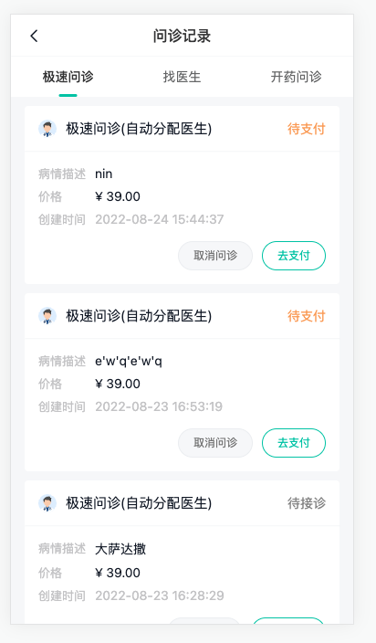
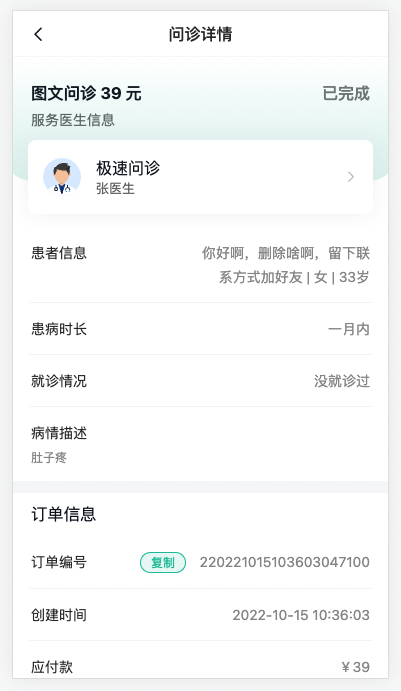

# 问诊订单

## 问诊记录-路由与组件{#consult-order-page}

> 目标：配置路由，分析问诊订单组件结构



代码：

1）分析问诊记录页面

`User/ConsultOrder.vue`

```ts
<script setup lang="ts">
import ConsultList from './components/ConsultList.vue'
// import { ConsultType } from '@/enums'
</script>

<template>
  <div class="consult-page">
    <cp-nav-bar title="问诊记录" />
    <van-tabs sticky>
      <van-tab title="找医生"><consult-list :type="1" /></van-tab>
      <van-tab title="极速问诊"><consult-list :type="2" /></van-tab>
      <van-tab title="开药问诊"><consult-list :type="3" /></van-tab>
    </van-tabs>
  </div>
</template>

<style lang="scss" scoped>
.consult-page {
  padding-top: 46px;
  background-color: var(--cp-bg);
  min-height: calc(100vh - 46px);
}
</style>

```

2）配置路由

```ts
    {
      path: '/user/consult',
      component: () => import('@/views/user/ConsultOrder.vue'),
      meta: { title: '问诊记录' }
    },
```

## 问诊记录-类型定义与API函数{#consult-order-type}

> 目标：定义接口参数类型和api函数

步骤：

- 定义接口参数类型
- 订单状态枚举
- 单个问诊订单类型
- 带分页问诊订单类型
- 定义查询[API函数](https://www.apifox.cn/apidoc/shared-16a58bff-e4db-465c-9c8b-859c839318ac/api-34951424)

代码：

1）定义接口参数类型 `types/consult.d.ts`

```ts 
// 根据通用分页类型定义
export type ConsultOrderListParams = PageParams & {
  type: ConsultType
}
```

2）订单状态枚举 `enums/index.ts`(已定义)

```ts
// 问诊订单状态
export enum OrderType {
  // ----------------问诊订单------------------
  // 待支付
  ConsultPay = 1,
  // 待接诊
  ConsultWait = 2,
  // 咨询中
  ConsultChat = 3,
  // 已完成
  ConsultComplete = 4,
  // 已取消
  ConsultCancel = 5,
  // ----------------药品订单------------------
  // 待支付
  MedicinePay = 10,
  // 待发货
  MedicineSend = 11,
  // 待收货
  MedicineTake = 12,
  // 已完成
  MedicineComplete = 13,
  // 已取消
  MedicineCancel = 14
}
```

3）单个问诊订单类型 `types/consult.d.ts`(已定义)

```ts
// 问诊订单单项信息
export type ConsultOrderItem = Consult & {
  createTime: string
  docInfo?: Doctor
  patientInfo: Patient
  orderNo: string
  statusValue: string
  typeValue: string
  status: OrderType
  countdown: number
  prescriptionId?: string
  evaluateId: number
  payment: number
  couponDeduction: number
  pointDeduction: number
  actualPayment: number
}
```

4）带分页问诊订单类型 `types/consult.d.ts`

```ts
export type ConsultOrderPage = {
  pageTotal: number
  total: number
  rows: ConsultOrderItem[]
}
```

5）定义查询API函数 `api/consult.ts`

```ts
import type { ConsultOrderListParams, ConsultOrderPage } from '@/types/consult'
```

```ts
// 获取问诊订单记录列表
export const getConsultOrderList = (params: ConsultOrderListParams) =>
  request.get<any, ConsultOrderPage>('/patient/consult/order/list', { params })
```


## 问诊记录-上拉加载{#consult-order-render}

> 实现：获取问诊订单数据，支持上拉加载更多

1）加载数据逻辑 `User/components/ConsultList.vue`

```vue
<script setup lang="ts">
import type { ConsultType } from '@/enums'
import { getConsultOrderList } from '@/api/consult'
import type { ConsultOrderItem, ConsultOrderListParams } from '@/types/consult'
import { ref } from 'vue'
import ConsultItem from './ConsultItem.vue'

const props = defineProps<{ type: ConsultType }>()
const params = ref<ConsultOrderListParams>({
  type: props.type,
  current: 1,
  pageSize: 5
})
const loading = ref(false)
const finished = ref(false)
const list = ref<ConsultOrderItem[]>([])
const onLoad = async () => {
  const res = await getConsultOrderList(params.value)
  list.value.push(...res.rows)
  if (params.value.current < res.pageTotal) {
    params.value.current++
  } else {
    finished.value = true
  }
  loading.value = false
}
</script>

<template>
  <div class="consult-list">
    <van-list
      v-model:loading="loading"
      :finished="finished"
      finished-text="没有更多了"
      @load="onLoad"
    >
      <consult-item v-for="item in list" :key="item.id" :item="item" />
    </van-list> 
  </div>
</template>     
```

2）渲染  `User/components/ConsultItem.vue`

```vue
<script setup lang="ts">
import type { ConsultOrderItem } from '@/types/consult'
import { OrderType } from '@/enums'

defineProps<{ item: ConsultOrderItem }>()
</script>

<template>
  <div class="consult-item">
    <div class="head van-hairline--bottom">
      
      <p>{{ item.docInfo?.name || '暂未分配医生' }}</p>
      <span
        :class="{
          orange: item.status === OrderType.ConsultPay,
          green: item.status === OrderType.ConsultChat
        }"
        >{{ item.statusValue }}</span
      >
    </div>
    <div class="body" @click="$router.push(`/user/consult/${item.id}`)">
      <div class="body-row">
        <div class="body-label">病情描述</div>
        <div class="body-value">{{ item.illnessDesc }}</div>
      </div>
      <div class="body-row">
        <div class="body-label">价格</div>
        <div class="body-value">¥ {{ item.payment }}</div>
      </div>
      <div class="body-row">
        <div class="body-label">创建时间</div>
        <div class="body-value tip">{{ item.createTime }}</div>
      </div>
    </div>
    <div class="foot">
      <van-button class="gray" plain size="small" round>取消订单</van-button>
      <van-button type="primary" plain size="small" round to="/">去支付</van-button>
    </div>
  </div>
</template>
```

## 问诊记录-订单状态

> 目标：了解问诊订单状态和对应业务功能

状态梳理：

1. 待支付：取消问诊+去支付

2. 待接诊：取消问诊+继续沟通

3. 咨询中：查看处方(如果开了) + 继续沟通

4. 已完成：更多菜单=> 查看处方(如果开了)+删除订单 + 问诊记录+去评价

5. 已取消：删除订单+咨询其他医生

代码实现：

 `User/components/ConsultItem.vue`

```ts
import { computed, ref } from 'vue'

// == 已完成订单使用 ==
// 控制更多操作显示
const showPopover = ref(false)
// 操作项
const actions = computed(() => [
  { text: '查看处方', disabled: !props.item.prescriptionId }, // 没有开处方不能查看
  { text: '删除订单' }
])
// 操作项的点击回调
const onSelect = () => {
  //
}
```

```html
   <!-- 1. 待支付：取消问诊+去支付 --> 
   <div class="foot" v-if="item.status === OrderType.ConsultPay">
      <van-button class="gray" plain size="small" round>取消问诊</van-button>
      <van-button type="primary" plain size="small" round :to="`/user/consult/${item.id}`">
        去支付
      </van-button>
    </div>
    <!-- 2. 待接诊：取消问诊+继续沟通 --> 
    <div class="foot" v-if="item.status === OrderType.ConsultWait">
      <van-button class="gray" plain size="small" round>取消问诊</van-button>
      <van-button type="primary" plain size="small" round :to="`/room?orderId=${item.id}`">
        继续沟通
      </van-button>
    </div>
    <!-- 3. 咨询中：查看处方（如果开了）+继续沟通 --> 
    <div class="foot" v-if="item.status === OrderType.ConsultChat">
      <van-button v-if="item.prescriptionId" class="gray" plain size="small" round>
        查看处方
      </van-button>
      <van-button type="primary" plain size="small" round :to="`/room?orderId=${item.id}`">
        继续沟通
      </van-button>
    </div>
    <!-- 4. 已完成：更多（查看处方，如果开了，删除订单）+问诊记录+（未评价?写评价:查看评价） --> 
    <div class="foot" v-if="item.status === OrderType.ConsultComplete">
      <div class="more">
        <van-popover
          placement="top-start"
          v-model:show="showPopover"
          :actions="actions"
          @select="onSelect"
        >
          <template #reference> 更多 </template>
        </van-popover>
      </div>
      <van-button class="gray" plain size="small" round :to="`/room?orderId=${item.id}`">
        问诊记录
      </van-button>
      <van-button v-if="!item.evaluateId" type="primary" plain size="small" round>
        去评价
      </van-button>
      <van-button v-else class="gray" plain size="small" round> 查看评价 </van-button>
    </div>
    <!-- 5. 已取消：删除订单+咨询其他医生 --> 
    <div class="foot" v-if="item.status === OrderType.ConsultCancel">
      <van-button class="gray" plain size="small" round>删除订单</van-button>
      <van-button type="primary" plain size="small" round to="/">咨询其他医生</van-button>
    </div>
```


## 问诊记录-取消订单

> 实现：取消问诊订单功能

步骤：

- [API接口](https://www.apifox.cn/apidoc/shared-16a58bff-e4db-465c-9c8b-859c839318ac/api-31781556)
- 取消订单逻辑函数
- 使用逻辑

代码：

1）API接口 `api/consult.ts`

```ts
// 取消订单
export const cancelOrder = (id: string) => request.put(`/patient/order/cancel/${id}`)
```

2）取消订单逻辑函数  `User/components/ConsultItem.vue`

```ts
import { cancelOrder } from '@/api/consult'
import { showFailToast, showSuccessToast } from 'vant'
```

```ts
  // 取消订单
  const loading = ref(false)
  const cancelConsultOrder = async (item: ConsultOrderItem) => {
    loading.value = true
    try {
      await cancelOrder(item.id)
      // 修改订单的状态
      item.status = OrderType.ConsultCancel
      item.statusValue = '已取消'
      showSuccessToast('取消成功')
    } catch (e) {
      showFailToast('取消失败')
    } finally {
      loading.value = false
    }
  }
```


3）使用逻辑

```diff
-   <!-- 1. 待支付：取消问诊+去支付 -->
  <div class="foot" v-if="item.status === OrderType.ConsultPay">
      <van-button
        class="gray"
        plain
        size="small"
+        :loading="loading"
        round
+        @click="cancelConsultOrder(item)"
      >
        取消问诊
      </van-button>
      <van-button type="primary" plain size="small" round :to="`/user/consult/${item.id}`">
        去支付
      </van-button>
    </div>
```

```diff
- <!-- 2. 待接诊：取消问诊+继续沟通 -->
   <div class="foot" v-if="item.status === OrderType.ConsultWait">
      <van-button
        class="gray"
        plain
        size="small"
+        :loading="loading"
        round
+        @click="cancelConsultOrder(item)"
      >
        取消问诊
      </van-button>
      <van-button type="primary" plain size="small" round :to="`/room?orderId=${item.id}`">
        继续沟通
      </van-button>
    </div>
```


## 问诊记录-删除订单(课堂练习)

> 实现：删除订单功能

步骤：

- [API接口](https://www.apifox.cn/apidoc/shared-16a58bff-e4db-465c-9c8b-859c839318ac/api-31781560)
- 删除订单逻辑函数
- 使用逻辑

代码：

1）API接口 `api/consult.ts`

```ts
// 删除订单
export const deleteOrder = (id: string) => request.delete(`/patient/order/${id}`)
```

2）删除订单逻辑函数  `User/components/ConsultItem.vue`

```ts
import { deleteOrder } from '@/api/consult'
```

```ts
// 删除订单
const emit = defineEmits<{
  (e: 'on-delete', id: string): void
}>()
const deleteLoading = ref(false)
const deleteConsultOrder = (item: ConsultOrderItem) => {
  deleteLoading.value = true
  deleteOrder(item.id)
    .then(() => {
      // 通知父组件更新列表
      emit('on-delete', item.id)
      showSuccessToast('删除成功')
    })
    .catch((error) => {
       console.log(error)
    })
    .finally(() => {
      deleteLoading.value = false
    })
}
```

3）使用逻辑

1. 更多操作的删除

```ts
const onSelect = (action: { text: string }, i: number) => {
  if (i === 1) {
    // 删除
    deleteConsultOrder(props.item)
  }
}
```

2. 已取消订单按钮删除

```diff
- <!-- 5. 已取消：删除订单+咨询其他医生 -->
  <div class="foot" v-if="item.status === OrderType.ConsultCancel">
      <van-button
        class="gray"
        plain
        size="small"
        round
+        :loading="deleteLoading"
+        @click="deleteConsultOrder(item)"
      >
        删除订单
      </van-button>
      <van-button type="primary" plain size="small" round to="/">咨询其他医生</van-button>
    </div>
```

4）父组件进行删除数据 `User/components/ConsultList.vue`

```diff
<consult-item v-for="item in list" :key="item.id" :item="item"
+              @on-delete="onDelete" />
```

```ts
const onDelete = (id: string) => {
  list.value = list.value.filter((item) => item.id !== id)
}
```

## 问诊记录-查看处方Hook

> 实现：查看处方逻辑复用，提取一个hook函数

步骤：

- 提取一个hook提供，查看处方函数
- 问诊室使用，订单列表中使用

代码：

1）在`Room/components/RoomMessage.vue`提取hook函数  `composable/index.ts`

```ts
import { getPrescriptionPic } from '@/api/consult'
import { showImagePreview } from 'vant'
```

```ts
// 封装查看处方逻辑
export const useShowPrescription = () => {
  const showPrescription = async (id?: string) => {
    if (id) {
      const res = await getPrescriptionPic(id)
      showImagePreview([res.data.url])
    }
  }
  return { showPrescription }
}
```

2）使用hook函数

1. 问诊室使用 `Room/components/RoomMessage.vue`

```ts
import { useShowPrescription } from '@/hooks'
const { showPrescription } = useShowPrescription()
```

```diff
          <div class="head-tit">
            <h3>电子处方</h3>
+            <p @click="showPrescription(msg.prescription?.id)">
              原始处方 <van-icon name="arrow"></van-icon>
            </p>
          </div>
```

2. 订单列表使用 `User/components/ConsultItem.vue`

```diff
+ import { useShowPrescription } from '@/hooks'
+ const { showPrescription } = useShowPrescription()
const onSelect = (action: { text: string }, i: number) => {
+  if (i === 0) {
+    showPrescription(props.item.prescriptionId)
+  }
  if (i === 1) {
    // 删除
    deleteConsultOrder(props.item)
  }
}
```

小结：

- 现在是只有一个函数复用，其实也可以复用状态数据之类的，或者多个函数。

## 问诊记录-详情路由和组件渲染(课堂练习)

> 目标：配置详情路由，分析组件结构，渲染详情数据




代码：

1）分析结构和路由配置

```ts
    {
      path: '/user/consult/:id',
      component: () => import('@/views/user/ConsultDetail.vue'),
      meta: { title: '问诊详情' }
    }
```

2）骨架效果

```html
  <div class="consult-detail-page" v-if="item">
  // ...
  </div>
  <div class="consult-detail-page" v-else>
    <cp-nav-bar title="问诊详情" />
    <van-skeleton title :row="4" style="margin-top: 30px" />
    <van-skeleton title :row="4" style="margin-top: 30px" />
  </div>
```

3）基本渲染

说明❓：api接口已定义

```vue
<script setup lang="ts">
import { OrderType } from '@/enums'
import { getConsultOrderDetail } from '@/api/consult'
import type { ConsultOrderItem } from '@/types/consult'
import { timeOptions, flagOptions } from '@/api/constants'

import { onMounted, ref } from 'vue'
import { useRoute } from 'vue-router'

const route = useRoute()
const item = ref<ConsultOrderItem>()
onMounted(async () => {
  const res = await getConsultOrderDetail(route.params.id as string)
  item.value = res.data
  console.log('订单详情：', res.data)
})
</script>

<template>
  <div class="consult-detail-page" v-if="item">
    <cp-nav-bar title="问诊详情" />
    <div class="detail-head">
      <div class="text">
        <h3>图文问诊 {{ item.payment }} 元</h3>
        <span
          class="sta"
          :class="{
            orange: item.status === OrderType.ConsultPay,
            green: item.status === OrderType.ConsultChat
          }"
          >{{ item.statusValue }}</span
        >
        <p class="tip">服务医生信息</p>
      </div>
      <div class="card">
        
        <p class="doc">
          <span>极速问诊</span>
          <span>{{ item.docInfo?.name }}</span>
        </p>
        <van-icon name="arrow" />
      </div>
    </div>
    <div class="detail-patient">
      <van-cell-group :border="false">
        <van-cell
          title="患者信息"
          :value="`${item.patientInfo.name} | ${item.patientInfo.genderValue} | ${item.patientInfo.age}岁`"
        />
        <van-cell
          title="患病时长"
          :value="timeOptions.find((i) => i.value === item?.illnessTime)?.label"
        />
        <van-cell
          title="就诊情况"
          :value="flagOptions.find((i) => i.value === item?.consultFlag)?.label"
        />
        <van-cell title="病情描述" :label="item.illnessDesc" />
      </van-cell-group>
    </div>
    <div class="detail-order">
      <h3>订单信息</h3>
      <van-cell-group :border="false">
        <van-cell title="订单编号">
          <template #value>
            <span class="copy">复制</span>
            {{ item.orderNo }}
          </template>
        </van-cell>
        <van-cell title="创建时间" :value="item.createTime" />
        <van-cell title="应付款" :value="`￥${item.payment}`" />
        <van-cell title="优惠券" :value="`-￥${item.couponDeduction}`" />
        <van-cell title="积分抵扣" :value="`-￥${item.pointDeduction}`" />
        <van-cell title="实付款" :value="`￥${item.actualPayment}`" class="price" />
      </van-cell-group>
    </div>
  </div>
  <div class="consult-detail-page" v-else>
    <cp-nav-bar title="问诊详情" />
    <van-skeleton title :row="4" style="margin-top: 30px" />
    <van-skeleton title :row="4" style="margin-top: 30px" />
  </div>
</template>
```


## 问诊记录-复制订单号

> 实现：使用useClipboard复制订单号

步骤：

- 知道 useClipboard 基本用法
- 使用 useClipboard 复制订单号

代码：

[参考代码-api](https://vueuse.org/core/useclipboard/#useclipboard)

语法：

1. copy 函数=》使用：copy(复制文本)=》copy方法会把传入的文本存储到系统粘贴板

2. copied ref响应变量 =》true 复制成功 | false 复制失败

3. isSupported ref响应变量 =》true 授权支持 | false 未授权不支持

实现逻辑 `User/ConsultDetail.vue`

```ts
import { useClipboard } from '@vueuse/core'
import { showSuccessToast, showFailToast } from 'vant'
```

```ts
const { copy, copied, isSupported } = useClipboard()
// 1. 复制回调
const onCopy = () => {
  if (!isSupported.value) showFailToast('未授权，不支持')
  copy(item.value?.orderNo || '')
}
// 2. 复制后提示
watch(copied, () => {
  if (copied.value) showSuccessToast('已复制')
})
```

```diff
<van-cell title="订单编号">
  <template #value>
+    <span class="copy" @click="onCopy()">复制</span>
    {{ item.orderNo }}
  </template>
</van-cell>
```


## 问诊记录-支付抽屉组件封装

> 实现：封装可复用的支付抽屉组件

思考❓：抽离`Consult/ConsultPay.vue`中支付抽屉部分

```vue
      <cp-pay-sheet
        v-model:show="show" // 控制支付抽屉显隐
        :order-id="orderId" // 订单ID
        :actualPayment="payInfo.actualPayment" // 支付金额
        :onClose="onClose" // 关闭后回调
      />
```


需求：

- 组件需要实现哪些功能？
  - 展示微信支付和支付宝支付，可以选择
  - 展示支付金额，传入订单ID用于生成订单支付链接
  - 打开关闭抽屉
  - 关闭后的业务可自定义
- 需要暴露哪些 props 参数？
  - show orderId  actualPayment  onClose 
- 需要提供哪些 emits 事件？
  - update:show


代码：

1）封装组件 `components/CpPaySheet.vue`

```vue
<script setup lang="ts">
import { showLoadingToast } from 'vant'
import { ref } from 'vue'
import { getConsultOrderPayUrl } from '@/api/consult'

const { orderId, show } = defineProps<{
  orderId: string
  actualPayment?: number
  onClose?: () => void
  show: boolean
}>()
const emit = defineEmits<{
  (e: 'update:show', val: boolean): void
}>()

const paymentMethod = ref<0 | 1>()

// 跳转支付
const pay = async () => {
  if (paymentMethod.value === undefined) return Toast('请选择支付方式')
  showLoadingToast('跳转支付')
  const res = await getConsultOrderPayUrl({
    orderId: orderId,
    paymentMethod: paymentMethod.value,
    payCallback: 'http://localhost/room'
  })
  window.location.href = res.payUrl
}
</script>

<template>
  <!-- 支付方式弹窗 -->
  <van-action-sheet
    :show="show"
    @update:show="emit('update:show', $event)"
    title="选择支付方式"
    :close-on-popstate="false"
    :before-close="onClose"
    :closeable="false"
  >
    <div class="pay-type">
      <p class="amount">￥{{ actualPayment?.toFixed(2) }}</p>
      <van-cell-group>
        <van-cell title="微信支付" @click="paymentMethod = 0">
          <template #icon><cp-icon name="consult-wechat" /></template>
          <template #extra><van-checkbox :checked="paymentMethod === 0" /></template>
        </van-cell>
        <van-cell title="支付宝支付" @click="paymentMethod = 1">
          <template #icon><cp-icon name="consult-alipay" /></template>
          <template #extra><van-checkbox :checked="paymentMethod === 1" /></template>
        </van-cell>
      </van-cell-group>
      <div class="btn">
        <van-button @click="pay" type="primary" round block>立即支付</van-button>
      </div>
    </div>
  </van-action-sheet>
</template>

<style lang="scss" scoped>
.pay-type {
  .amount {
    padding: 20px;
    text-align: center;
    font-size: 16px;
    font-weight: bold;
  }
  .btn {
    padding: 15px;
  }
  .van-cell {
    align-items: center;
    .cp-icon {
      margin-right: 10px;
      font-size: 18px;
    }
    .van-checkbox :deep(.van-checkbox__icon) {
      font-size: 16px;
    }
  }
}
</style>
```

```diff
import CpNavBar from '@/components/CpNavBar.vue'
import CpIcon from '@/components/CpIcon.vue'
import CpRadioBtn from '@/components/CpRadioBtn.vue'
+import CpPaySheet from '@/components/CpPaySheet.vue'
import { RouterLink, RouterView } from 'vue-router'

declare module 'vue' {
  interface GlobalComponents {
    CpNavBar: typeof CpNavBar
    CpIcon: typeof CpIcon
    CpRadioBtn: typeof CpRadioBtn
+    CpPaySheet: typeof CpPaySheet
  }
}
```

2）使用组件

问诊支付`Consult/ConsultPay.vue`

```html
     <cp-pay-sheet
        v-model:show="show"
        :order-id="orderId"
        :actualPayment="payInfo.actualPayment"
        :onClose="onClose"
      />
```

问诊订单页支付`User/components/ConsultItem.vue`

```ts
// 4. 支付
const show = ref(false)
```

```diff
<template>
<div class="consult-item">...</div>
+ <cp-pay-sheet v-model:show="show" :orderId="item.id" :actualPayment="item.payment" />
</template>
```

注意❓：

> 父传子订单ID：子组件解构orderId失去响应式解决

1. 设置props解构响应式转换

`vite.config.ts`

```diff
export default defineConfig({
  plugins: [
    vue({
+      reactivityTransform: true
    }),
    Components({
      dts: false, // 关闭自动生成类型声明文件
      resolvers: [VantResolver()]
    }),
    createSvgIconsPlugin({
      // 指定图标文件夹，绝对路径（NODE代码）
      iconDirs: [path.resolve(process.cwd(), 'src/icons')]
    })
  ],
  resolve: {
    alias: {
      '@': fileURLToPath(new URL('./src', import.meta.url))
    }
  }
})
```

2. 重启服务：`pnpm dev`

# 第十一天