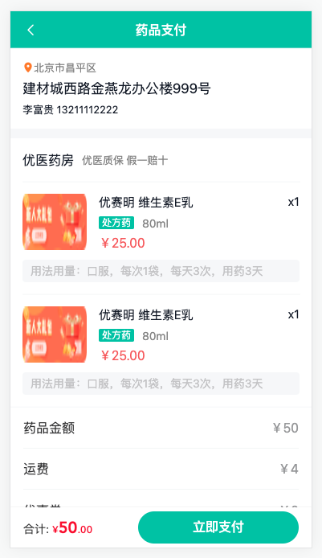
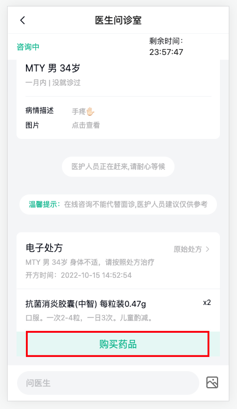
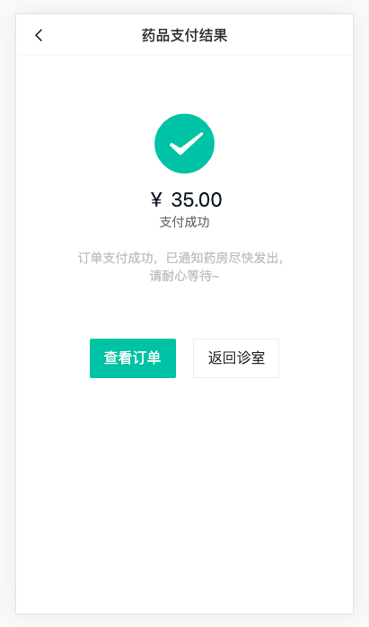
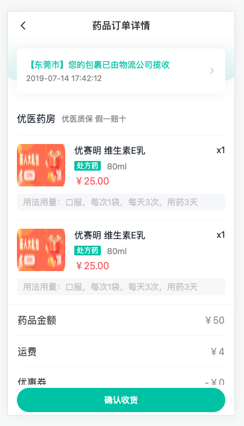
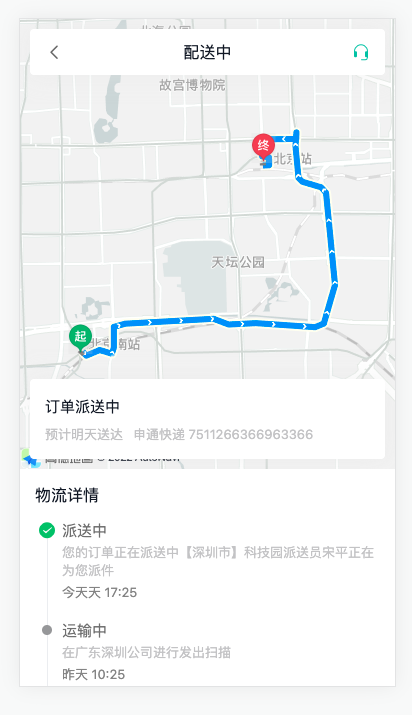
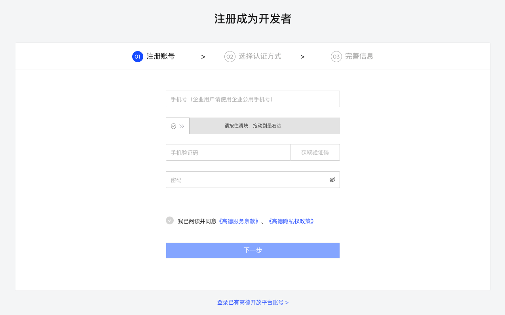
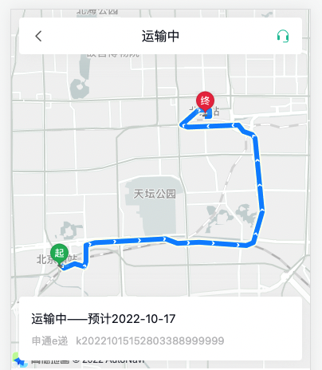

# 药品订单

## 药品订单-支付页面-路由

> 目标：配置路由，分析药品支付组件结构



1）路由与组件

```ts
    {
      path: '/medicine/pay',
      component: () => import('@/views/medicine/OrderPay.vue'),
      meta: { title: '药品支付' }
    }
```

## 药品订单-支付页面-类型定义和api函数

> 目标：定义药品订单预支付信息和收货地址类型和api函数

1. 定义类型

`types/medicine.d.ts`

```ts
import type { Medical } from './room'
// 药品预订单数据
export type OrderPre = {
  id: string
  couponId: string
  pointDeduction: number
  couponDeduction: number
  payment: number
  expressFee: number
  actualPayment: number
  medicines: Medical[]
}
// 地址信息
export type Address = {
  id: string
  mobile: string
  receiver: string
  province: string
  city: string
  county: string
  addressDetail: string
}

// 收货地址
export type AddressItem = Address & {
  isDefault: 0 | 1
  postalCode: string
}
```

2. 定义药品预支付查询[api函数](https://www.apifox.cn/apidoc/shared-16a58bff-e4db-465c-9c8b-859c839318ac/api-34951427)和查询收货地址[api函数](https://www.apifox.cn/apidoc/shared-16a58bff-e4db-465c-9c8b-859c839318ac/api-31781554)

`api/medicine.ts`

```ts
import type { OrderPre,AddressItem } from '@/types/medicine'
import { request } from '@/utils/request'

// 查询药品订单预支付信息
export const getMedicalOrderPre = (params: { prescriptionId: string }) =>
  request.get<any, OrderPre>('/patient/medicine/order/pre', { params })

// 获取收货地址列表
export const getAddressList = () => request.get<any, AddressItem[]>('/patient/order/address')
```

## 药品订单-支付页面-渲染支付详情

> 目标：获取药品预支付页面信息渲染

步骤：

1. 获取药品预支付信息和默认收货地址
2. 没有数据时展示骨架屏

说明❓：str.replace(/^(\d{3})(?:\d{4})(\d{4})$/, '\$1****\$2')手机号脱敏处理

`medicine/OrderPay.vue`

```vue
<script setup lang="ts">
import { getAddressList, getMedicalOrderPre } from '@/api/order'
import type { AddressItem, OrderPre } from '@/types/order'
import { onMounted, ref } from 'vue'
import { useRoute } from 'vue-router'

const route = useRoute()
// 1. 获取药品预订单信息和地址信息
const orderPre = ref<OrderPre>()
const address = ref<AddressItem>()
onMounted(async () => {
  const res = await getMedicalOrderPre({ prescriptionId: route.query.id as string })
  const addRes = await getAddressList()
  orderPre.value = res
  // 设置收货地址
  if (addRes.data.length) {
    const defAddress = addRes.find((item) => item.isDefault === 0)
    if (defAddress) address.value = defAddress
    else address.value = addRes[0]
  }
})
</script>

<template>
  <div class="order-pay-page" v-if="orderPre && address">
    <cp-nav-bar title="药品支付" />
    <div class="order-address">
      <p class="area">
        <van-icon name="location" />
        <span>{{ address.province + address.city + address.county }}</span>
      </p>
      <p class="detail">{{ address.addressDetail }}</p>
      <p>
        {{ address.receiver }}
        {{ address.mobile.replace(/^(\d{3})(?:\d{4})(\d{4})$/, '\$1****\$2') }}
      </p>
    </div>
    <div class="order-medical">
      <div class="head">
        <h3>优医药房</h3>
        <small>优医质保 假一赔十</small>
      </div>
      <div class="item van-hairline--top" v-for="med in orderPre.medicines" :key="med.id">
        
        <div class="info">
          <p class="name">
            <span>{{ med.name }}</span>
            <span>x{{ med.quantity }}</span>
          </p>
          <p class="size">
            <van-tag v-if="med.prescriptionFlag === 1">处方药</van-tag>
            <span>{{ med.specs }}</span>
          </p>
          <p class="price">￥{{ med.amount }}</p>
        </div>
        <div class="desc">{{ med.usageDosag }}</div>
      </div>
    </div>
    <div class="order-detail">
      <van-cell-group>
        <van-cell title="药品金额" :value="`￥${orderPre.payment}`" />
        <van-cell title="运费" :value="`￥${orderPre.expressFee}`" />
        <van-cell title="优惠券" :value="`-￥${orderPre.couponDeduction}`" />
        <van-cell title="实付款" :value="`￥${orderPre.actualPayment}`" class="price" />
      </van-cell-group>
    </div>
    <div class="order-tip">
      <p class="tip">
        由于药品的特殊性，如非错发、漏发药品的情况，药品一经发出
        不得退换，请核对药品信息无误后下单。
      </p>
      <van-checkbox>我已同意<a href="javascript:;">支付协议</a></van-checkbox>
    </div>
    <van-submit-bar
      :price="orderPre.actualPayment * 100"
      button-text="立即支付"
      button-type="primary"
      text-align="left"
    ></van-submit-bar>
  </div>
  <div class="order-pay-page" v-else>
    <cp-nav-bar title="药品支付" />
    <van-skeleton title :row="4" style="margin-top: 30px" />
    <van-skeleton title :row="4" style="margin-top: 30px" />
  </div>
</template>
```

## 药品订单-支付页面-进行支付

> 实现：对药品进行支付

说明❓：新建极速问诊订单，医生端app开处方后，点击购买药品进行支付



1）生成药品订单的[API函数](https://www.apifox.cn/apidoc/shared-16a58bff-e4db-465c-9c8b-859c839318ac/api-34951428)

`api/medicine.ts`

```ts
// 创建药品订单
export const createMedicalOrder = (data: { id: string; addressId: string; couponId?: string }) =>
  request.post<any, { id: string }>('/patient/medicine/order', data)
```

2）支付抽屉支持，设置回跳地址

`components/CpPaySheet.vue`

```diff
const { orderId, show, payCallback } = defineProps<{
  orderId: string
  actualPayment?: number
  onClose?: () => void
  show: boolean
+  payCallback?: string
}>()
```

```diff
// 跳转支付
const pay = async () => {
  if (paymentMethod.value === undefined) return Toast('请选择支付方式')
  Toast.loading('跳转支付')
  const res = await getConsultOrderPayUrl({
    orderId: orderId,
    paymentMethod: paymentMethod.value,
+    payCallback: payCallback || 'http://localhost/room'
  })
  window.location.href = res.payUrl
}
```

3) 生成订单，使用支付抽屉组件
   需求分析：
   1. 满足：同意支付协议、有收货地址、有效处方
   2. 药品订单是否存在：
      1. 不存在：创建订单，存储订单ID，打开支付抽屉
      2. 存在：直接打开支付抽屉

`medicine/OrderPay.vue`

```ts
import { ..., createMedicalOrder } from '@/api/medicine'

// 生成订单
const agree = ref(false)
const loading = ref(false)
// 控制抽屉和弹窗
const show = ref(false)
const orderId = ref('')
const submit = async () => {
  if (!agree.value) return Toast('请同意支付协议')
  if (!address.value?.id) return Toast('请选择收货地址')
  if (!orderPre.value?.id) return Toast('未找到处方')
  // 1. 没有生成订单ID
  if (!orderId.value) {
    loading.value = true
    try {
      const res = await createMedicalOrder({
        id: orderPre.value?.id,
        addressId: address.value?.id
      })
      orderId.value = res.id
      // 打开支付抽屉
      show.value = true
    } finally {
      loading.value = false
    }
  } else {
    // 2. 已经生成
    show.value = true
  }
}
```

```diff
    <div class="order-tip">
      <p class="tip">
        由于药品的特殊性，如非错发、漏发药品的情况，药品一经发出
        不得退换，请核对药品信息无误后下单。
      </p>
+      <van-checkbox v-model="agree">我已同意<a href="javascript:;">支付协议</a></van-checkbox>
    </div>
    <van-submit-bar
+     @click="submit"
+     :loading="loading"
      :price="orderPre.actualPayment * 100"
      button-text="立即支付"
      button-type="primary"
      text-align="left"
    ></van-submit-bar>
-    <!-- 支付 -->
+    <cp-pay-sheet
+      :orderId="orderId"
+      :actualPayment="orderPre.payment"
+      payCallback="http://localhost:5173/medicine/pay/result"
+      v-model:show="show"
+    />
```

## 药品订单-支付结果(课堂练习)

> 目标：显示支付结果




1）路由与组件

```ts
    {
      path: '/medicine/pay/result',
      component: () => import('@/views/medicine/OrderPayResult.vue'),
      meta: { title: '药品支付结果' }
    }
```

2）展示信息

1. 定义类型

`medicine.d.ts`

```ts
export type OrderDetail = {
  id: string
  orderNo: string
  type: 4
  createTime: string
  prescriptionId: string
  status: OrderType
  statusValue: string
  medicines: Medical[]
  countDown: number
  addressInfo: Address
  expressInfo: {
    content: string
    time: string
  }
  payTime: string
  paymentMethod?: 0 | 1
  payment: number
  pointDeduction: number
  couponDeduction: number
  payment: number
  expressFee: number
  actualPayment: number
  roomId: string
}
```

2. 定义[api函数](https://www.apifox.cn/apidoc/shared-16a58bff-e4db-465c-9c8b-859c839318ac/api-34951429)

`api/medicine.ts`


```ts
// 获取药品订单详情
export const getMedicalOrderDetail = (id: string) =>
  request.get<any, OrderDetail>(`/patient/medicine/order/detail/${id}`)
```

3. 获取数据渲染

`medicine/OrderPayResult.vue`

```vue
<script setup lang="ts">
import { getMedicalOrderDetail } from '@/api/medicine'
import type { OrderDetail } from '@/types/medicine'
import { onMounted, ref } from 'vue'
import { useRoute } from 'vue-router'

const route = useRoute()
const order = ref<OrderDetail>()
onMounted(async () => {
  const res = await getMedicalOrderDetail(route.query.orderId as string)
  order.value = res
})
</script>

<template>
  <div class="order-pay-result-page">
    <cp-nav-bar title="药品支付结果" />
    <div class="result">
      <van-icon name="checked" />
      <p class="price">￥ {{ order?.actualPayment }}</p>
      <p class="status">支付成功</p>
      <p class="tip">订单支付成功，已通知药房尽快发出， 请耐心等待~</p>
      <div class="btn">
        <van-button type="primary" :to="`/medicine/${order?.id}`">查看订单</van-button>
        <van-button :to="`/room?orderId=${order?.roomId}`">返回诊室</van-button>
      </div>
    </div>
  </div>
</template>
```

## 药品订单-订单详情-路由和渲染

> 实现：配置药品订单详情路由和渲染




1）路由与组件

```ts
    {
      path: '/medicine/:id',
      component: () => import('@/views/medicine/OrderDetail.vue'),
      meta: { title: '药品订单详情' }
    }
```

2）获取订单详情数据hook封装

说明❓：和支付结果使用同一个api函数

`hooks/index.ts`

```ts
import { getMedicalOrderDetail } from '@/api/medicine'
import type { OrderDetail } from '@/types/medicine'
import { onMounted, ref } from 'vue'

export const useOrderDetail = (id: string) => {
  const loading = ref(false)
  const order = ref<OrderDetail>()
  onMounted(async () => {
    loading.value = true
    try {
      const res = await getMedicalOrderDetail(id)
      order.value = res
    } finally {
      loading.value = false
    }
  })
  return { order, loading }
}
```

3）获取信息且渲染

```vue
<script setup lang="ts">
import { useRoute } from 'vue-router'
import { useOrderDetail } from '@/hooks'

const route = useRoute()
const { order } = useOrderDetail(route.params.id as string)
</script>

<template>
  <div class="order-detail-page" v-if="order">
    <cp-nav-bar title="药品订单详情" />
    <div class="order-head">
      <div class="card" @click="$router.push(`/medicine/express/${order?.id}`)">
        <div class="logistics">
          <p>{{ order.expressInfo?.content || '已通知快递取件' }}</p>
          <p>{{ order.expressInfo?.time || '--' }}</p>
        </div>
        <van-icon name="arrow" />
      </div>
    </div>
    <!-- 药品列表 -->
    <div class="order-medical">
      <div class="head">
        <h3>优医药房</h3>
        <small>优医质保 假一赔十</small>
      </div>
      <div class="item van-hairline--top" v-for="med in order.medicines" :key="med.id">
        
        <div class="info">
          <p class="name">
            <span>{{ med.name }}</span>
            <span>x{{ med.quantity }}</span>
          </p>
          <p class="size">
            <van-tag v-if="med.prescriptionFlag === 1">处方药</van-tag>
            <span>{{ med.specs }}</span>
          </p>
          <p class="price">￥{{ med.amount }}</p>
        </div>
        <div class="desc" v-if="med.usageDosag">{{ med.usageDosag }}</div>
      </div>
    </div>
    <div class="order-detail">
      <van-cell-group>
        <van-cell title="药品金额" :value="`￥${order.payment}`" />
        <van-cell title="运费" :value="`￥${order.expressFee}`" />
        <van-cell title="优惠券" :value="`-￥${order.couponDeduction}`" />
        <van-cell title="实付款" :value="`￥${order.actualPayment}`" class="price" />
        <van-cell title="订单编号" :value="order.orderNo" />
        <van-cell title="创建时间" :value="order.createTime" />
        <van-cell title="支付时间" :value="order.payTime" />
        <van-cell title="支付方式" :value="order.paymentMethod === 0 ? '微信' : '支付宝'" />
      </van-cell-group>
    </div>
    <van-action-bar>
      <van-action-bar-button type="primary" text="确认收货" />
    </van-action-bar>
  </div>
</template>
```

注意⚠️：物流信息返回可能会有延迟，需要手动刷新页面测试

## 药品订单-物流详情-路由和渲染

> 实现：配置物流详情路由和渲染



1）路由与组件

```ts
    {
      path: '/medicine/express/:id',
      component: () => import('@/views/medicine/OrderExpress.vue'),
      meta: { title: '物流详情' }
    }
```

2）相关类型声明
`types/medicine.d.ts`

```ts
// 物流日志item
export type Log = {
  id: string
  content: string
  createTime: string
  status: number // 订单派送状态：1已发货 2已揽件 3 运输中 4 派送中 5已签收
  statusValue: string
}
// 经纬度
export type Location = {
  longitude: string
  latitude: string
}
// data数据
export type Express = {
  estimatedTime: string
  name: string
  awbNo: string
  status: ExpressStatus
  statusValue: string
  list: Log[]
  logisticsInfo: Location[]
  currentLocationInfo: Location
}
```

3）获取物流详情[API函数](https://www.apifox.cn/apidoc/shared-16a58bff-e4db-465c-9c8b-859c839318ac/api-31781561)
`api/medicine.ts`

```ts
// 获取药品订单物流信息
export const getMedicalOrderLogistics = (id: string) =>
  request.get<any, Express>(`/patient/order/${id}/logistics`)
```

4）获取数据且渲染

`Medicine/OrderExpress.vue`

```vue
<script setup lang="ts">
import { getMedicalOrderLogistics } from '@/api/medicine'
import type { Express } from '@/types/medicine'
import { onMounted, ref } from 'vue'
import { useRoute } from 'vue-router'

// 获取物流信息
const express = ref<Express>()
const route = useRoute()
onMounted(async () => {
  const res = await getMedicalOrderLogistics(route.params.id as string)
  express.value = res
})
</script>

<template>
  <div class="order-logistics-page">
    <div id="map">
      <div class="title">
        <van-icon name="arrow-left" @click="$router.back()" />
        <span>{{ express?.statusValue }}</span>
        <van-icon name="service" />
      </div>
      <div class="current">
        <p class="status">{{ express?.statusValue }}——预计{{ express?.estimatedTime }}送达</p>
        <p class="predict">
          <span>{{ express?.name }}</span>
          <span>{{ express?.awbNo }}</span>
        </p>
      </div>
    </div>
    <div class="logistics">
      <p class="title">物流详情</p>
      <van-steps direction="vertical" :active="0">
        <van-step v-for="item in express?.list" :key="item.id">
          <p class="status" v-if="item.statusValue">{{ item.statusValue }}</p>
          <p class="content">{{ item.content }}</p>
          <p class="time">{{ item.createTime }}</p>
        </van-step>
      </van-steps>
    </div>
  </div>
</template>
```

## 药品订单-高德地图-初始化

> 目标：注册[高德地图](https://lbs.amap.com)开放平台并初始化地图

步骤：

- 准备工作 https://lbs.amap.com/api/jsapi-v2/guide/abc/prepare
- Vue中使用 https://lbs.amap.com/api/jsapi-v2/guide/webcli/map-vue1



参考文档

- [Web开发-JSAPI文档](https://lbs.amap.com/api/jsapi-v2/summary/)

流程：

1. 注册&认证个人开发者===>创建web应用====>得到 `key` 和 `jscode`

- `key` 4eed3d61125c8b9c168fc22414aaef7e
- `jscode` 415e917da833efcf2d5b69f4d821784b

2. 在vue3项目中使用

代码：

1. [按 NPM 方式使用 Loader](https://lbs.amap.com/api/jsapi-v2/guide/webcli/map-vue1)，安装

```bash
pnpm i @amap/amap-jsapi-loader
```

2. 配置安全密钥 securityJsCode

`medicine/OrderExpress.vue`

```ts
// v2.0 需要配置安全密钥jscode
window._AMapSecurityConfig = {
  securityJsCode: '415e917da833efcf2d5b69f4d821784b'
}
```

3. 扩展 Window 的类型

`types/global.d.ts`

```ts
interface Window {
  _AMapSecurityConfig: {
    securityJsCode: string
  }
}  
```

4. 组件初始化的时候：加载高德地图需要的资源

`Medicine/OrderExpress.vue`

```ts
import AMapLoader from '@amap/amap-jsapi-loader'
```

```ts
onMounted(async () => {
  // ... 省略 ...
  AMapLoader.load({
    key: '4eed3d61125c8b9c168fc22414aaef7e',
    version: '2.0'
  }).then((AMap) => {
    // 使用 Amap 初始化地图
  })
})
```

5. 初始化地图，参考[demo示例](https://lbs.amap.com/demo/list/jsapi-v2)

`Medicine/OrderExpress.vue`

```vue
<div id="map">...</div>
```

```ts
const app = new AMap.Map("map",{ //设置地图容器id
  zoom:12, //初始化地图级别
  mapStyle: 'amap://styles/whitesmoke' // 设置地图样式
});
```


## 药品订单-高德地图-物流轨迹

> 实现：使用高德地图api绘制物流轨迹

步骤：

- 绘制轨迹
- 绘制起点和终点位置

代码：

1. 根据 [参考示例-使用经纬度获取驾车规划数据](https://lbs.amap.com/demo/jsapi-v2/example/driving-route/plan-route-according-to-lnglat)，获取路线规划方案

说明❓：[通过插件引入](https://lbs.amap.com/api/javascript-api/guide/abc/plugins)



```ts
AMap.plugin('AMap.Driving', () => {
  var driving = new AMap.Driving({
    map: map, // 指定轨迹显示地图实例
    showTraffic: false // 关闭交通状态
  })
	// 开始位置坐标
  var startLngLat = [116.379028, 39.865042]
  // 结束位置坐标
  var endLngLat = [116.427281, 39.903719]

  driving.search(startLngLat, endLngLat, function (status: string, result: object) {
    // 未出错时，result即是对应的路线规划方案
  })
})
```

2. 使用当前药品订单物流坐标信息，获取：开始坐标、途经点坐标、终点坐标

```diff
    AMap.plugin('AMap.Driving', () => {
      var driving = new AMap.Driving({
        map: map, // 指定轨迹显示地图实例
        showTraffic: false // 关闭交通状态
      })

-      // var startLngLat = [116.38, 39.87]
-      // var endLngLat = [116.37, 40.1]
      // == 替换真实物流坐标数据 ==
      // 第一个是起始坐标，第二个是终点坐标， 第三个是路途中的经纬度坐标， 第四个规划好了的回调函数
      // 1. 使用经纬度数组中的第一个数据：起始坐标
+     const start = express.value?.logisticsInfo.shift()
      // 2. 使用经纬度数组中的最后一个数据：结束坐标
+      const end = express.value?.logisticsInfo.pop()
-     // 3. 途径点坐标：express.value?.logisticsInfo shift和pop后剩余未途经点坐标，处理成二维数据
+      const road = express.value?.logisticsInfo.map((item) => [item.longitude, item.latitude])

      driving.search(
+       [start?.longitude, start?.latitude],
+        [end?.longitude, end?.latitude],
        {
+          waypoints: road  // 显示途经点坐标
        },
        function (status: string, result: object) {
          // 未出错时，result即是对应的路线规划方案
        }
      )
    })
```

3. 关闭路线规划默认 `marker` 标记，自定义[ `marker` 标记 ](https://lbs.amap.com/api/jsapi-v2/guide/map/map-layer)

```diff
  const driving = new AMap.Driving({
    map: map,
    showTraffic: false,
+    hideMarkers: true
  })
```

```ts
import carImg from '@/assets/car.png'
import startImg from '@/assets/start.png'
```

```ts
// 自定义开始结束位置图片
const startMarker = new AMap.Marker({
  icon: startImg, // 设置自定义图片
  position: [start?.longitude, start?.latitude] // 图片显示的坐标位置
})
map.add(startMarker)
const endMarker = new AMap.Marker({
  icon: endImg,
  position: [end?.longitude, end?.latitude]
})
map.add(endMarker)
```

## 药品订单-高德地图-当前位置

> 实现：标记物流货车当前运送位置

代码：

```ts
import endImg from '@/assets/end.png'
```

```diff
      driving.search(
        [start?.longitude, start?.latitude],
        [end?.longitude, end?.latitude],
        {
          waypoints: road
        },
        function (status: string, result: object) {
          // 未出错时，result即是对应的路线规划方案
-         // 绘制运输中货车的当前位置
+          const carMarker = new AMap.Marker({
+            icon: carImg,
+            position: [
+              express.value?.currentLocationInfo.longitude,
+              express.value?.currentLocationInfo.latitude
+            ],
+            anchor: 'center' // 设置基于坐标点显示的位置
+          })
+          map.add(carMarker)
-          // 3s后，定位到货车，放大地图
+          setTimeout(() => {
+            map.setFitView([carMarker])
+            map.setZoom(10)
+          }, 3000)
        }
      )
    })
```