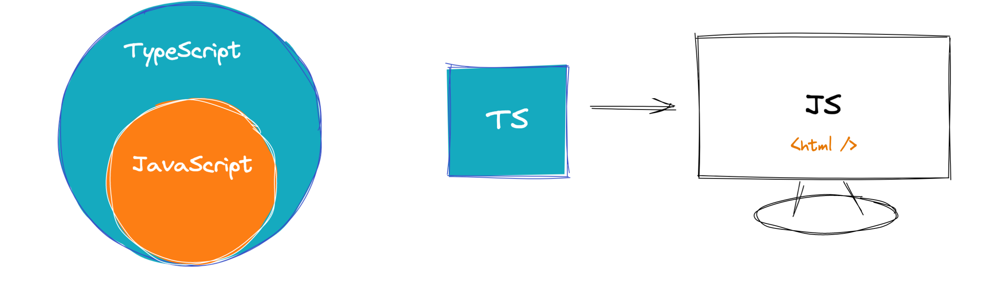

# TypeScript 起步


## TypeScript 介绍{#intro}

> 知道：TS是带类型语法的JS


官方网站：https://www.typescriptlang.org/

~~中文官网：https://www.tslang.cn/~~



`TypeScript` 是一种带有 `类型语法` 的 JavaScript 语言，在任何使用 JavaScript 的开发场景中都可以使用。

JavaScript 代码

```js
// 没有明确的类型
let age = 18
```

TypeScript 代码

```typescript
// 有明确的类型，可以指定age是number类型(数值类型)
let age: number = 18
```


注意：TS 需要编译才能在浏览器运行。

总结：TS 是 JS 的超集，支持了JS 语法和扩展了类型语法。


## TypeScript 作用{#effect}

> 知道：TS作用是在编译时进行类型检查提示错误

发现：

- 在程序运行的时候 <span style="color:red">Uncaught TypeError...</span> 这个错误挺常见的
- 这些错误导致在开发项目的时候，需要花挺多的时间去定位和处理 BUG

```js
const num = 18;
num.toLowerCase() 
// Uncaught TypeError: num.toLowerCase is not a function
```

原因：

- JS 是动态类型的编程语言，动态类型最大的特点就是它只能在 `代码执行` 期间做类型的相关检查，所以往往你发现问题的时候，已经晚了。

方案：

- TS 是静态类型的编程语言，代码会先进行编译然后去执行，在 `代码编译` 期间做类型的相关检查，如果有问题编译是不通过的，也就暴露出了问题。
- 配合 VSCode 等开发工具，TS 可以提前到在 `编写代码` 的时候就能发现问题，更准确更快的处理错误。

TS 优势：

- 更早发现错误，提高开发效率
- 随时随地提示，增强开发体验
- 强大类型系统，代码可维护性更好，重构代码更容易
- 类型推断机制，减少不必要类型注解，让编码更简单
- 最后：Vue3源码TS重写，React和TS完美配合，Angular默认支持TS，大中型前端项目首选。

`Vue3 + TS` 最新的开发技术栈，你还在等什么？

## TypeScript 编译{#compile}

> 知道：如何使用 tsc 编译 ts 代码

全局安装：

```bash
# npm 安装
npm i -g typescript
# yarn 安装
yarn global add typescript
# 部分mac电脑安装需要sudo权限
# sudo npm i -g typescript
# sudo yarn global add typescript
```

查看版本：

```bash
tsc -v
```

编译 TS：

- 新建 `hello.ts` 文件
- 当前目录打开命令行窗口，执行 `tsc hello.ts` 命令，同级目录生成 `hello.js` 文件
- 执行 `node hello.js` 验证一下

思考：

- 以后我们写 ts 都是手动的编译执行吗？
  - 在开发中：一般使用 `webpack` `vite` 等工具自动构建编译。

# TypeScript 核心

## 类型注解{#annotate}

> 知道：TypeScript 类型注解
>
> 语法：let 变量名:类型 = 值

示例代码：

```typescript
// 约定变量 age 的类型为 number 类型
let age: number = 18;
age = 19;
```

- `: number` 就是类型注解，它为变量提供类型约束。
- 约定了什么类型，就只能给该变量赋值什么类型的值，否则报错。
- 而且：约定类型之后，代码的提示也会非常清晰。

错误演示：

```typescript
let age: number = 18;
// 报错：不能将类型“string”分配给类型“number”
age = '19';
```

小结：

- 什么是类型注解？
  - 变量后面约定类型的语法，就是类型注解
- 类型注解作用？
  - 约定类型，明确提示

## 原始类型{#base}

> 知道：ts 有哪些类型，掌握：原始类型使用

TS 常用类型：

- JS 已有类型
  - 简单类型，`number` `string` `boolean` `null` `undefined`
  - 复杂类型，对象 数组 函数
- TS 新增类型
  - 联合类型、自定义类型(类型别名)、接口、元组、字面量类型、枚举、void、any、泛型 等

原始类型：

- 使用简单，完全按照 JS 的类型来书写即可

```typescript
let age: number = 18;
let myName: string = '黑马程序员';
let isLoading: boolean = false;
let nullValue: null = null;
let undefinedValue: undefined = undefined;
```

## 数组类型{#array}

> 掌握：数组类型的两种写法

- 写法 1

```typescript
let numbers: number[] = [1, 3, 5];
```

- 写法 2

```typescript
let strings: Array<string> = ['a', 'b', 'c'];
```

推荐使用：

- `number[]` 写法

思考：

- 如果数组需要存储多种类型数据呢？

## 联合类型{#union}

> 掌握：通过联合类型将多个类型合并为一个类型
>
> 语法：type1 | type2 ...

需求：数组中有 `number` 和 `string` 类型，这个数组的类型如何书写？

```typescript
let arr: (number | string)[] = [1, 'a', 3, 'b'];
```

定义：

- 类型与类型之间使用 `|` 连接，代表类型可以是它们当中的其中一种，这种类型叫：`联合类型`

---

练习：给一个定时器 ID 加类型

```typescript
let timer: number | null = null;
timer = setInterval(() => {}, 1000);
```

思考：

```typescript
let arr: number | string[];
// 这是什么类型？
```

## 类型别名{#alias}

> 掌握：使用类型别名语法给类型取别字
>
> 语法：type 别名变量名 = types类型值

示例代码：

```typescript
// let arr: ( number | string )[] = [ 1, 'a', 4]
// 类型别名: type 类型别名 = 具体类型
type CustomArr = (number | string)[];
let arr: CustomArr = [1, 'a', 4];
```

类型别名:

- `type 类型别名 = 具体类型` 基本语法
- 定义类型别名，遵循大驼峰命名规范，类似于变量
- 使用类型别名，与类型注解的写法一样即可

使用场景：

- 当同一类型（复杂）被多次使用时，可以通过类型别名，`简化` 该类型的使用

```typescript
type CustomArr = (number | string)[];
let arr: CustomArr = [1, 'a', 4];
let arr2: CustomArr = [2, 'b', 8];
```

## 函数类型{#fn}

### 基本使用{#fn-base}

> 掌握：给函数指定类型

- 给函数指定类型，其实是给 `参数` 和 `返回值` 指定类型。
- 两种写法：
  - 在函数基础上 `分别指定` 参数和返回值类型
  - 使用类型别名 `同时指定` 参数和返回值类型

示例代码 1：分别指定

```typescript
// 函数声明
function add(num1: number, num2: number): number {
  return num1 + num2;
}

// 箭头函数
const add = (num1: number, num2: number): number => {
  return num1 + num2;
};
```

示例代码 2：同时指定

```typescript
type AddFn = (num1: number, num2: number) => number;

const add: AddFn = (num1, num2) => {
  return num1 + num2;
};
```

::: tip 注意：
通过类似箭头函数形式的语法来为函数添加类型，只适用于 `函数表达式`
:::

### void 类型{#fn-void}

> 掌握：void 函数返回值类型

- 如果函数没有返回值，定义函数类型时返回值类型为 `void`

```typescript
const say = (): void => {
  console.log('hi');
};
```

- 如果函数没有返回值，且没有定义函数返回值类型的时候，默认是 `void`

```typescript
const say = () => {
  console.log('hi');
};
```

注意：

- 在 `JS` 中如果没有返回值，默认返回的是 `undefined`
- 但是 `void` 和 `undefined` 在 `TypeScript` 中并不是一回事
- 如果指定返回值类型是 `undefined` 那返回值必须是 `undefined`

```typescript
const add = (): undefined => {
  return undefined;
};
```

### 可选参数{#fn-params}

> 掌握： 使用 `?` 将参数标记为可选

- 如果函数的参数，可以传也可以不传，这种情况就可以使用 `可选参数` 语法，参数后加 `?` 即可

```typescript
const fn = (n?: number) => {
  // ..
};
fn();
fn(10);
```

- 练习，模拟 `slice` 函数，定义函数参数类型

```typescript
const mySlice = (start?: number, end?: number) => {
  console.log('起始Index:', start, '结束Index:', end);
};
mySlice();
mySlice(1);
mySlice(1, 2);
```

:::tip 注意：

- 必选参数不能位于可选参数后 `(start?: number, end: number)` 这样是不行的
  :::

## 对象类型{#object}

### 基本使用{#obj-base}

> 掌握：对象类型语法
>
> 语法：变量名:{key1:type1; key2:type2...}

- TS 的对象类型，其实就是描述对象中的 `属性` `方法` 的类型，因为对象是由属性和方法组成的。

```typescript
// 空对象
let person: {} = {};

// 有属性的对象
let person: { name: string } = {
  name: '同学',
};

// 有属性和方法，一行书写多个属性 ; 分隔
let person: { name: string; sayHi(): void } = {
  name: 'jack',
  sayHi() {},
};

// 换行写可以省略 ; 符号
let person: {
  name: string;
  sayHi(): void;
} = {
  name: 'jack',
  sayHi() {},
};
```

小结：

- 使用声明描述对象结构？`{}`
- 属性怎么写类型？`属性名: 类型`
- 方法怎么写类型? `方法名(): 返回值类型`

### 扩展用法{#obj-ext}

> 掌握：对象类型中，函数使用箭头函数类型，属性设置可选，使用类型别名。

- 函数使用箭头函数类型

```typescript{3}
let person: {
  name: string
  sayHi: () => void
} = {
  name: 'jack',
  sayHi() {},
};
```

- 对象属性可选

```typescript
// 例如：axios({url,method}) 如果是 get 请求 method 可以省略
const axios = (config: { url: string; method?: string }) => {};
```

- 使用类型别名

```typescript
// {} 会降低代码可阅读性，建议对象使用类型别名
// const axios = (config: { url: string; method?: string }) => {};
type Config = {
  url: string;
  method?: string;
};
const axios = (config: Config) => {};
```

小结：

- 对象的方法使用箭头函数类型怎么写？`{sayHi:()=>void}`
- 对象的可选属性怎么设置？`{name?: string}`
- 对象类型会使用 `{}` 如何提供可阅读性？`类型别名`

:::warning 练习
创建一个学生对象，该对象中具有以下属性和方法：

- 属性：必选属性：姓名、性别、成绩，可选属性：身高
- 方法：学习、打游戏（可选）
  :::

## 接口类型{#interface}

### 基本使用{#interface-base}

> 掌握：使用 interface 声明对象类型
>
> 语法：interface 接口类型名字 {key1:type1; key2?:type2...}

- 接口声明是命名对象类型的另一种方式

```typescript
// 通过interface定义对象类型
interface Person {
  name: string;
  age: number;
  sayHi: () => void;
}
// 使用类型
let person: Person = {
  name: 'jack',
  age: 19,
  sayHi() {},
};
```

小结：

- `interface` 后面是接口名称，和类型别名的意思一样。
- 指定 `接口名称` 作为变量的类型使用。
- 接口的每一行只能有 `一个` 属性或方法，每一行不需要加分号。

### interface 继承{#interface-extends}

> 掌握：使用 extends 实现接口继承，达到类型复用

思考：

- 有两个接口，有相同的属性或者函数，如何提高代码复用？

```typescript
interface Point2D {
  x: number;
  y: number;
}
interface Point3D {
  x: number;
  y: number;
  z: number;
}
```

继承：

- 相同的属性或展示可以抽离出来，然后使用 `extends` 实现继承复用

```typescript
interface Point2D {
  x: number;
  y: number;
}
// 继承 Point2D
interface Point3D extends Point2D {
  z: number;
}
// 继承后 Point3D 的结构：{ x: number; y: number; z: number }
```

小结：

- 接口继承的语法：`interface 接口A extends 接口B {}`
- 继承后 `接口A` 拥有 `接口B` 的所有属性和函数的类型声明

### type 交叉类型{#type}

> 掌握：使用 `交叉类型` 实现接口的继承效果

- 实现 `Point2D` 与 `{z: number}` 类型合并得到 `Ponit3D` 类型

```typescript
// 使用 type 来定义 Point2D 和 Point3D
type Point2D = {
  x: number;
  y: number;
};

// 使用 交叉类型 来实现接口继承的功能：
// 使用 交叉类型 后，Point3D === { x: number; y: number; z: number }
type Point3D = Point2D & {
  z: number;
};

let o: Point3D = {
  x: 1,
  y: 2,
  z: 3,
};
```

小结：

- 使用 `&` 可以合并连接的对象类型，也叫：`交叉类型`

### interface vs type{#interface-type}

> 了解：interface 和 type 的相同点和区别

- 类型别名和接口非常相似，在许多情况下，可以在它们之间`自由选择`。
- 接口的几乎所有特性都以类型的形式可用，关键的区别在于不能重新打开类型以添加新属性，而接口总是`可扩展`的。

| interface      | type                     |
| -------------- | ------------------------ |
| 支持：对象类型 | 支持：对象类型，其他类型 |
| 复用：可以继承 | 复用：交叉类型           |

不同的点：

- type 不可重复定义

```typescript
type Person = {
  name: string;
};
// 标识符“Person”重复  Error
type Person = {
  age: number;
};
```

- interface 重复定义会合并

```typescript
interface Person {
  name: string;
}
interface Person {
  age: number;
}
// 类型会合并
const p: Person = {
  name: 'jack',
  age: 18,
};
```

小结：

- 它们都可以定义对象类型
- 它们都可以复用，interface 使用 `extends` , type 使用 `&`
- type 不能重复定义，interface 可以重复会合并

## 字面量类型{#literal}

### 字面量类型介绍{#literal-intro}

> 知道：什么是字面量类型？类型是一个具体的值（类似常量）

- js 字面量如：`18` `'jack'` `['a']` `{age: 10}` 等等。
- 使用 `js字面量` 作为变量类型，这种类型就是字面量类型。

```typescript
// : 'jack' 是字面量类型
let name: 'jack' = 'jack';
// : 18 是字面量类型
let age: 18 = 18;

// 报错：不能将类型“19”分配给类型“18”
age = 19;
```

思考：这两个变量的类型是什么？

```typescript
let str1 = 'Hello TS';
const str2 = 'Hello TS';
```

- 通过类型推断发现，str1 类型是 `string` ， str2 类型是 `Hello TS`
- 原因：`str2` 是 `const` 声明的，值只能是 `Hello TS`，所以类型只能是 `Hello TS`

### 字面量类型应用{#literal-use}

> 知道：字面量类型的应用场景

例如：性别只能是 男 和 女，不会出现其他值。

```ts
// let gender = '男'
// gender = '女'
// ------------------------
type Gender = '男' | '女'
let gender: Gender = '男'
gender = '女'
```

小结：

- 字面量类型配合联合类型来使用，表示：一组明确的可选的值

例子：

```ts
// 使用自定义类型:
type Direction = 'up' | 'down' | 'left' | 'right'

function changeDirection(direction: Direction) {
  console.log(direction)
}

// 调用函数时，会有类型提示：
changeDirection('up')
```

- 解释：参数 `direction` 的值只能是 `up/down/left/right` 中的任意一个
- 优势：相比于 `string` 类型，使用字面量类型更加精确、严谨

## 类型推断{#type-infer}

> 知道：TS 的的类型推断机制作用？根据定义变量的值，自动添加类型约束

- 在 TS 中存在类型推断机制，在没有指定类型的情况下，TS 也会给变量提供类型。

发生类型推断的几个场景场景：

- 声明变量并初始化时

```typescript
// 变量 age 的类型被自动推断为：number
let age = 18;
```

- 决定函数返回值时

```typescript
// 函数返回值的类型被自动推断为：number
const add = (num1: number, num2: number) => {
  return num1 + num2;
};
```

:::tip 建议：

- 将来在开发项目的时候，能省略类型注解的地方就省略，`充分利用TS推断` 的能力，提高开发效率。
- 在你还没有熟悉 ts 类型的时候建议都加上类型，比如今天第一次写 ts 最好都写上
- 如果你不知道类型怎么写，可以把鼠标放至变量上，可以通过 `Vscode` 提示看到类型
  :::


## 类型断言{#type-assert}

> 语法：let 变量名 = 值 as 类型

有时候你会比 TS 更加明确一个值的类型，此时，可以使用类型断言来指定更具体的类型。 比如，

```ts
// aLink 的类型 HTMLElement，该类型只包含所有标签公共的属性或方法
// 这个类型太宽泛，没包含 a 元素特有的属性或方法，如 href
const aLink = document.getElementById('link')
```

- 但是我们明确知道获取的是一个 `A` 元素，可以通过 `类型断言` 给它指定一个更具体的类型。

```ts
const aLink = document.getElementById('link') as HTMLAnchorElement
```

- 解释:
  1. 使用 `as` 关键字实现类型断言
  2. 关键字 `as` 后面的类型是一个更加具体的类型（HTMLAnchorElement 是 HTMLElement 的子类型）
  3. 通过类型断言，aLink 的类型变得更加具体，这样就可以访问 a 标签特有的属性或方法了

例如：

```ts
const img = document.getElementById('img') as HTMLImageElement
// 如果不知道标签的类型：document.querySelector('div') 鼠标摸上去就可以看见
```

## 泛型{#generic}

> 作用：泛型（Generics）可以在保证类型安全前提下，给别名、接口、函数等添加**类型参数**，从而实现**复用**

:::tip

- 软件工程中，我们不仅要创建一致的定义良好的API，同时也要考虑**可重用性**。 组件不仅能够支持当前的数据类型，同时也能支持未来的数据类型，这在创建大型系统时为你提供了十分灵活的功能。 
- 在TypeScript中，泛型是一种创建**可复用**代码组件的工具。这种组件不只能被一种类型使用，而是能被多种类型复用。类似于参数的作用，泛型是一种用以**增强类型（types）、接口（interfaces）、函数类型等**能力的非常可靠的手段。   
  :::

### 泛型别名{#generic-alias}

> 掌握：泛型别名基本使用，实现类型复用
>
> 语法：type 类型别名<Type1, Type2...> = {}

```ts
// 对后台返回的数据进行类型定义
type User = {
  name: string;
  age: number;
}

type Goods = {
  id: number;
  goodsName: string;
}

type Data<T> = {
  msg: string;
  code: number;
  data: T
}

// 使用类型
type UserData = Data<User>
type GoodsData = Data<Goods>
```

小结：

- 泛型：定义类型别名后加上`<类型参数>` 就是泛型语法， 使用的时候传入具体的类型即可
- `<T>` 是一个变量，可以随意命名，建议遵循大驼峰即可。
- 和类型别名配合，在类型别名后加上泛型语法，然后类型别名内就可以使用这个类型参数
- 泛型可以提高类型的`复用性`和`灵活性`


### 泛型接口{#generic-interface}

> 掌握：泛型接口基本使用，实现类型复用，了解内置泛型接口
>
> interface 接口名<Type1, Type2...> {}

```ts
// 对象，获取单个ID函数，获取所有ID函数，ID的类型肯定是一致的，但是可能是数字可能是字符串
interface IdFn<T> {
  id: () => T;
  ids: () => T[];
}

const idObj: IdFn<number> = {
  id() { return 1 },
  ids() { return [1, 2] },
};
```

- 在接口名称的后面添加 `<类型变量>`，那么，这个接口就变成了泛型接口，接口中所有成员都可以使用类型变量。

内置的泛型接口：

```ts
const arr = [1, 2, 3];
// TS有自动类型推断，其实可以看做：const arr: Array<number> = [1, 2, 3]
arr.push(4);
arr.forEach((item) => console.log(item));
```

- 可以通过 Ctrl + 鼠标左键(Mac：Command + 鼠标左键) 去查看内置的泛型接口


### 泛型函数{#generic-fn}

> 掌握：泛型函数基本使用，保证函数内类型复用，且保证类型安全
>
> 语法：const fn = <Type1, Type2...>(a:Type1, b:Type2):Type1=>{}

```ts
// 函数的参数是什么类型，返回值就是什么类型
function getId<T>(id: T): T {
  return id
}

let id1 = getId<number>(1)
let id2 = getId('2')
// TS会进行类型推断，参数的类型作为泛型的类型 getId<string>('2')
```

小结

- 泛型函数语法？
  - 函数名称后加上 `<T>` ， `T`是类型参数，是个类型变量，命名建议遵循大驼峰即可。
- `T` 什么时候确定？
  - 当你调用函数的时候，传入具体的类型，T 或捕获到这个类型，函数任何位置均可使用。
- 泛型函数好处？
  - 让函数可以支持不同类型（复用），且保证类型是安全的。
- 调用函数，什么时候可以省略泛型？
  - 传入的数据可以推断出你想要的类型，就可以省略。

```ts
// 我需要的类型 { name: string, age?: number } 但是推断出来是 { name: string}
let id2 = getId({name:'jack'})
```

## any 类型{#any}

> 知道：any 类型的作用是逃避 TS 的类型检查

- 显式any情况：当变量的类型指定为 any 的时候，不会有任何错误，也不会有代码提示，TS会忽略类型检查

```ts
let obj: any = { age: 18 }
obj.bar = 100
obj()
```

以上的代码虽然没有报错提示，但是将来是可能出现错误的。

- 隐式any的情况：声明变量不给类型或初始值，函数参数不给类型或初始值

```ts
// 声明变量不给类型或初始值
let a;
// 函数参数不给类型或初始值
const fn = (n) => {}
```

小结：

- `any` 的使用越多，程序可能出现的漏洞越多，因此**不推荐**使用 `any` 类型，尽量避免使用。


# 第二天


# TypeScript 应用

## 创建 vue-ts 项目(预习){#vue-ts}

> 创建一个基于 ts 的 vue 项目，来学习 ts 语法

命令说明❓：`npm create vite@latest 项目名 --template vue-ts`

```bash
# npm 6.x
npm create vite@latest my-vue-ts-app --template vue-ts

# npm 7+, extra double-dash is needed:
npm create vite@latest my-vue-ts-app -- --template vue-ts

# yarn
yarn create vite my-vue-ts-app --template vue-ts

# pnpm
pnpm create vite my-vue-ts-app --template vue-ts
```

在基于 vite 的项目中可以直接验证 ts 代码结果，因为已经配置好了 ts 环境。


## ① TypeScript与Vue{#ts-vue}

:::tip
typescript 配合 Vue3 composition-api 使用

https://staging-cn.vuejs.org/guide/typescript/composition-api.html
:::

## defineProps与Typescript{#ts-define-props}

> 掌握：ts中defineProps的使用

1. defineProps的运行时写法

```ts
// 运行时声明
defineProps({
  money: {
    type: Number,
    required: true
  },
  car: {
    type: String,
    required: true
  }
})
```

2. defineProps配合ts的泛型定义props类型校验，这样更直接

```ts
// 使用ts的泛型指令props类型
defineProps<{
  money: number
  car?: string
}>()
```

3. props可以通过解构来指定默认值

```ts
<script lang="ts" setup>
// 使用ts的泛型指令props类型
const { money, car = '小黄车' } = defineProps<{
  money: number
  car?: string
}>()
</script>
```


如果提供的默认值需要在模板中渲染，需要额外添加配置，才能正常显示默认值

https://vuejs.org/guide/extras/reactivity-transform.html#explicit-opt-in

```ts
// vite.config.ts
export default {
  plugins: [
    vue({
      reactivityTransform: true
    })
  ]
}
```


## defineEmits与Typescript{#ts-define-emits}

> 掌握：defineEmits的使用

1. defineEmits配合运行时声明

```ts
const emit = defineEmits(['change', 'update'])
```

2. defineEmits配合ts 类型声明，可以实现更细粒度的校验

```ts
const emit = defineEmits<{
  (e: 'changeMoney', money: number): void
  (e: 'changeCar', car: string): void
}>()
```

- 基于类型的声明使我们可以对所触发事件的类型进行更细粒度的控制。


## ref与Typescript{#ts-ref}

> 掌握：ts中ref函数如何使用

1. 通过泛型指定value的值类型，如果是简单值，该类型可以省略

```ts
const money = ref<number>(10)

const money = ref(10)
```

2. 如果是复杂类型，推荐显示指定泛型

```ts
type Todo = {
  id: number
  name: string
  done: boolean
}
const list = ref<Todo[]>([])

setTimeout(() => {
  list.value = [
    { id: 1, name: '吃饭', done: false },
    { id: 2, name: '睡觉', done: true }
  ]
})
```

## reactive与TypeScript{#ts-reactive}

> 掌握：ts中reactive函数的使用

`reactive()` 也会隐式地从它的参数中推导类型：

```ts
import { reactive } from 'vue'

// 推导得到的类型：{ title: string }
const book = reactive({ title: 'Vue 3 指引' })
```

要显式地标注一个 reactive property 的类型，我们可以使用接口：

```ts
import { reactive } from 'vue'

interface Book {
  title: string
  year?: number
}

const book: Book = reactive({ title: 'Vue 3 指引' })
```

## computed与Typescript{#ts-computed}

`computed()` 会从其计算函数的返回值上推导出类型：

```ts
import { ref, computed } from 'vue'

const count = ref(0)

// 推导得到的类型：ComputedRef<number>
const double = computed(() => count.value * 2)

// => TS Error: Property 'split' does not exist on type 'number'
const result = double.value.split('')
```

你还可以通过泛型参数显式指定类型：

```ts
const double = computed<number>(() => {
  // 若返回值不是 number 类型则会报错
})
```


## 事件处理与Typescript{#ts-event}

> 掌握：在ts中如何给事件处理加类型

没加类型：

```vue
<script setup lang="ts">
function handleChange(event) {
  // `event` implicitly has `any` type
  console.log(event.target.value)
}
</script>

<template>
  <input type="text" @change="handleChange" />
</template>
```

处理类型：

说明❓：

1. 通过`$event`查看事件对象类型 
2. `document.querySelector('input').__proto__`查看元素类型

```ts
// 1. handleChange($event) 查看$event类型
function handleChange(event: Event) {
  // `event` 隐式地标注为 `any` 类型
  // 2. document.querySelector('input').__proto__ 查看元素类型
  console.log((event.target as HTMLInputElement).value)
}
```

## Template Ref与Typescript{#ts-ref-attr}

> 掌握：在ts中通过ref获取dom的操作

模板 `ref` 需要通过一个显式指定的泛型参数

```vue
<script setup lang="ts">
import { ref, onMounted } from 'vue'

const el = ref<HTMLInputElement>()

onMounted(() => {
  el.value?.focus()
})
</script>

<template>
  <input ref="el" />
</template>
```

- 注意为了严格的类型安全，有必要在访问 `el.value` 时使用可选链。


## ② TypeScript类型声明文件{#ts-declare}

:::tip
typescript 类型声明文件相关知识
:::

## 基本介绍{#ts-declare-intro}

> 知道：TS类型声明文件是什么以及作用

项目中安装的第三方库里面都是打包后的JS代码，但是我们使用的时候却有对应的TS类型提示，这是为什么呢？

- 在第三方库中的JS代码都有对应的 `TS类型声明文件`


什么是类型什么文件？

- 通俗地来讲，在 TypeScript 中以 .d.ts 为后缀的文件，我们称之为 TypeScript 类型声明文件。它的主要作用是描述 JavaScript 模块内所有导出成员的类型信息。


TS 中有两种文件类型：`.ts` 文件 `.d.ts` 文件作用是啥？

- .ts 文件:
  1. `既包含类型信息又可执行代码`
  2. 可以被编译为 .js 文件，然后，执行代码
  3. 用途：编写程序代码的地方
- .d.ts 文件:
  1. `只包含类型信息`的类型声明文件
  2. 不会生成 .js 文件，仅用于提供类型信息,在.d.ts文件中不允许出现可执行的代码，只用于提供类型
  3. 用途：为 JS 提供类型信息

小结：

- .ts 是 `implementation` 代码实现文件
- .d.ts 是  `declaration` 类型声明文件
- 如果要为 JS 库或者模块提供类型，就需要类型声明文件


## 内置类型声明文件{#ts-declare-file}

> 知道：什么是内置的类型什么文件


- 发现，在使用数组时，数组所有方法都会有相应的代码提示以及类型信息:

```ts
const strs = ['a', 'b', 'c']
// 鼠标放在 forEach 上查看类型
strs.forEach
```

TypeScript 给 JS 运行时可用的所有标准化内置 API 都提供了声明文件，这个声明文件就是 `内置类型声明文件`

- 可以通过 Ctrl + 鼠标左键(Mac：Command + 鼠标左键)来查看内置类型声明文件内容
  - 查看 forEach 的类型声明，在 VSCode 中会自动跳转到 `lib.es5.d.ts` 类型声明文件中
  - 像 window、document 等 BOM、DOM API 也都有相应的类型声明文件 `lib.dom.d.ts`

## 第三方库类型声明文件{#ts-declare-3th}

> 掌握：给第三方库添加对应的类型声明文件

首先，常用的第三方库都有相应的类型声明文件，只是使用的方式不同而已。

情况1：库本身自带类型声明文件

- 比如：axios，安装后可查看 `node_modules/axios` 可发现对应的类型声明文件。
- 导入 axios 后就会加载对应的类型文件，提供该库的类型声明。

情况2：由 DefinitelyTyped 提供

- 比如：lodash，安装后导入，提示：需要安装 `@types/lodash` 类型声明包
- [DefinitelyTyped](https://github.com/DefinitelyTyped/DefinitelyTyped/) 是一个 github 仓库，用来提供高质量 TypeScript 类型声明
- 当安装 `@types/*` 类型声明包后，TS 也会自动加载该类声明包，以提供该库的类型声明

[lodash - Find Types](https://types.kubajastrz.com/package/)搜素对应的@types/*


## 自定义类型声明文件{#ts-declare-custom}

### 共享类型 ☆☆☆

> 掌握：使用类型声明文件提供需要共享的TS类型

- 如果多个 `.ts` 文件中都用到同一个类型，此时可以创建 `.d.ts` 文件提供该类型，实现类型共享。
- 操作步骤:
  1. 创建 `index.d.ts` 类型声明文件。
  2. 创建需要共享的类型，并使用 `export` 导出(TS 中的类型也可以使用 `import/export` 实现模块化功能)。
  3. 在需要使用共享类型的 `.ts` 文件中，通过 `import` 导入即可(`.d.ts` 后缀导入时，直接省略)。

`src/types/data.d.ts`

```ts
export type Person = {
  id: number;
  name: string;
  age: number;
};
```

`App.vue`

```vue
<script lang="ts" setup>
import { Person } from './types/data'
const p: Person = {
  id: 100,
  name: 'jack',
  age: 19
}
</script>
```


### 给JS文件提供类型{#ts-declare-with-js}

> 了解：使用类型声明文件给JS文件添加类型

- 在导入 .js 文件时，TS 会自动加载与 **.js 同名的 .d.ts 文件**，以提供类型声明。

- declare 关键字：

  - 用于类型声明，为其他地方(比如，.js 文件)已存在的变量声明类型，而不是创建一个新的变量。

  1. 对于 `type` `interface` 等这些明确就是 TS 类型的(只能在 TS 中使用的)，可以`省略` declare 关键字。
  2. 其他 JS 变量，应该使用 `declare` 关键字，明确指定此处用于类型声明。

`add/index.js`

```js
const add = (a, b) => {
  return a + b;
};

const ponit = (p) => {
  console.log('坐标：', p.x, p.y);
};

export { add, ponit }
```

`add/index.d.ts`

```ts
declare const add: (a: number, b: number) => number;

type Position = {
  x: number;
  y: number;
};

declare const ponit: (p: Position) => void;

export { add , ponit};
```

`main.ts`

```ts
import { add , ponit} from './add';

add(3, 10)

ponit({x: 100, y: 200})
```


# TS 黑马头条案例

## 基础结构{#case-html}

> 完成：准备项目的基础结构，使用案例模板


## axios 与 TypeScript{#axios-and-ts}

>掌握：掌握axios配合泛型设置响应数据类型

```vue
<script setup lang="ts">
import axios from 'axios'
// 频道对象
type ChannelItem = {
  id: number;
  name: string;
};

// 频道接口响应数据
type ChannelResData = {
  data: {
    channels: ChannelItem[];
  };
  message: string;
};
axios
  .request<ChannelResData>({
    url: 'http://geek.itheima.net/v1_0/channels',
  })
  .then((res) => {
    // res.data 的类型就是 ChannelResData
    console.log(res.data.data.channels[0].name);
  });
</script>
```

小结：

- 使用axios的时候怎么给返回数据提供类型？
  - `axios.request<数据类型>()`  其他请求方法类似
- 提供的类型要注意啥？
  - 类型需要根据接口返回的数据类声明，或者根据接口文档


## axios封装优化

> 优化axios数据获取和类型定义

1. 封装axios

   ```js
   import axios from 'axios'
   
   const request = axios.create({
     baseURL: 'http://geek.itheima.net/v1_0'
   })
   
   request.interceptors.request.use((config) => {
     return config
   })
   
   request.interceptors.response.use((res) => {
     return res.data?.data
   })
   
   export default request
   ```

2. 使用

   ```js
   <script setup lang="ts">
   import request from '../utils/request';
   
   // 频道对象
   type ChannelItem = {
     id: number;
     name: string;
   };
   
   // 频道接口响应数据
   type ChannelResData =  {
     channels: ChannelItem[];
   }
   
   axios
     .request<any, ChannelData>({
       url: '/channels',
     })
     .then((res) => {
       // res 的类型就是 ChannelResData
       console.log(res.channels[0].name);
     });
   </script>
   ```


## 频道渲染{#case-channel}

> 完成：axios获取数据后[频道列表](https://www.apifox.cn/apidoc/shared-fa9274ac-362e-4905-806b-6135df6aa90e/api-23348775)渲染

步骤：

- 提取类型到 `types` 目录
- 在组件初始化通过 `axios.get` 获取数据
- 进行渲染

`types/data.d.ts`

```ts
// 频道对象
export type ChannelItem = {
  id: number;
  name: string;
};

// 频道接口响应数据
export type ChannelResData =  {
    channels: ChannelItem[];
}
```

`ChannelNav.vue`

```vue
<script setup lang="ts">
import request from '../utils/request';
import { onMounted, ref } from 'vue';
import { ChannelItem, ChannelResData } from '../types/data'
// 创建响应式数据
const channels = ref<ChannelItem[]>([])
onMounted(async ()=>{
  const res = await request.get<any, ChannelResData>('/channels')
  // 给响应式数据赋值
  channels.value = res.channels
})
</script>

<template>
  <div class="channel-nav">
    <nav class="list">
      <a
        class="item"
        href="javascript:;"
        v-for="(item, i) in channels"
        :key="item.id"
      >
        {{item.name}}
      </a>
    </nav>
  </div>
</template>
```

## 导航切换(课堂练习){#case-nav-toogel}

> 完成：频道导航切换效果

- 切换的频道ID将来需要给 `ArticleList` 组件使用，所以在 `App` 组件定义数据
- 在 `ChannelNav` 改变频道的时候，通过自定义事件传递给 `App` 组件使用和修改


默认选中

`App.vue`

```diff
<script setup lang="ts">
import ChannelNav from './components/ChannelNav.vue';
import ArticleList from './components/ArticleList.vue'
import { ref } from 'vue';

-// 存储选中频道ID，因为切换频道ID的时候 列表需要根据频道ID更新
+ const channelId = ref(0)
</script>

<template>
+  <ChannelNav :channelId="channelId" />
  <ArticleList />
</template>
```

`ChannelNav.vue`

```diff
// 2.完成切换效果
+defineProps<{ channelId: number }>()
</script>

<template>
  <div class="channel-nav">
    <nav class="list">
      <a
        class="item"
+        :class="{active: channelId === item.id}"
        href="javascript:;"
        v-for="item in channels"
```

进行切换

`ChannelNav.vue`

```diff
+const emit = defineEmits<{
+  (e: 'changeChannel', id: number): void;
+}>();
</script>

<template>
  <div class="channel-nav">
    <nav class="list">
      <a
        class="item"
        :class="{ active: channelId === item.id }"
        href="javascript:;"
        v-for="item in channels"
        :key="item.id"
+        @click="emit('changeChannel', item.id)"
      >
        {{ item.name }}
      </a>
    </nav>
  </div>
</template>
```

`App.vue`

```xml
<ChannelNav :channelId="channelId" @change-channel="channelId = $event"/>

或者调方法
const changeID = (id: number) => {
  channelId.value = id
}
</script>

<template>
  <!-- 1.上边频道菜单组件 -->
  <ChannelNav
    :channelId="channelId"
    @change-channel-id="changeID"
  />
```

## 列表更新{#case-list}

> 实现：频道切换后列表更新

步骤：

- 声明接口数据的类型
- 监听频道ID变化，开启默认执行
- 发起请求，获取数据
- 完成渲染

代码：

- 类型
  `types/data.d.ts`

```ts
// 文章对象
export type ArticleItem = {
  art_id: string;
  aut_id: string;
  aut_name: string;
  comm_count: number;
  cover: {
    type: number;
    images: string[];
  };
  is_top: number;
  pubdate: string;
  title: string;
};

// 文章接口响应数据
export type ArticleResData = {
  pre_timestamp: string;
  results: ArticleItem[];
}
```

- 监听频道ID变化，开启默认执行，获取数据

`App.vue`

```xml
<ArticleList :channelId="channelId"/>
```

`ArticleList.vue`

```ts
import request from '../utils/request';
import { ref, watch } from 'vue';
import { ArticleItem, ArticleResData } from '../types/data';

const props = defineProps<{ channelId: number }>();

const articles = ref<ArticleItem[]>([]);
watch(
  () => props.channelId,
  async () => {
    const res = await request.get<any, ArticleResData>(
      `/articles`,
      {
        params: {
          channel_id: props.channelId,
          timestamp: Date.now(),
        },
      },
    );
    articles.value = res.results;
  },
  { immediate: true }
);
```

- 渲染

```vue
<template>
  <div class="article-list">
    <div class="article-item" v-for="item in articles" :key="item.art_id">
      <p class="title">{{ item.title }}</p>
      
      <div class="info">
        <span>{{ item.aut_name }}</span>
        <span>{{ item.comm_count }}评论</span>
        <span>{{ item.pubdate }}</span>
      </div>
    </div>
  </div>
</template>
```

