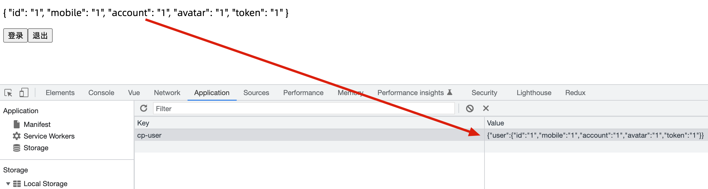
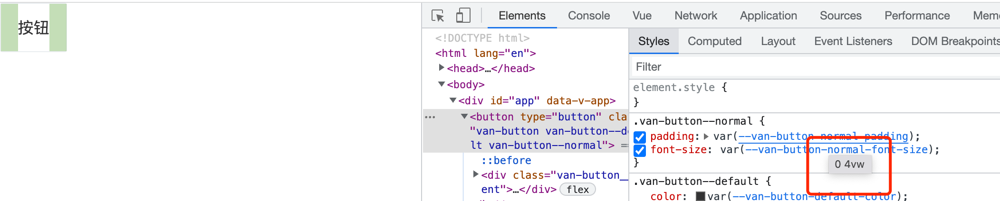

# 优医问诊-项目起步

## 项目介绍{#intro}

> 知道：整体项目概况，并且知道课程中会实现哪些功能

- [产品原型](https://app.mockplus.cn/s/dtKxarcngm8)
- [接口文档](https://www.apifox.cn/apidoc/shared-16a58bff-e4db-465c-9c8b-859c839318ac)
- [演示项目](http://mengi.gitee.io/consult-code)

## 能学到什么{#what}

> 了解：在项目中会使用到哪些技术方案和特色业务

技术方案：  

1. 基于 vue3+typescript 中大型项目开发解决方案
2. 基于 vant 组件库快速构建H5界面解决方案
3. 基于 vue-router 的前端路由解决方案
4. 基于 vite 的 create-vue 构建vue3项目解决方案
5. 基于 pinia 的状态管理解决方案
6. 基于 pinia-plugin-persistedstate 状态持久化解决方案
7. 基于 @vuecore/use 的组合式API工具库解决方案
8. 基于 id-validator 的身份证信息校验解决方案
9. 基于 postcss-px-to-viewport 移动端适配解决方案
10. 基于 vite-plugin-svg-icons 的svg图标组件解决方案
12. 基于 unplugin-vue-components 组件自动注册解决方案
13. 基于 socket.io 的即时通讯问诊室解决方案
15. 第三方支付解决方案
16. 第三方地图解决方案
17. pnpm 包管理方案
18. css 变量主题定制方案
19. 自定义 hook 解决方案
20. axios 二次封装解决方案
21. services API接口分层解决方案
22. 基于 vant 的通用组件封装解决方案
24. 基于 eruda 的移动端调试解决方案
25. 生产环境配置方案
26. CI/CD 持续集成自动部署方案


特色业务：  

1. 医生与文章推荐业务
2. **快速问诊业务**
3. **问诊费用支付宝支付业务**
4. **问诊室业务**
5. 药品订单支付宝支付业务
6. 实时物流高德地图业务


## pnpm介绍&安装{#pnpm}

> 掌握：pnpm 的安装和使用

本质上他是一个包管理工具，和npm/yarn没有区别，主要优势在于

- 包安装速度极快
- 磁盘空间利用效率高

安装：

```sh
npm i pnpm -g
```

使用：

| npm命令          | pnpm等效            |
| ---------------- | ------------------- |
| npm install      | pnpm install        |
| npm i axios      | pnpm add axios      |
| npm i webpack -D | pnpm add webpack -D |
| npm run dev      | pnpm dev            |


小结：

- pnpm 是一个高效的包管理工具，使用和npm和yarn基本相同

## 项目创建{#create-vue}

> 使用 create-vue 脚手架创建项目

create-vue(类似vue-cli)是Vite + Vue 项目的脚手架工具，参考地址：https://github.com/vuejs/create-vue

步骤：

1. 执行创建命令

```bash
pnpm create vue
# or
npm init vue@latest
# or
yarn create vue
```

2. 选择项目依赖内容

```bash
✔ Project name: … patients-h5-100 // 项目名字
✔ Add TypeScript? … No / `Yes` // 选择js或ts开发
✔ Add JSX Support? … `No` / Yes // 是否使用jsx(react 编写template语法)
✔ Add Vue Router for Single Page Application development? … No / `Yes` // 是否添加路由
✔ Add Pinia for state management? … No / `Yes` // 是否添加pinia
✔ Add Vitest for Unit Testing? … `No` / Yes // 是否添加单元测试
✔ Add Cypress for both Unit and End-to-End testing? … `No` / Yes // 是否添加端对端测试
✔ Add ESLint for code quality? … No / `Yes` // 是否添加eslint代码检查
✔ Add Prettier for code formatting? … No / `Yes` // 是否添加Prettier代码格式化支持

Scaffolding project in /Users/zhousg/Desktop/patient-h5-100...

Done. Now run:

  cd patient-h5-100
  pnpm install
  pnpm lint
  pnpm dev
```


## vscode插件安装{#ext}

> 安装：项目开发需要的一些插件

必装：

- `Vue Language Features (Volar)` vue3语法支持
- `TypeScript Vue Plugin (Volar)` vue3项目ts支持
- `Eslint` 代码风格校验

## eslint 预制配置{#eslint}

> 使用：eslint的预制配置，且了解配置作用

`.eslintrc.cjs`中添加：

```ts
  rules: {
    'prettier/prettier': [
      'warn',
      {
        singleQuote: true,
        semi: false,
        printWidth: 100,
        trailingComma: 'none'
      }
    ],
    'vue/multi-word-component-names': [
      'warn',
      {
        ignores: ['index']
      }
    ],
    'vue/no-setup-props-destructure': ['off']
  }
```

- 格式：单引号，没有分号，行宽度100字符，没有对象数组最后一个逗号
- vue 组件需要大驼峰命名，除去 index 之外，App 是默认支持的

vscode 开启 eslint  自动修复

```json
    "editor.codeActionsOnSave": {
        "source.fixAll": true,
    },
```

* 允许对父传子 props 进行解构，我们会开启解构保持响应式的语法糖   
   https://vuejs.org/guide/extras/reactivity-transform.html#explicit-opt-in

```ts
// vite.config.ts
export default {
  plugins: [
    vue({
      reactivityTransform: true
    })
  ]
}
```

小结：

- 如果公司中会有自己的代码风格规则，大家只需遵守即可
- https://prettier.io/docs/en/options.html 常见规则


## 项目结构调整{#dir}

> 了解：每一个目录结构的作用

```bash
./src
├── assets        `静态资源，图片`
├── components    `通用组件`
├── hooks         `可复用逻辑函数`
├── icons         `svg图标`
├── router        `路由`
│   └── index.ts
├── api           `后台接口API`
├── stores        `全局状态仓库`
├── styles        `全局样式`
│   └── main.scss
├── types         `TS类型`
├── utils         `工具函数`
├── views         `页面`
├── main.ts       `入口文件`
└──App.vue       `根组件`
```


项目使用sass预处理器，安装sass，即可支持scss语法：

```bash
pnpm add sass -D
```


## 路由代码解析{#router}

> 知道：默认生成的路由代码的含义


```ts
import { createRouter, createWebHistory } from 'vue-router'

// createRouter 创建路由实例，===> new VueRouter()
// history 是路由模式，hash模式，history模式
// createWebHistory() 是开启history模块   http://xxx/user
// createWebHashHistory() 是开启hash模式    http://xxx/#/user

// vite 的配置 import.meta.env.BASE_URL 是路由的基准地址，默认是 ’/‘
// https://vitejs.dev/guide/build.html#public-base-path
// 如果将来你部署的域名路径是：http://xxx/my-path/user
// vite.config.ts  添加配置  base: my-path，路由这就会加上 my-path 前缀了

const router = createRouter({
  history: createWebHistory(import.meta.env.BASE_URL),
  routes: []
})

export default router

```

小结：

- 如何创建路由实例？
  - `createRouter()`

- 如何设置路由模式？
  - `createWebHistory()`  或者  `createWebHashHistory()`

- `import.meta.env.BASE_URL` 值来自哪里？
  - `vite.config.ts` 的 `base` 属性的值

- `base` 作用是什么?
  - 项目的基础路径前缀，默认是 `/`


## 用户状态仓库{#store}

> 完成：[用户信息](https://www.apifox.cn/apidoc/shared-16a58bff-e4db-465c-9c8b-859c839318ac/api-31644712)仓库创建，提供用户信息，修改用信息，删除用户信息的方法

1. 实现登录会使用，存储登录成功用户信息

2. 请求工具需要携带token，访问权限控制需要token，所以用户信息仓库先完成

需求：

- 用户信息仓库创建
- 提供用户信息
- 修改用信息的方法
- 删除用信息的方法

代码：

`types/user.d.ts`

```ts
// 用户信息
export type User = {
  token: string
  id: string
  account: string
  mobile: string
  avatar: string
}
```

`stores/modules/user.ts`

```ts
import type { User } from '@/types/user'
import { defineStore } from 'pinia'
import { ref } from 'vue'

export const useUserStore = defineStore('cp-user', () => {
  // 用户信息
  const user = ref<User>()
  // 设置用户，登录后使用
  const setUser = (u: User) => {
    user.value = u
  }
  // 清空用户，退出后使用
  const delUser = () => {
    user.value = undefined
  }
  return { user, setUser, delUser }
})
```

小结：

- pinia存储这个数据的意义？
  - 数据共享，提供给项目中任何位置使用

- 如果存储了数据，刷新页面后数据还在吗？
  - 不在，现在仅仅是js内存中，需要进行本地存储（持久化）

## 数据持久化{#persisted}

> 掌握：使用 `pinia-plugin-persistedstate` 实现pinia仓库状态持久化，且完成测试

[参考文档](https://www.npmjs.com/package/pinia-plugin-persistedstate)



- 安装

```bash
pnpm i pinia-plugin-persistedstate
# or
npm i pinia-plugin-persistedstate
# or
yarn add pinia-plugin-persistedstate
```

- 使用 `main.ts`

```diff
+ import persist from 'pinia-plugin-persistedstate'
import { createPinia } from 'pinia'

const app = createApp(App)

+ app.use(createPinia().use(persist))
```

- 配置 `stores/user.ts`

```diff
import type { User } from '@/types/user'
import { defineStore } from 'pinia'
import { ref } from 'vue'

export const useUserStore = defineStore(
  'cp-user',
  () => {
    // 用户信息
    const user = ref<User>()
    // 设置用户，登录后使用
    const setUser = (u: User) => {
      user.value = u
    }
    // 清空用户，退出后使用
    const delUser = () => {
      user.value = undefined
    }
    return { user, setUser, delUser }
  },
  {
+    persist: true
  }
)

```

- 测试 `test.vue`

```vue
<script setup lang="ts">
import { useUserStore } from './stores/user'

const store = useUserStore()
</script>

<template>
  <p>{{ store.user }}</p>
  <button @click="store.setUser({ id: '1', mobile: '1', account: '1', avatar: '1', token: '1' })">
    登录
  </button>
  <button @click="store.delUser()">退出</button>
</template>
```


## stores统一导出{#stores-export}

> 实现：仓库的导出统一从 `./stores`  代码简洁，职能单一，入口唯一

- 抽取pinia实例代码，职能单一

`stores/index`

```ts
import { createPinia } from 'pinia'
import persist from 'pinia-plugin-persistedstate'

// 创建pinia实例
const pinia = createPinia()
// 使用pinia插件
pinia.use(persist)
// 导出pinia实例，给main使用
export default pinia
```

`main.ts`

```diff
import { createApp } from 'vue'
import App from './App.vue'
+ import pinia from './stores'
import router from './router'
import './styles/main.scss'

const app = createApp(App)

+ app.use(pinia)
app.use(router)
app.mount('#app')
```

- 统一导出，代码简洁，入口唯一

`stores/index`

```ts
export * from './modules/user'
```

`App.vue`

```diff
-import { useUserStore } from './stores/user'
+import { useUserStore } from './stores'
```

小结：

- 统一导出是什么意思？
  - 一个模块下的所有资源通过index导出

## vant组件库{#vant}

> 实现：完整使用vant组件库

[文档](https://vant-contrib.gitee.io/vant/#/zh-CN/quickstart#dao-ru-suo-you-zu-jian-bu-tui-jian)

安装：

```bash
# Vue 3 项目，安装最新版 Vant
npm i vant
# 通过 yarn 安装
yarn add vant
# 通过 pnpm 安装
pnpm add vant
```

[按需引入](https://vant-contrib.gitee.io/vant/#/zh-CN/quickstart#fang-fa-er.-an-xu-yin-ru-zu-jian-yang-shi)：

在基于 `vite`、`webpack` 或 `vue-cli` 的项目中使用 Vant 时，可以使用 [unplugin-vue-components](https://github.com/antfu/unplugin-vue-components) 插件，它可以自动引入组件，并按需引入组件的样式。

相比于常规用法，这种方式可以按需引入组件的 CSS 样式，从而减少一部分代码体积，但使用起来会变得繁琐一些。如果业务对 CSS 的体积要求不是特别极致，我们推荐使用更简便的常规用法。

1. 安装 [unplugin-vue-components](https://github.com/antfu/unplugin-vue-components) 插件：

```bash
# 通过 npm 安装
npm i unplugin-vue-components -D

# 通过 yarn 安装
yarn add unplugin-vue-components -D

# 通过 pnpm 安装
pnpm add unplugin-vue-components -D

```

2. 配置插件

注意❓：关闭自动生成类型声明文件

```diff
+ import Components from 'unplugin-vue-components/vite';
+ import { VantResolver } from 'unplugin-vue-components/resolvers';
export default defineConfig({
  plugins: [
    vue(),
    Components({
+     dts: false, // 关闭自动生成类型声明文件
+     resolvers: [VantResolver()]
    })
  ],
  server: {
    port: 3200,
    open: true
  },
  resolve: {
    alias: {
      '@': fileURLToPath(new URL('./src', import.meta.url))
    }
  }
})
```


使用：`App.vue`

```vue
<script setup lang="ts">
</script>

<template>
  <!-- 直接使用vant组件 -->
  <van-button>按钮</van-button>
</template>

<style scoped></style>
```

## 移动端适配{#vw}

> 实现：使用 vw 完成移动端适配

[文档](https://vant-contrib.gitee.io/vant/#/zh-CN/advanced-usage#viewport-bu-ju)

安装：

```bash
npm install postcss-px-to-viewport -D
# or
yarn add -D postcss-px-to-viewport
# or
pnpm add -D postcss-px-to-viewport
```

配置：

1. 新增`postcss.config.js`

```js
// eslint-disable-next-line no-undef
module.exports = {
  plugins: {
    'postcss-px-to-viewport': {
      // 设备宽度375计算vw的值
      viewportWidth: 375,
    },
  },
};
```

2. 重启dev服务器

3. 测试：




说明❓：有一个控制台警告可忽略，或者使用 `postcss-px-to-viewport-8-plugin` 代替当前插件

注意事项：

1. vant组件库、css/scss/less、组件内style会转换
2. 但是元素行内样式不会转换

## 请求工具函数(作业){#request}

> 实现：token请求头携带，错误响应处理，401错误处理

### 拦截器逻辑{#request-interceptors}

`utils/request.ts`

```ts
import { useUserStore } from '@/stores'
import router from '@/router'
import axios from 'axios'
import { showFailToast } from 'vant'

// 1. 新axios实例，基础配置
const baseURL = 'https://consult-api.itheima.net/'
const request = axios.create({
  baseURL,
  timeout: 10000
})

// 2. 请求拦截器，携带token
request.interceptors.request.use(
  (config) => {
    const store = useUserStore()
    if (store.user?.token) {
      config.headers.Authorization = `Bearer ${store.user.token}`
    }
    return config
  },
  (err) => Promise.reject(err)
)

// 3. 响应拦截器，剥离无效数据，401拦截
request.interceptors.response.use(
  (res) => {
    // 后台约定，响应成功，但是code不是10000，是业务逻辑失败
    if (res.data?.code !== 10000) {
      showFailToast(res.data.message)
      return Promise.reject(res.data)
    }
    // 业务逻辑成功，返回响应数据，作为axios成功的结果
    return res.data?.data
  },
  (err) => {
    if (err.response.status === 401) {
      // 删除用户信息
      const store = useUserStore()
      store.delUser()
      // 跳转登录，带上接口失效所在页面的地址，登录完成后回跳使用
      router.push(`/login?returnUrl=${router.currentRoute.value.fullPath}`)
    }
    return Promise.reject(err)
  }
)

export { baseURL, request }
```

提问：

- baseURL 导出的目的是啥？
  - 其他模块可能需要使用


### 测试请求工具{#request-test}

> 测试：封装好的请求工具函数
>
> 接口：
>
> 1. 获取[用户信息api](https://www.apifox.cn/apidoc/shared-16a58bff-e4db-465c-9c8b-859c839318ac/api-32162162)，测试401 => 没有token
> 2. [登录api](https://www.apifox.cn/apidoc/shared-16a58bff-e4db-465c-9c8b-859c839318ac/api-31644712)，测试非10000的情况 => 输入错误密码

`test.vue`

```vue
<script setup lang="ts">
import { request } from '@/utils/request'
import type { User } from './types/user'
import { useUserStore } from './stores'

// 测试，请求拦截器，是否携带token，响应拦截器401拦截到登录地址
const getUserInfo = async () => {
  const res = await request.get('/patient/myUser')
  console.log(res)
}

// 测试，响应拦截器，出现非10000的情况，和返回剥离后的数据
const store = useUserStore()
const login = async () => {
  const res = await request.post<any, User>('/login/password', {
    mobile: '13211112222',
    // 密码 abc123456 测试：出现非10000的情况
    password: 'abc12345'
  })
  store.setUser(res)
}
</script>

<template>
  <van-button type="primary" @click="getUserInfo">获取个人信息</van-button>
  <van-button type="primary" @click="login">登录</van-button>
</template>
```

测试：

- 登录的时候把密码改错，是测试？
  - 业务逻辑失败
- 登录成功，看 res 打印，是测试？
  - 剥离一层数据
- 获取用户信息成功，是测试？
  - 是否携带token
- 把 token 删除或修改，获取用户信息失败，是测试？
  - 401 token 失效跳转 login 页面


## 约定路由规则{#router-rules}

> 知道：约定项目的映射规则

| 路由路径              | 路由级别 | 组件功能         |
| --------------------- | -------- | ---------------- |
| /login                | 1        | 登录             |
| /                     | 1        | Layout布局容器   |
| /user                 | ②        | 个人中心         |
| /user/patient         | 1        | 家庭档案         |
| /home                 | ②        | 首页             |
| /consult/fast         | 1        | 快速问诊         |
| /consult/dep          | 1        | 选择科室         |
| /consult/illness      | 1        | 病情描述         |
| /consult/pay          | 1        | 问诊支付         |
| /room                 | 1        | 问诊室           |
| /user/consult         | 1        | 我的问诊         |
| /user/consult/:id     | 1        | 问诊详情         |
| /medicine/pay         | 1        | 药品订单支付     |
| /medicine/pay/result  | 1        | 药品订单支付结果 |
| /medicine/:id         | 1        | 药品订单详情     |
| /medicine/express/:id | 1        | 药品订单物流     |
| /article              | ②        | 健康百科         |
| /notify               | ②        | 消息通知         |

小结：

- `/` 是布局容器，是一级路由  `/home` `/article`  `/notify`  `/user` 是二级路由
- 他们的配置需要嵌套，其他的页面路由都是一级路由


# 第四天

