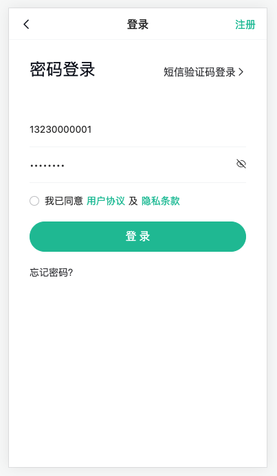

# 登录模块

## 路由与组件{#router-and-component}

> 完成：路由规则的配置，基础组件结构，app组件路由出口



- 基础组件结构 `views/Login/index.vue`

```vue
<template>
  <div class="login">
    <van-button type="primary">按钮</van-button>
    <van-checkbox :checked="true">复选框</van-checkbox>
  </div>
</template>

<style lang="scss" scoped></style>
```

- 路由规则的配置 `router/index.ts`

```ts
  routes: [{ path: '/login', component: () => import('@/views/Login/index.vue') }]
```

- app组件路由出口 `App.vue`

```vue
<script setup lang="ts"></script>

<template>
  <router-view></router-view>
</template>
```

疑问：

- vue 生成组件基础结构？
  - 使用vscode代码片段，或插件
- vant 的主题色和项目的不一致？
  - css变量定制主题

## 组件代码片段{#code-snippet}

> 配置：一个vue3页面的基础代码片段

1. 打开代码片段设置界面：

- windows：ctrl + shift + p 
- mac：cmmmand + shift + p 

2. 新建全局代码片段文件

3. 拷贝一下代码，保存即可，输入v3t

```json
	"sfc-ts语法糖": {
		"scope": "vue,markdown",
		"prefix": "v3t",
		"body": [
			"<script setup lang='ts'>",
			"   $2",
			"</script>",
			"",
			"<template>",
			"  <div>",
			"   $1",
			"  </div>",
			"</template>",
			"",
			"<style lang='scss' scoped>",
			"",
			"</style>",
		]
	}
```

或者安装：Vue 3 Snippets 插件，快捷键可以看插件[文档](https://github.com/hollowtree/vscode-vue-snippets)。

## css变量主题定制{#css-var}

> 实现：使用css变量定制项目主题，和修改vant主题


- 定义和使用 css 变量

`styles/main.scss`

```css
/**
 原生css变量的定义=》类似less/sass定义变量
 语法：
 1. 定义：--css变量名:css变量值
 2. 使用：var(--css变量名)
 作用域：
 1. 局部变量 =》 .类名 {    }
 2. 全局变量 =》 :root {    }
*/
:root {
  --main: #999;
}
a {
  color: var(--main)
}
```

- 定义项目的颜色风格，覆盖vant的主题色  [官方文档](https://vant-contrib.gitee.io/vant/#/zh-CN/config-provider#ji-chu-bian-liang)

修改vant组件库主题思路❓：

**前提=》**vant组件库中所有组件用到的颜色、字体大小、间距等，都定义成全局的原生css变量

**根据公司需求修改主题**=》覆盖vant内置的全局css变量=》变量修改后，就会影响所有组件

`styles/main.scss`

```scss
:root:root {
  // 项目定义变量
  --cp-primary: #16c2a3;
  --cp-plain: #eaf8f6;
  --cp-orange: #fca21c;
  --cp-text1: #121826;
  --cp-text2: #3c3e42;
  --cp-text3: #6f6f6f;
  --cp-tag: #848484;
  --cp-dark: #979797;
  --cp-tip: #c3c3c5;
  --cp-disable: #d9dbde;
  --cp-line: #ededed;
  --cp-bg: #f6f7f9;
  --cp-price: #eb5757;
  // 覆盖vant主体色
  --van-primary-color: var(--cp-primary);
  // == vant组件变量 ==
  // 单元格上下间距
  --van-cell-vertical-padding: 14px;
  // 复选框大小
  --van-checkbox-size: 14px;
  // 默认按钮文字大小
  --van-button-normal-font-size: 16px;
}

// 全局样式
body {
  font-size: 14px;
  color: var(--cp-text1);
}
a {
  color: var(--cp-text2);
}
h1,h2,h3,h4,h5,h6,p,ul,ol {
  margin: 0;
  padding: 0;
}

// 全局覆盖van-tab样式
.van-tabs {
  .van-tabs__nav {
    padding: 0 0 15px 0;
  }
  .van-tabs__line {
    width: 20px;
    background-color: var(--cp-primary);
  }
  .van-tab {
    padding: 0 15px;
  }
}
```

说明❓：通过两个`:root`覆盖vant变量

`App.vue`

```vue
<script setup lang="ts"></script>

<template>
  <!-- 验证vant颜色被覆盖 -->
  <van-button type="primary">按钮</van-button>
  <a href="#">123</a>
</template>

<style scoped lang="scss">
// 使用 css 变量
a {
  color: var(--cp-primary);
}
</style>
```


## cp-nav-bar 组件结构{#cp-nav-bar-html}

> 掌握：van-nav-bar组件的基础使用，封装成 cp-nav-bar 组件，作为项目通用组件

提取原因❓：

- 定制需求：api、style等
- 多页面使用：复用

> 组件使用：了解 van-nav-bar 组件的基本功能属性[文档](https://vant-contrib.gitee.io/vant/#/zh-CN/nav-bar#api)

抽离组件：`components/cp-nav-bar.vue`

```vue
<script setup lang="ts">
// 封装需求❓：支持 title rightText 属性，支持 click-right 事件，click-left函数内支持返回上一页或默认首页
const onClickLeft = () => {
  //
}
const onClickRight = () => {
  //
}
</script>

<template>
  <van-nav-bar
    left-arrow
    @click-left="onClickLeft"
    fixed
    title="注册"
    right-text="注册"
    @click-right="onClickRight"
  ></van-nav-bar>
</template>

<style lang="scss" scoped>
::v-deep() {
  .van-nav-bar {
    &__arrow {
      font-size: 18px;
      color: var(--cp-text1);
    }
    &__text {
      font-size: 15px;
    }
  }
}
</style>
```

提问：

- 怎么深度作用其他组件样式？
  - `::v-deep(){  // 样式  }`

## cp-nav-bar 组件功能{#cp-nav-bar-logic}

> 实现：组件的返回功能，支持 title rightText 属性，支持 click-right 事件

封装需求❓：支持 title rightText 属性，支持 click-right 事件，click-left函数内支持返回上一页或默认首页

`components/cp-nav-bar.vue`

```vue
<script setup lang="ts">
import { useRouter } from 'vue-router'

//1. 已有的功能：返回图标，返回效果，固定定位（组件内部实现）
const router = useRouter()
const onClickLeft = () => {
  // 判断历史记录中是否有回退
  if (history.state?.back) {
    router.back()
  } else {
    router.push('/')
  }
}

// 2. 使用组件时候才能确定的功能：标题，右侧文字，点击右侧文字行为（props传入）
defineProps<{
  title?: string
  rightText?: string
}>()
const emit = defineEmits<{
  (e: 'click-right'): void
}>()
const onClickRight = () => {
  emit('click-right')
}
</script>

<template>
  <van-nav-bar
    left-arrow
    @click-left="onClickLeft"
    fixed
    :title="title"
    :right-text="rightText"
    @click-right="onClickRight"
  ></van-nav-bar>
</template>

<style lang="scss" scoped>
::v-deep() {
  .van-nav-bar {
    &__arrow {
      font-size: 18px;
      color: var(--cp-text1);
    }
    &__text {
      font-size: 15px;
    }
  }
}
</style>
```

`views/Login/index.vue`

```vue
<script setup lang="ts"></script>

<template>
  <div class="login">
    <cp-nav-bar title="登录"></cp-nav-bar>
  </div>
</template>

<style lang="scss" scoped></style>
```

提问：

- 怎么在项目中判断是否可以回退？
  - `history.state?.back`

- 怎么定义属性，怎么定义事件
  - `defineProps` `defineEmits`

- 为什么可以直接使用组件，不导入不注册？
  - 使用了 `unplugin-vue-components` 默认 `src/compoenents` 下组件会自动导入注册


## cp-nav-bar 组件类型{#cp-nav-bar-type}

> 解释：给组件添加类型，让写属性和事件可以有提示

提问：

- vant 的组件为啥有提示？
  - 看下 vant 的组件类型声明文件

发现：

```ts
// 核心代码
// 1. 导入组件实例
import NavBar from './NavBar.vue'
// 2. 声明 vue 类型模块
declare module 'vue' {
    // 3. 给 vue  添加全局组件类型，interface 和之前的合并
    interface GlobalComponents {
        // 4. 定义具体组件类型，typeof 获取到组件实例类型
        // typeof 作用是得到对应的TS类型
        VanNavBar: typeof NavBar;
    }
}
```

给 `cp-nav-bar` 组件添加类型

`types/components.d.ts`

```ts
import CpNavBar from '@/components/CpNavBar.vue'

declare module 'vue' {
  interface GlobalComponents {
    CpNavBar: typeof CpNavBar
  }
}
```

验证❓：

1. 看看属性提示，事件提示，鼠标放上去有没有类型。
2. 代码提示需要组件双闭合（没有这个问题了，单闭合也有提示）


小结：

- 怎么给全局的组件提供类型？
  - 写一个类型声明文件，`declare module 'vue'` 声明一个 vue 类型模块
  - 然后 `interface GlobalComponents` 书写全局组件的类型
  - key组件名称支持大驼峰，value是组件类型,通过 typeof 组件实例得到


## 页面布局-头底{#login-html}

> 准备分析：login页面的基础布局

- 基础布局 `vies/Login/index.vue`

```vue
<script setup lang="ts"></script>

<template>
  <cp-nav-bar right-text="注册" @click-right="$router.push('/register')"></cp-nav-bar>
  <div class="login">
    <div class="login-head">
      <h3>密码登录</h3>
      <a href="javascript:;">
        <span>短信验证码登录</span>
        <van-icon name="arrow"></van-icon>
      </a>
    </div>
    <!-- == form 表单 == -->
   
  </div>
</template>

<style lang="scss" scoped>
.login {
  padding-top: 46px;
  &-head {
    padding: 30px 30px 50px;
    display: flex;
    justify-content: space-between;
    align-items: flex-end;
    line-height: 1;
    h3 {
      font-weight: normal;
      font-size: 24px;
    }
    a {
      font-size: 15px;
    }
  }
  // .van-form {
  //   padding: 0 14px;
  //   .cp-cell {
  //     height: 52px;
  //     padding: 14px 16px;
  //     box-sizing: border-box;
  //     display: flex;
  //     align-items: center;
  //     .van-checkbox {
  //       a {
  //         color: var(--cp-primary);
  //         padding: 0 5px;
  //       }
  //     }
  //   }
  // }
}
</style>
```

## 页面布局-表单{#login-form}

> 准备分析：表单的绘制，以及表单根据项目需要进行定制

- 组件结构 `Login/index.vue`

```ts
import { ref } from 'vue'

const agree = ref(false)
```

```html
<div class="login">
    <!-- ... -->
    <!-- 表单 -->
    <van-form autocomplete="off">
        <van-field placeholder="请输入手机号" type="tel"></van-field>
        <van-field placeholder="请输入密码" type="password"></van-field>
        <div class="cp-cell">
          <van-checkbox v-model="agree">
            <span>我已同意</span>
            <a href="javascript:;">用户协议</a>
            <span>及</span>
            <a href="javascript:;">隐私条款</a>
          </van-checkbox>
        </div>
        <div class="cp-cell">
          <van-button block round type="primary">登 录</van-button>
        </div>
        <div class="cp-cell">
          <a href="javascript:;">忘记密码？</a>
        </div>
      </van-form>
     <!-- ... -->
   </div>
```

```scss
.login {
  // ...
  // 新增form样式
  .van-form {
    padding: 0 14px;
    .cp-cell {
      height: 52px;
      padding: 14px 16px;
      box-sizing: border-box;
      display: flex;
      align-items: center;
      .van-checkbox {
        a {
          color: var(--cp-primary);
          padding: 0 5px;
        }
      }
    }
  }
}
```


## 图标组件-打包svg地图{#svg-plugin}

> 实现：把icons目录下svg图片打包为精灵图使用

准备：拷贝02-其它资源中icons目录到项目下

[参考文档](https://github.com/vbenjs/vite-plugin-svg-icons)

- 安装插件

```bash
yarn add vite-plugin-svg-icons -D
# or
npm i vite-plugin-svg-icons -D
# or
pnpm install vite-plugin-svg-icons -D
```

- 使用插件

`vite.config.ts`

```diff
import { VantResolver } from 'unplugin-vue-components/resolvers'
+import { createSvgIconsPlugin } from 'vite-plugin-svg-icons'
+import path from 'path'

// https://vitejs.dev/config/
export default defineConfig({
  plugins: [
    vue(),
    Components({
      dts: false,
      resolvers: [VantResolver({ importStyle: false })]
    }),
+    createSvgIconsPlugin({
+      // 指定图标文件夹，绝对路径（NODE代码）
+      iconDirs: [path.resolve(process.cwd(), 'src/icons')]
+    })
  ],
```

- 导入到main

```diff
import router from './router'
// 注册图标
+import 'virtual:svg-icons-register'
```

- 使用svg精灵地图

```html
    <svg aria-hidden="true">
      <!-- #icon-文件夹名称-图片名称 -->
      <use href="#icon-login-eye-off" />
    </svg>
```

小结：

- icons文件打包的产物？
  - 会生成一个 svg 结构（js创建的）包含所有图标，理解为 `精灵图`

- 怎么使用svg图标？
  - 通过 svg 标签 `#icon-文件夹名称-图片名称` 指定图片，理解 `精灵图定位坐标`


## 图标组件-封装svg组件{#svg-com}

> 实现：把 svg 标签使用组件封装起来，完成密码可见切换功能。

- 组件 `components/CpIcon.vue`

```vue
<script setup lang="ts">
// 提供name属性即可
defineProps<{
  name: string
}>()
</script>

<template>
  <svg aria-hidden="true" class="cp-icon">
    <use :href="`#icon-${name}`" />
  </svg>
</template>

<style lang="scss" scoped>
.cp-icon {
  // 说明：em 相对于父元素字体大小
  width: 1em;
  height: 1em;
}
</style>
```

- 类型 `types/components.d.ts`

```diff
import CpNavBar from '@/components/CpNavBar.vue'
+ import CpIcon from '@/components/CpIcon.vue'

declare module 'vue' {
  interface GlobalComponents {
    CpNavBar: typeof CpNavBar
+   CpIcon: typeof CpIcon
  }
}
```

提示：

- 有些图标可以根据 style 中 `color` 的值来设置颜色，图标是否有这个功能取决于 UI 做图片时否开启。


实现切换密码可见功能：`Login/index.vue`

```ts
// 表单数据
const mobile = ref('')
const password = ref('')
// 控制密码是否显示
const show = ref(false)
```

```html
<van-field v-model="mobile" placeholder="请输入手机号" type="tel"></van-field>
<van-field v-model="password" placeholder="请输入密码" :type="show ? 'text' : 'password'">
  <template #button>
    <cp-icon @click="show = !show" :name="`login-eye-${show ? 'on' : 'off'}`"></cp-icon>
  </template>
</van-field>
```

小结：

- 表单绑定数据后，通过 show 切换 text 和 password，对应切换图标组件的 name 即可。


## 表单校验{#login-form-validate}

> 实现：单个表单项校验，以及整体表单校验

- 提取表单校验规则（为了其他页面复用）`utils/rules.ts`

```ts
// 表单校验
const mobileRules = [
  { required: true, message: '请输入手机号' },
  { pattern: /^1[3-9]\d{9}$/, message: '手机号格式不正确' }
]

const passwordRules = [
  { required: true, message: '请输入密码' },
  { pattern: /^\w{8,24}$/, message: '密码需8-24个字符' }
]

export { mobileRules, passwordRules }
```

- 单个表单项校验 `Login/index.vue`

```ts
import { mobileRules, passwordRules } from '@/utils/rules'
```

```diff
      <van-field
         v-model="mobile"
+        :rules="mobileRules"
         placeholder="请输入手机号" type="tel"></van-field>
      <van-field
        v-model="password"
+        :rules="passwordRules"
        placeholder="请输入密码"
        :type="show ? 'text' : 'password'"
      >
```

- 以及整体表单校验 `Login/index.vue`

设置button组件为原生 submit 类型按钮

```diff
<van-button
block round
type="primary"
+ native-type="submit"
>
  登 录
</van-button>
```

监听表单校验成功后 submit 事件

```diff
<van-form
  autocomplete="off"
+ @submit="login">
```

```ts
import { Toast } from 'vant'

// 表单提交
const login = () => {
  if (!agree.value) return Toast('请勾选我已同意')
  // 验证完毕，进行登录
}
```

小结：

- 怎么给单个表单加校验？
  - reules 属性，规则和  element-ui 类似
- 怎么给整个表单加校验？
  - 按钮组件设置 `native-type="submit"`，表单组件绑定 `@submit` 事件


## 密码登录{#login-logic}

> 实现：通过手机号和密码进行登录

:::warning 温馨提示

- 提供了100个测试账号
- 手机号：13230000001 - 13230000100
- 密码：abc12345
  :::

登录逻辑：

- 定义一个 [api 接口函数](https://www.apifox.cn/apidoc/shared-16a58bff-e4db-465c-9c8b-859c839318ac/api-31644712)
- 登录成功：
  - 存储用户信息
  - 回跳页面，或者进入个人中心
  - 提示

落地代码：

- api函数 `api/user.ts`

```ts
import type { User } from '@/types/user'
import { request } from '@/utils/request'

// 密码登录
export const loginByPassword = (mobile: string, password: string) =>
  request.post<any, User>('/login/password', { mobile, password })
```

- 进行登录 `Login/index.vue`

```ts
import { loginByPassword } from '@/api/user'
import { useUserStore } from '@/stores'
import { useRoute, useRouter } from 'vue-router'
import { showSuccessToast, showFailToast } from 'vant'
```

```ts
const store = useUserStore()
const router = useRouter()
const route = useRoute()
// 表单提交
const login = async () => {
  if (!agree.value) return showFailToast('请勾选我已同意')
  // 验证完毕，进行登录
  const res = await loginByPassword(mobile.value, password.value)
  store.setUser(res)
  // 如果有回跳地址就进行回跳，没有跳转到个人中心
  router.push((route.query.returnUrl as string) || '/user')
  showSuccessToast('登录成功')
}
```

说明❓：Toast消息提示需要[单独添加样式](https://vant-contrib.gitee.io/vant/#/zh-CN/toast#shou-dong-yin-ru-yang-shi)

`main.ts`

```diff
...
+ import 'vant/es/toast/style';
```

## 短信登录-切换效果(作业){#code-toggle}

> 实现：添加短信登录与密码登录界面切换，添加code的校验

步骤：

- 完成界面切换
- 完成code校验

需求分析❓：

1. 定义切换密码和短信登录响应变量isPass：true 密码登录 | false 短信登录
2. 使用响应变量做标题和表单项条件渲染
3. 为验证码code添加响应变量和rules校验规则

代码：

1）完成界面切换 `Login/index.vue`

- 切换数据

```ts
const isPass = ref(true)
```

- 标题切换

```html
    <div class="login-head">
      <h3>{{ isPass ? '密码登录' : '短信验证码登录' }}</h3>
      <a href="javascript:;" @click="isPass = !isPass">
        <span>{{ !isPass ? '密码登录' : '短信验证码登录' }}</span>
        <van-icon name="arrow"></van-icon>
      </a>
    </div>
```

- 表单项切换

```diff
      <van-field
+        v-if="isPass"
        v-model="password"
        :rules="passwordRules"
        placeholder="请输入密码"
        :type="show ? 'text' : 'password'"
      >
        <template #button>
          <cp-icon @click="show = !show" :name="`login-eye-${show ? 'on' : 'off'}`"></cp-icon>
        </template>
      </van-field>
+     <van-field v-else placeholder="短信验证码">
        <template #button>
          <span>发送验证码</span>
        </template>
+      </van-field>
```

2）完成code校验

- 校验规则 `utils/rules.ts`

```ts
const codeRules = [
  { required: true, message: '请输入验证码' },
  { pattern: /^\d{6}$/, message: '验证码6个数字' }
]

export { mobileRules, passwordRules, codeRules }
```

- 使用规则 `Login/index.vue`

```ts
import {  codeRules } from '@/utils/rules'
```

```ts
const code = ref('')
```

```diff
<van-field v-else
+           v-model="code" :rules="codeRules"
           placeholder="短信验证码">
```

小结：

- 接下来就是实现 `发送短信` 和  `合并短信登录` 的功能了

## 短信登录-发送短信(作业){#code-send}

> 实现：点击按钮发送验证码功能

步骤：

- API 接口函数
- 发送验证码逻辑
- 倒计时逻辑

需求分析❓：

1. 定义发送验证码api需要的ts联合类型：'login' 登录 | 'register' 注册
1. 封装发送验证码api接口方法
3. 发送按钮绑定点击事件，发送验证码，满足两个条件：
   1. 定义倒计时变量time，默认值0=》**大于0说明已经发送，60s内不能再次发送**
   2. 获取form 组件实例，使用实例validate方法校验，**每次输入的手机号格式是否正确**

4. 调用发送验证码api接口
4. 验证码发送成功后，设置time倒计时60s，使用定时器开启倒计时，结束关闭定时器
4. 组件卸载时，清除定时器（倒计时没有结束，就登录跳转页面情况）

代码：

1）API 接口函数

- 类型 `types/user.d.ts`

```ts
// 短信验证码类型
export type CodeType = 'login' | 'register'
```

- 接口 `api/user.ts`

```diff
+ import type { CodeType, User } from '@/types/user'
import { request } from '@/utils/request'

// 密码登录
export const loginByPassword = (mobile: string, password: string) =>
  request.post<any, User>('/login/password', { mobile, password })

+ // 发送验证码
+ export const sendMobileCode = (mobile: string, type: CodeType) =>request.get<any, { code: string }>('/code', { params: { mobile, type } })
```

2）发送验证码逻辑

- 校验没在倒计时

```html
<span @click="send">发送验证码</span>
```

```ts
const time = ref(0)
const send = async () => {
  // 已经倒计时time的值大于0，60s内不能重复发送验证码
  if (time.value > 0) return
}
```

- 校验手机表单项
  使用 form 组件的函数 [参考文档](https://vant-contrib.gitee.io/vant/#/zh-CN/form#fang-fa)

```diff
      <van-field
        v-model="mobile"
+        name="mobile"
        :rules="mobileRules"
        placeholder="请输入手机号"
        type="tel"
      ></van-field>
```

```ts
import { showSuccessToast, type FormInstance } from 'vant'
```

```diff
+const form = ref<FormInstance>()
const time = ref(0)
const send = async () => {
  if (time.value > 0) return
+  // 验证不通过报错，阻止程序继续执行
+  await form.value?.validate('mobile')
}
```

- 发送短信验证码

```ts
import { sendMobileCode } from '@/api/user'
```

```diff
const send = async () => {
  if (time.value > 0) return
  await form.value?.validate('mobile')
+  await sendMobileCode(mobile.value, 'login')
+  showSuccessToast('发送成功')
}
```

3）倒计时逻辑

- 逻辑代码

```diff
const form = ref<FormInstance>()
const time = ref(0)
+let timeId: number
const send = async () => {
if (time.value > 0) return
  await form.value?.validate('mobile')
  await sendMobileCode(mobile.value, 'login')
  showSuccessToast('发送成功')
+  time.value = 60
+  // 倒计时
+  timeId = window.setInterval(() => {
+    time.value--
+    if (time.value <= 0) window.clearInterval(timeId)
+  }, 1000)
}
+onUnmounted(() => {
+  window.clearInterval(timeId)
+})
```

注意：

- 组件卸载关闭定时器
- 定时器相关函数是 window 去调用，因为 node 也有定时器返回类型不一样。


- 界面展示

```html
<span :class="{ active: time > 0 }" @click="send">
  {{ time > 0 ? `${time}s后再次发送` : '发送验证码' }}
</span>
```

## 短信登录-进行登录(作业){#code-login}

> 实现：通过短信进行登录

步骤：

- api 接口函数
- 合并到密码登录逻辑中

需求分析❓：

1. 封装短信登录api接口方法
2. 提交表单登录时，判断是密码还是短信登录，调用对应api接口方法进行登录

代码：

- 接口API
  `api/user.ts`

```ts
// 短信登录
export const loginByMobile = (mobile: string, code: string) =>
  request.post<any, User>('/login', { mobile, code })
```

- 合并短信登录

```ts
import { loginByMobile } from '@/api/user'
```

```diff
// 表单提交
const login = async () => {
  if (!agree.value) return showFailToast('请勾选我已同意')
  // 验证完毕，进行登录
+  const res = isPass.value
+    ? await loginByPassword(mobile.value, password.value)
+    : await loginByMobile(mobile.value, code.value)
  store.setUser(res)
  // 如果有回跳地址就进行回跳，没有跳转到个人中心，replace目的 a => login  => b  变成 a => b
  router.replace((route.query.returnUrl as string) || '/user')
  showSuccessToast('登录成功')
}
```

小结：

- 处理接口和传参不一样，成功后的逻辑都一样的。


# 第五天

