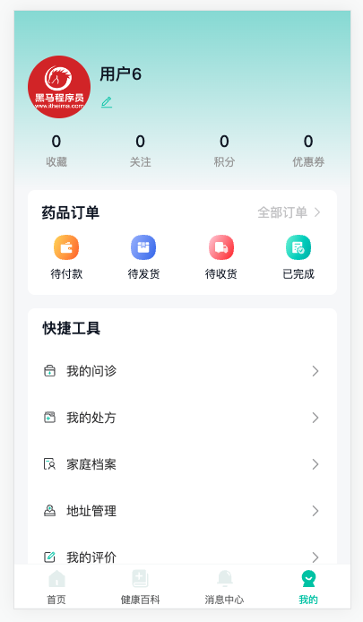
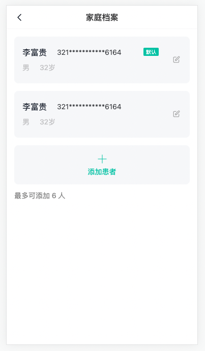
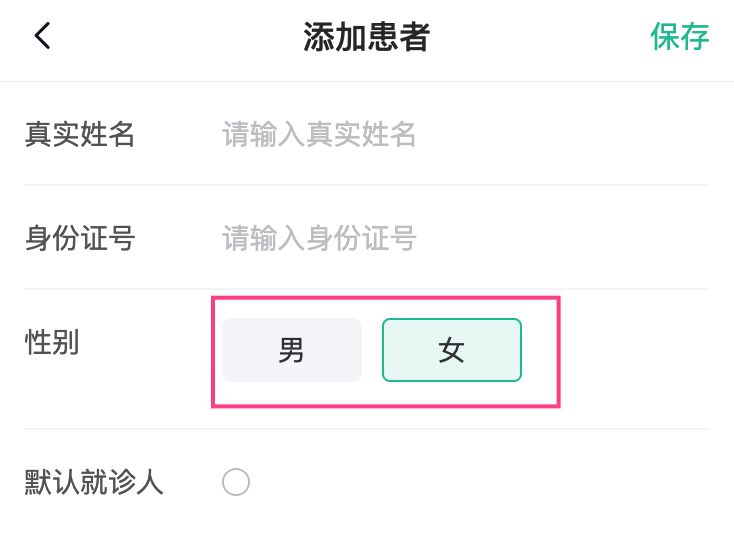
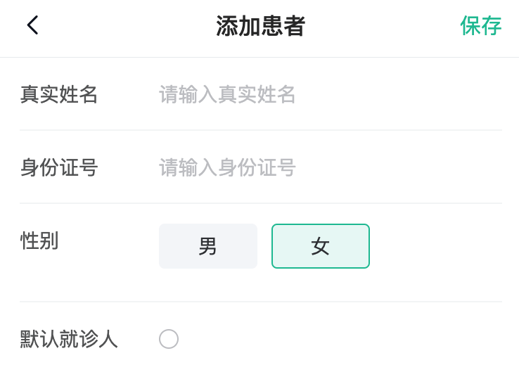

# 用户模块

## 布局容器-组件路由{#layout-routes}

> 目标：首页，健康百科，消息通知，我的，布局容器等静态结构搭建



说明：练习模板组件(02-其它资源)，重点学习在线医疗**业务功能开发**，基本结构都使用vant组件库搭建。

- 基础组件

`Layout/index.vue` == **公共布局** ==

`Home/index.vue`-首页

`Article/index.vue`-健康百科

`Notify/index.vue`-消息通知

`User/index.vue`-我的

* 其它业务组件

`Consult/ConsultFast.vue`-**极速问诊**

`Consult/ConsultIllness.vue`-选择问诊类型

`Consult/ConsultDep.vue`-选择问诊科室=>选择问诊患者

`Consult/ConsultPay.vue`-问诊支付

`Room/index.vue`-**医生问诊室**

`Medicine/OrderPay.vue`**药品支付**

`Medicine/OrderPayResult.vue`支付结果

`Medicine/OrderDetail.vue`订单详情

`Medicine/OrderExpress.vue`物流详情

* ts类型声明文件和api函数

`user.d.ts` 用户类型

`consult.d.ts` 极速问诊类型

`room.d.ts` 问诊室类型

`medicine.d.ts`药品订单类型

> 路由配置

```ts
  routes: [
    
    {
      path: '/',
      component: () => import('@/views/Layout/index.vue'),
      redirect: '/home',
      children: [
        { path: '/home', component: () => import('@/views/home/index.vue') },
        { path: '/article', component: () => import('@/views/article/index.vue') },
        { path: '/notify', component: () => import('@/views/notify/index.vue') },
        { path: '/user', component: () => import('@/views/user/index.vue') }
      ]
    }
  ]
```


## 布局容器-底部tab栏{#layout-tab}

> 实现：底部tab的切换

步骤：

- 使用 `tab-bar` 实现路由切换功能，给tabbar添加`route属性`
- 给 `tab-bar` 加上自定义图标，根据`active`判断是否选中
- 根据需要自定义tabbar字体大小

代码：

`Layout/index.vue`

- 路由切换功能

```html
    <van-tabbar route>
      <van-tabbar-item to="/home">首页</van-tabbar-item>
      <van-tabbar-item to="/article">健康百科</van-tabbar-item>
      <van-tabbar-item to="/notify">消息中心</van-tabbar-item>
      <van-tabbar-item to="/user">我的</van-tabbar-item>
    </van-tabbar>
```

- 自定义图标

```vue
<script setup lang="ts"></script>

<template>
  <div class="layout-page">
    <router-view></router-view>
    <van-tabbar route>
      <van-tabbar-item to="/home">
        首页
        <template #icon="{ active }">
          <cp-icon :name="`home-index-${active ? 'active' : 'default'}`" />
        </template>
      </van-tabbar-item>
      <van-tabbar-item to="/article">
        健康百科
        <template #icon="{ active }">
          <cp-icon :name="`home-article-${active ? 'active' : 'default'}`" />
        </template>
      </van-tabbar-item>
      <van-tabbar-item to="/notify">
        消息中心
        <template #icon="{ active }">
          <cp-icon :name="`home-notice-${active ? 'active' : 'default'}`" />
        </template>
      </van-tabbar-item>
      <van-tabbar-item to="/user">
        我的
        <template #icon="{ active }">
          <cp-icon :name="`home-mine-${active ? 'active' : 'default'}`" />
        </template>
      </van-tabbar-item>
    </van-tabbar>
  </div>
</template>

<style lang="scss" scoped>
.layout-page {
  ::v-deep() {
    .van-tabbar-item {
      &__icon {
        font-size: 21px;
      }
      &__text {
        font-size: 11px;
      }
    }
  }
}
</style>
```


## 布局容器-访问权限控制{#layout-auth}

> 实现：需要登录的页面，需要判断是否有`token`

- vue-router 导航守卫[文档](https://router.vuejs.org/zh/guide/advanced/navigation-guards.html#%E5%85%A8%E5%B1%80%E5%89%8D%E7%BD%AE%E5%AE%88%E5%8D%AB)
  + `return '/login'` 跳转指定地址
  + 不返回，或者 `return true` 就是放行；`return false`取消导航
  + 可以不是 `next` 函数了 

- 访问权限控制 `router/index.ts`

```ts
import { useUserStore } from '@/stores'

// 访问权限控制
router.beforeEach((to, from) => {
  // 用户仓库
  const store = useUserStore()
  // 不需要登录的页面，白名单
  const wihteList = ['/login']
  // 如果没有登录且不在白名单内，去登录
  if (!store.user?.token && !wihteList.includes(to.path)) return '/login'
  // 否则不做任何处理
})
```

提问：

- 如果 `/register` 也不需要登录，写哪里？
  - `const wihteList = ['/login', 'register']`


## 布局容器-页面标题{#layout-title}

> 实现：切换页面切换标题，扩展 `vue-router` 的类型

步骤：

1. 给路由添加`meta`元信息
2. 前置守卫获取元信息设置网页title


- 给每一个路由添加 [元信息](https://router.vuejs.org/zh/guide/advanced/meta.html#%E8%B7%AF%E7%94%B1%E5%85%83%E4%BF%A1%E6%81%AF) 数据

`router/index.ts`

```ts
const router = createRouter({
  history: createWebHistory(import.meta.env.BASE_URL),
  routes: [
    { path: '/login', component: () => import('@/views/Login/index.vue'), meta: { title: '登录' } },
    {
      path: '/',
      component: () => import('@/views/Layout/index.vue'),
      redirect: '/home',
      children: [
        {
          path: '/home',
          component: () => import('@/views/Home/index.vue'),
          meta: { title: '首页' }
        },
        {
          path: '/article',
          component: () => import('@/views/Article/index.vue'),
          meta: { title: '健康百科' }
        },
        {
          path: '/notify',
          component: () => import('@/views/Notify/index.vue'),
          meta: { title: '消息通知' }
        },
        {
          path: '/user',
          component: () => import('@/views/User/index.vue'),
          meta: { title: '个人中心' }
        }
      ]
    }
  ]
})
```

- 切换路由设置标题

`router/index.ts`

```diff
// 访问权限控制
router.beforeEach((to) => {
  // 处理标题
+  document.title = `优医问诊-${to.meta.title || ''}`
  // 用户仓库
  const store = useUserStore()
```

- 扩展元信息类型 `types/vue-router.d.ts`

```ts
import 'vue-router'

declare module 'vue-router' {
  // 扩展 元信息类型
  interface RouteMeta {
    // 标题
    title?: string
  }
}
```

## 个人中心-用户信息类型{#user-types}

> 掌握：Pick 与 Omit 从现有类型中得到可复用类型

场景：

- 有 `User` 对象类型，现在需要[用户api接口](https://www.apifox.cn/apidoc/shared-16a58bff-e4db-465c-9c8b-859c839318ac/api-32162162) `UserInfo` 类型，字段多一些
- 使用 交叉类型  可以复用 `User` 类型，但是不需要 token 属性

Pick 与 Omit TS内置类型

- Pick 可以从一个对象类型中 取出某些属性

```ts
type Person = {
  name: string
  age: number
}
type PickPerson = Pick<Person, 'age'>
// PickPerson === { age: string }
```

- Omit 可以从一个对象类型中 排出某些属性

```ts
type Person = {
  name: string
  age: number
}
type OmitPerson = Omit<Person, 'age'>
// OmitPerson === { name: string }
```

落地代码：

`types/user.d.ts`

```ts
// 1. 登录响应数据
export interface User {
  /**
   * 用户名
   */
  account?: string
  /**
   * 头像
   */
  avatar?: string
  /**
   * 用户id
   */
  id?: string
  /**
   * 脱敏手机号，带星号的手机号
   */
  mobile?: string
  /**
   * refreshToken
   */
  refreshToken?: string
  /**
   * token
   */
  token: string
}

// 短信验证码类型
export type CodeType = 'login' | 'register'

// == add 个人信息 ==
type OmitUser = Omit<User, 'token'>
export type UserInfo = OmitUser & {
  likeNumber: number
  collectionNumber: number
  score: number
  couponNumber: number
  orderInfo: {
    paidNumber: number
    receivedNumber: number
    shippedNumber: number
    finishedNumber: number
  }
}
```

小结：

- `Pick` 作用？
  - 从类型对象中**取出指定的属性类型**
- `Omit` 作用？
  - 从类型对象中排出指定的属性类型，**得到剩余的属性类型**


## 个人中心-头部展示{#user-head-render}

> 实现：头部个人信息展示与订单卡片布局

步骤：

- 熟悉基础结构
- 定义API函数
- 获取数据进行渲染

需求分析❓：

1. 定义api接口返回数据类型

2. 封装后台api函数

3. 获取用户信息数据渲染显示

4. 退出登录

代码：

1）定义API函数

`api/user.ts`

```ts
import type { ..., UserInfo } from '@/types/user'

// ... 省略 ...
// 获取个人信息
export const getUserInfo = () => request.get<any, UserInfo>('/patient/myUser')
```

2）获取数据进行渲染

`user/index.vue`

```ts
import { getUserInfo } from '@/api/user'
import type { UserInfo } from '@/types/user'
import { onMounted, ref } from 'vue'

const user = ref<UserInfo>()
onMounted(async () => {
  const res = await getUserInfo()
  user.value = res
})
```

```diff
+<div class="user-page" v-if="user">
    <div class="user-page-head">
      <div class="top">
+        <van-image round fit="cover" :src="user.avatar" />
        <div class="name">
+          <p>{{ user.account }}</p>
          <p><van-icon name="edit" /></p>
        </div>
      </div>
      <van-row>
        <van-col span="6">
+          <p>{{ user.collectionNumber }}</p>
          <p>收藏</p>
        </van-col>
        <van-col span="6">
+          <p>{{ user.likeNumber }}</p>
          <p>关注</p>
        </van-col>
        <van-col span="6">
+          <p>{{ user.score }}</p>
          <p>积分</p>
        </van-col>
        <van-col span="6">
+          <p>{{ user.couponNumber }}</p>
          <p>优惠券</p>
        </van-col>
      </van-row>
    </div>
    <div class="user-page-order">
      <div class="head">
        <h3>药品订单</h3>
        <router-link to="/order">全部订单 <van-icon name="arrow" /></router-link>
      </div>
      <van-row>
        <van-col span="6">
+          <van-badge :content="user.orderInfo.paidNumber || ''">
            <cp-icon name="user-paid" />
+          </van-badge>
          <p>待付款</p>
        </van-col>
        <van-col span="6">
+          <van-badge :content="user.orderInfo.shippedNumber || ''">
            <cp-icon name="user-shipped" />
+          </van-badge>
          <p>待发货</p>
        </van-col>
        <van-col span="6">
+          <van-badge :content="user.orderInfo.receivedNumber || ''">
            <cp-icon name="user-received" />
+          </van-badge>
          <p>待收货</p>
        </van-col>
        <van-col span="6">
+          <van-badge :content="user.orderInfo.finishedNumber || ''">
            <cp-icon name="user-finished" />
+          </van-badge>
          <p>已完成</p>
        </van-col>
      </van-row>
    </div>
  </div>
```


## 个人中心-快捷工具{#user-tools}

> 实现：快捷工具栏目渲染

步骤：

- 准备初始化数据
- 遍历工具栏

代码：

`user/index.vue`

1）准备初始化数据

```ts
const tools = [
  { label: '我的问诊', path: '/user/consult' },
  { label: '我的处方', path: '/' },
  { label: '家庭档案', path: '/user/patient' },
  { label: '地址管理', path: '/user/address' },
  { label: '我的评价', path: '/' },
  { label: '官方客服', path: '/' },
  { label: '设置', path: '/' }
]
```

2）遍历工具栏

```html
    <div class="user-page-group">
      <h3>快捷工具</h3>
      <van-cell
        :title="item.label"
        is-link
        :to="item.path"
        :border="false"
        v-for="(item, i) in tools"
        :key="i"
      >
        <template #icon><cp-icon :name="`user-tool-0${i + 1}`" /></template>
      </van-cell>
    </div>
```

## 个人中心-退出登录{#user-logout}

> 实现：退出功能

步骤：

- 实现退出
  - 确认框
  - 清除token
  - 跳转登录

代码：

`user/index.vue`

1）实现退出

```vue
<a class="logout" @click="logout" href="javascript:;">退出登录</a>
```

```ts
import { showConfirmDialog } from 'vant'
import { useUserStore } from '@/stores/index'

// ... 省略 ...
const store = useUserStore()
const router = useRouter()
const logout = async () => {
  await showConfirmDialog({
    title: '提示',
    message: '亲，确定退出问诊吗？'
  })
  store.delUser()
  router.push('/login')
}
```

说明❓：Dialog需要[单独引入样式](https://vant-contrib.gitee.io/vant/#/zh-CN/dialog#shou-dong-yin-ru-yang-shi)

`main.ts`

```diff
...
+ import 'vant/es/dialog/style';
```

## 家庭档案-路由与组件{#patient-html}



> 实现：路由的配置和分析结构

- 路由 `router/index.ts`

```ts
    {
      path: '/user/patient',
      component: () => import('@/views/user/PatientInfo.vue'),
      meta: { title: '家庭档案' }
    }
```

说明：注意是一级路由

## 家庭档案-展示患者{#patient-list}

> 实现：患者的查询操作业务逻辑

步骤：

- 定义 [api 函数](https://www.apifox.cn/apidoc/shared-16a58bff-e4db-465c-9c8b-859c839318ac/api-34951415)，以及对应类型
- 实现查询患者业务

需求分析❓：

1. 定义患者api接口函数和data数据类型
2. 获取患者列表信息渲染展示，对患者身份证信息进行脱敏处理
3. 对defaultFlag等于1患者，通过条件渲染显示tag标签
4. 控制患者数量最多添加6人，对添加患者按钮做条件渲染

代码：

1）定义 api 函数，以及对应类型 

- 定义类型 `types/user.d.ts`

```ts
// 家庭档案-患者信息
export type Patient = {
  id?: string
  name: string
  idCard: string
  defaultFlag: 0 | 1
  gender: 0 | 1
  genderValue?: string
  age?: number
}

// 家庭档案-患者信息列表
export type PatientList = Patient[]
```

- 定义API `api/user.ts`

```ts
import type { ..., PatientList} from '@/types/user'
// ... 省略 ...
// 获患者信息列表
export const getPatientList = () => request.get<any, PatientList>('/patient/mylist')
```

2）实现查询患者业务 `User/PatientInfo.vue`

- 获取数据

```ts
import { getPatientList } from '@/api/user'
import type { PatientList } from '@/types/user'
import { onMounted, ref } from 'vue'

// 1. 查询家庭档案-患者列表
const list = ref<PatientList>([])
const loadList = async () => {
  const res = await getPatientList()
  list.value = res
}
onMounted(() => {
  loadList()
})
```

- 进行渲染

```html
      <div class="patient-item" v-for="item in list" :key="item.id">
        <div class="info">
          <span class="name">{{ item.name }}</span>
          <span class="id">{{ item.idCard.replace(/^(.{6})(?:\d+)(.{4})$/, '\$1******\$2') }}</span>
          <span>{{ item.genderValue }}</span>
          <span>{{ item.age }}岁</span>
        </div>
        <div class="icon"><cp-icon name="user-edit" /></div>
        <div class="tag" v-if="item.defaultFlag === 1">默认</div>
      </div>
			<!-- 最多可添加 6 人控制 -->
      <div class="patient-add" v-if="list.length < 6">
```

说明❓：身份证脱敏处理：`/^(.{6})(?:\d+)(.{4})$/`，显示前6和后4，出生日期隐藏

- 匹配第一个$1 `^(.{6})` 
- `?:` 不作为匹配结果存储
- 匹配第二个$2 `(.{4})$`


## 家庭档案-v-model语法糖{#v-model}

> 掌握：vue3中v-model语法糖原理

回顾：

- vue2 中父子组件数据同步 父→子 子→父 如何实现？
  - `v-model="count"` 或者 `xxx.sync="msg"`
- v-model 语法糖 完整写法？
  - `:value="count"` 和 `@input="count=$event"`
- xxx.sync 语法糖 完整写法？
  - `:xxx="msg"` 和 `@update:xxx="msg=$event"`

> 现在：一个 v-model 指令搞定，不需要记忆两种语法

- vue3 中 `v-model` 语法糖

```html
<com-a v-model="count"></com-a>
<!-- 等价 -->
<com-a :modelValue="count" @update:modelValue="count=$event"></com-a>
```

```html
<com-a v-model:msg="str"></com-a>
<!-- 等价 -->
<com-a :msg="str" @update:msg="str=$event"></com-a>
```

小结：

- vue3中只需要 `v-model` 指令可以支持对个数据在父子组件同步，不再支持 `.sync` 语法。

提问：

- vue3 中 v-model 语法糖？
  - `:modelValue="count"` 和 `@update:modelValue="count=$event"`
- vue3 中 v-model:xxx 语法糖？
  - `:xxx="count"` 和 `@update:xxx="count=$event"`

## 家庭档案-新增弹层显示隐藏{#patient-popup}

> 实现：使用 van-popup 完成侧边栏效果

需求分析❓：

1. 点击添加患者，使用 van-popup 组件作为弹层新增患者
1. 扩展 cp-nav-bar 组件，支持自定义返回，传递方法关闭弹层

代码：

1. 使用 van-popup 组件和v-model，实现显示隐藏 `User/PatientInfo.vue`

```ts
// 2. 打开侧滑栏
const show = ref(false)
const showPopup = () => {
  show.value = true
}
```

```html
   <div class="patient-add" v-if="list.length < 6" @click="showPopup()">

   <!-- 侧边栏 -->
    <van-popup v-model:show="show" position="right">
      <cp-nav-bar title="添加患者" right-text="保存"></cp-nav-bar>
      <!-- 表单 -->
    </van-popup>
```

```scss
.patient-page {
  padding: 46px 0 80px;
  ::v-deep() {
    .van-popup {
      width: 80%;
      height: 100%;
    }
  }
}
```

2) 不使用 v-model 实现父子数据同步（理解语法糖，不推荐）

```html
    <van-popup :show="show" @update:show="show=$event" position="right">
      <cp-nav-bar title="添加患者" right-text="保存"></cp-nav-bar>
    </van-popup>
```

Tips: 这种写法麻烦，知道写法即可，一般使用 `v-model:show="show"`

3) 扩展 cp-nav-bar 组件，支持自定义返回

扩展 back 属性，如果有就执行 back 对应的函数。

```diff
const router = useRouter()
const onClickLeft = () => {
+  if (props.back) {
+    return props.back()
+  }
  // 判断历史记录中是否有回退
  if (history.state?.back) {
    router.back()
  } else {
    router.push('/')
  }
}

// 2. 使用组件时候才能确定的功能：标题，右侧文字，点击右侧文字行为（props传入）
+const props = defineProps<{
  title?: string
  rightText?: string
+  back?: () => void
}>()
```

`User/PatientPage.vue` 全屏展示，空出导航栏

```diff
<cp-nav-bar
+            :back="() => (show = false)"
            title="添加患者" right-text="保存"></cp-nav-bar>
```

```diff
.patient-page {
  padding: 46px 0 80px;
  ::v-deep() {
    .van-popup {
      width: 80%;
      height: 100%;
+      padding-top: 46px;
+      box-sizing: border-box;
    }
  }
}
```

小结：

- 属性可以传函数吗？
  - 可以
- popup 组件怎么双向绑定？
  - v-model:show

## cp-radio-btn 组件封装{#patient-cp-radio-btn}

> 实现：按钮组单选框组件



说明：后期快速问诊，病情描述也会使用

需求分析❓：

1. 准备组件静态结构和样式，添加组件ts类型

2. 支持传入options动态渲染选项
3. 支持默认选中和点击切换选中，借助v-model做数据同步

代码：

1）准备基础布局 `components/CpRadioBtn.vue`

```vue
<script setup lang="ts"></script>

<template>
  <div class="cp-radio-btn">
    <a class="item" href="javascript:;">男</a>
    <a class="item" href="javascript:;">女</a>
  </div>
</template>

<style lang="scss" scoped>
.cp-radio-btn {
  display: flex;
  flex-wrap: wrap;
  .item {
    height: 32px;
    min-width: 70px;
    line-height: 30px;
    padding: 0 14px;
    text-align: center;
    border: 1px solid var(--cp-bg);
    background-color: var(--cp-bg);
    margin-right: 10px;
    box-sizing: border-box;
    color: var(--cp-text2);
    margin-bottom: 10px;
    border-radius: 4px;
    transition: all 0.3s;
    &.active {
      border-color: var(--cp-primary);
      background-color: var(--cp-plain);
    }
  }
}
</style>
```

```diff
import CpNavBar from '@/components/CpNavBar.vue'
import CpIcon from '@/components/CpIcon.vue'
+import CpRadioBtn from '@/components/CpRadioBtn.vue'

declare module 'vue' {
  interface GlobalComponents {
    CpNavBar: typeof CpNavBar
    CpIcon: typeof CpIcon
+    CpRadioBtn: typeof CpRadioBtn
  }
}
```

2）实现组件的渲染

- 使用传入数组额方式动态展示需要显示的按钮

`components/CpRadioBtn.vue`

```vue
<script setup lang="ts">
defineProps<{
  options: {
    label: string
    value: string | number
  }[]
}>()
</script>

<template>
  <div class="cp-radio-btn">
    <a class="item" href="javascript:;" v-for="item in options" :key="item.value">
      {{ item.label }}
    </a>
  </div>
</template>
```

`User/PatientInfo.vue`

```ts
const options = [
  { label: '男', value: 1 },
  { label: '女', value: 0 }
]
```

```html
  <cp-radio-btn :options="options"></cp-radio-btn>
```


3）默认选中

使用组件：`User/PatientInfo.vue`

```ts
const gender = ref(1)
```

```html
<cp-radio-btn :options="options" :modelValue="gender"></cp-radio-btn>
```

定义组件：`components/CpRadioBtn.vue`

```diff
<script setup lang="ts">
defineProps<{
  options: {
    label: string
    value: string | number
  }[]
+ modelValue?: string | number
}>()
</script>

<template>
  <div class="cp-radio-btn">
    <a
      class="item"
      href="javascript:;"
      v-for="item in options"
      :key="item.value"
+      :class="{ active: modelValue === item.value }"
    >
      {{ item.label }}
    </a>
  </div>
</template>
```


4）切换效果

使用组件：`User/PatientInfo.vue`  暂时不管类型校验，这种写法不常用

```html
            <cp-radio-btn
              :options="options"
              :modelValue="gender"
              @update:model-value="gender = $event"
            ></cp-radio-btn>
```

定义组件：`components/CpRadioBtn.vue`

```ts
const emit = defineEmits<{
  (e: 'update:modelValue', value: string | number): void
}>()
const toggleItem = (value: string | number) => {
  // 触发自定义事件把数据给父组件
  emit('update:modelValue', value)
}
```

```diff
    <a
      class="item"
      href="javascript:;"
      v-for="item in options"
      :key="item.value"
      :class="{ active: modelValue === item.value }"
+      @click="toggleItem(item.value)"
    >
      {{ item.label }}
    </a>
```

5）改用 v-model 写法

```diff
  <cp-radio-btn
    :options="options"
-    :modelValue="gender"
-    @update:model-value="gender = $event"
+    v-model="gender"
  ></cp-radio-btn>
```

提问：

- `options` 作用是？
  - 提供可选项
- `v-model` 语法糖，拆分写法？
  - `:modelValue="count"` 和 `@update:modelValue="count=$event"`


## 家庭档案-新增表单{#patient-form}

> 实现：准备患者信息录入的表单和绑定数据



需求分析❓：

1. 准备新增患者表单
2. 定义患者响应变量并对表单做双向绑定
3. 默认患者需要通过计算属性完整写法绑定做转换
4. 每次打开新增弹层清空上次输入和选择为默认值

代码：`User/PatientInfo.vue` 

1）绘制表单

```html
<van-form autocomplete="off">
  <van-field label="真实姓名" placeholder="请输入真实姓名" />
  <van-field label="身份证号" placeholder="请输入身份证号" />
  <van-field label="性别">
    <!-- 单选按钮组件 -->
    <template #input>
      <cp-radio-btn :options="options"></cp-radio-btn>
    </template>
  </van-field>
  <van-field label="默认就诊人">
    <template #input>
      <van-checkbox round />
    </template>
  </van-field>
</van-form>
```

2）绑定数据

```ts
import type { Patient, PatientList } from '@/types/user'
import { computed, onMounted, ref } from 'vue'
```

```ts
const patient = ref<Patient>({
  name: '',
  idCard: '',
  gender: 1,
  defaultFlag: 0
})
// 默认值需要转换
const defaultFlag = computed({
  get() {
    return patient.value.defaultFlag === 1 ? true : false
  },
  set(value) {
    patient.value.defaultFlag = value ? 1 : 0
  }
})
```

```diff
    <van-popup v-model:show="show" position="right">
      <cp-nav-bar :back="() => (show = false)" title="添加患者" right-text="保存"></cp-nav-bar>
      <!-- 表单 -->
      <van-form autocomplete="off">
+       <van-field v-model="patient.name" label="真实姓名" placeholder="请输入真实姓名" />
+       <van-field v-model="patient.idCard" label="身份证号" placeholder="请输入身份证号" />
        <van-field label="性别">
          <!-- 单选按钮组件 -->
          <template #input>
+            <cp-radio-btn :options="options" v-model="patient.gender"></cp-radio-btn>
          </template>
        </van-field>
        <van-field label="默认就诊人">
          <template #input>
            <!-- 说明：直接绑定存储的是boolean值 -->
            <!-- <van-checkbox round v-model="patient.defaultFlag" /> -->
            <!-- 使用计算属性转换 -->
+            <van-checkbox round v-model="defaultFlag" />
          </template>
        </van-field>
      </van-form>
    </van-popup>
```


3）打开侧滑栏重置表单

```ts
// 准备默认值
const initPatient: Patient = {
  name: '',
  idCard: '',
  gender: 1,
  defaultFlag: 0
}
const patient = ref<Patient>({ ...initPatient })
```

```diff
// 2. 打开侧滑栏
const show = ref(false)
const showPopup = () => {
+  patient.value = { ...initPatient }
  show.value = true
}
```

小结：

- 为什么使用计算属性 get set 写法？
  - 组件需要的是 布尔 类型，需要通过计算属性转换一下
- 为什么要解构初始数据？
  - 克隆一份新数据，要不然是同一个对象。


## 家庭档案-身份证校验{#patient-validate}

> 实现：提交的时候校验表单，身份证需要校验格式

需求分析❓：

1. 点击新增校验患者名字和身份证格式

- 名字非空，身份证非空
- 身份证格式，性别需要和填写的一致

2. 身份证格式使用id-validator插件(手动添加ts类型，解决类型问题)

代码：

1）名字非空，身份证非空

```diff
      <cp-nav-bar
        :back="() => (show = false)"
        title="添加患者"
        right-text="保存"
+        @click-right="submit"
      ></cp-nav-bar>
```

```ts
const submit = () => {
  if (!patient.value.name) return Toast('请输入真实姓名')
  if (!patient.value.idCard) return Toast('请输入身份证号')
}
```

2）身份证格式，性别需要和填写的一致

- 测试号 
- 110101198307212600 
- 110101196107145504 
- 11010119890512132X 
- 110101196501023433
- 110101197806108758
- 110101198702171378
- 110101198203195893
- 如有雷同纯属巧合，可删除。

[身份证验证](https://github.com/mc-zone/IDValidator) 

```bash
pnpm i id-validator --save
```

由于是比较老的库，没有提供类型，自己定义类型 `types/id-validator.d.ts`

```ts
declare module 'id-validator' {
  // 默认导出的，class是es6的类语法，对应 es5 的构造函数
  export default class {
    // es6 类中的方法，对应 es5 的原型方法
    isValid(id: string): boolean
    getInfo(id: string): {
      sex: number
    }
  }
}
```

`User/PatientPage.vue` 使用库进行校验

```ts
import { Toast } from 'vant'
import Validator from 'id-validator'
```

```ts
const submit = () => {
 	// ...
  // 身份证校验
  const validate = new Validator()
  if (!validate.isValid(patient.value.idCard)) return Toast('身份证格式错误')
  const { sex } = validate.getInfo(patient.value.idCard)
  if (patient.value.gender !== sex) return Toast('性别和身份证不符')
}
```

小结：

- 模块默认返回是构造函数怎么写类型声明文件？
  - `declare module 'id-validate' { export default class {}  }`

扩展阅读：[身份证知识](https://jingyan.baidu.com/article/d621e8da0372106964913f13.html)

## 家庭档案-新增患者{#patient-add}

> 实现：患者的添加操作业务逻辑

需求分析❓：

1. 定义 [api 函数](https://www.apifox.cn/apidoc/shared-16a58bff-e4db-465c-9c8b-859c839318ac/api-34951413)，以及对应类型

2. 校验通过后，调用新增患者api方法新增，成功关闭弹层并刷新患者列表

代码：

1）定义 api 函数

`api/user.ts`

```ts
import type { ..., Patient } from '@/types/user'

// 添加患者信息
export const addPatient = (patient: Patient) => request.post('/patient/add', patient)
```

2）实现添加患者业务

`User/PatientPage.vue`

```diff
+import { addPatient } from '@/api/user'

// ... 省略 ...

const submit = async () => {
  if (!patient.value.name) return Toast('请输入真实姓名')
  if (!patient.value.idCard) return Toast('请输入身份证号')
  const validate = new Validator()
  if (!validate.isValid(patient.value.idCard)) return Toast('身份证格式错误')
  const { sex } = validate.getInfo(patient.value.idCard)
  if (patient.value.gender !== sex) return Toast('性别和身份证不符')

+  // 添加
+  await addPatient(patient.value)
+  show.value = false
+  loadList()
+  showSuccessToast('添加成功')
}
```


## 家庭档案-编辑患者(作业){#patient-edit}

> 实现：患者的编辑操作业务逻辑

需求分析❓：

1. 复用新增弹层，打开弹层回填数据，显示当前点击编辑患者信息

2. 编写修改api 函数

3. 根据是否有患者ID区分新增或编辑，调用对应api函数

提示❓：可以根据是否存在id判断是添加或者编辑操作

代码：

- 打开对话框，区分编辑和添加

```html
<div @click="showPopup(item)" class="icon"><cp-icon name="user-edit" /></div>
```

```diff
const showPopup = (item?: Patient) => {
+  if (item) {
-    // 如果点的是编辑，解构出后台需要的数据
+    const { id, gender, name, idCard, defaultFlag } = item
+    patient.value = { id, gender, name, idCard, defaultFlag }
+  } else {
    patient.value = { ...initPatient }
  }
  show.value = true
}
```

```diff
      <cp-nav-bar
        :back="() => (show = false)"
+        :title="patient.id ? '编辑患者' : '添加患者'"
        right-text="保存"
        @click-right="submit"
      ></cp-nav-bar>
```

- api 函数

```ts
// 编辑患者信息
export const editPatient = (patient: Patient) => request.put('/patient/update', patient)
```

- 合并编辑患者请求

```ts
import { ..., editPatient } from '@/api/user'
```

```diff
const submit = async () => {
  // ...
  // 添加 & 修改
+  patient.value.id ? await editPatient(patient.value) : await addPatient(patient.value)
  show.value = false
  loadList()
+  showSuccessToast(patient.value.id ? '编辑成功' : '添加成功')
}
```


## 家庭档案-删除患者(作业){#patient-del}

> 实现：患者的删除操作业务逻辑

需求分析❓：

1. 在**修改状态**下，显示删除患者按钮

2. 定义删除[API函数](https://www.apifox.cn/apidoc/shared-16a58bff-e4db-465c-9c8b-859c839318ac/api-34951412)

3. 点击删除，弹出确认框，确认删除调用api函数
4. 关闭弹层并刷新患者列表

代码：

- 准备按钮

```diff
      </van-form>
+      <van-action-bar>
+        <van-action-bar-button type="danger" text="删除"></van-action-bar-button>
+      </van-action-bar>
    </van-popup>
```

- 定义API

```ts
// 删除患者信息
export const delPatient = (id: string) => request.delete(`/patient/del/${id}`)
```

- 点击删除，弹出确认框，确认删除

```html
      <van-action-bar v-if="patient.id">
        <van-action-bar-button @click="remove" type="danger" text="删除"></van-action-bar-button>
      </van-action-bar>
```

```ts
import { showFailToast, showSuccessToast, showConfirmDialog } from 'vant'
import { ..., delPatient } from '@/api/user'
// ... 省略 ...
const remove = async () => {
  if (patient.value.id) {
    await showConfirmDialog({
      title: '温馨提示',
      message: `您确认要删除 ${patient.value.name} 患者信息吗 ？`
    })
    await delPatient(patient.value.id)
    show.value = false
    getList()
    showSuccessToast('删除成功')
  }
}
```

# 第六天


