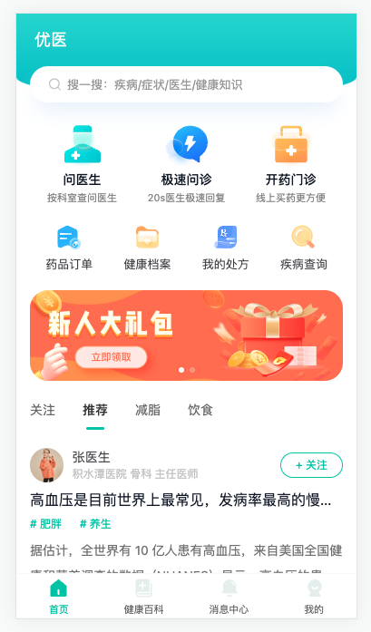
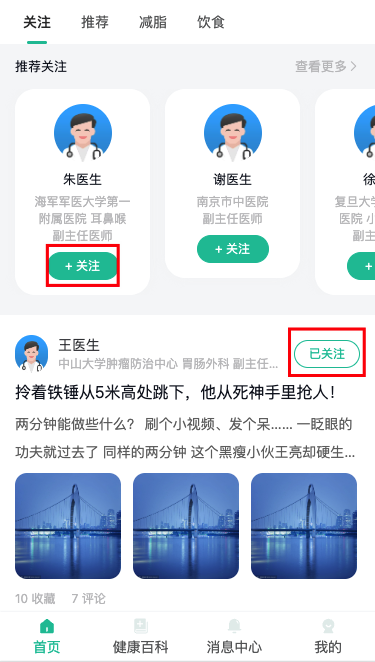

# 首页模块

## 首页模块-基础结构{#homw-html}

> 目标：了解基础结构和组件

分析结构：

- 头部
- 导航
- 轮播图




## 首页模块-切换知识列表{#home-knowledge-html}

> 实现：tab切换效果，准备知识列表组件

步骤：

- 使用 van-tabs 组件做切换
- 新建 knowledge-list 组件展示知识文章列表
- 默认激活 推荐tab , 结合查询列表接口的知识类型

代码：

1）使用 [van-tabs 组件](https://vant-contrib.gitee.io/vant/#/zh-CN/tab)实现切换效果

 `Home/index.vue`

```html
    <van-tabs shrink sticky v-model:active="active">
      <van-tab title="关注">1 </van-tab>
      <van-tab title="推荐">2</van-tab>
      <van-tab title="减脂">3</van-tab>
      <van-tab title="饮食">4</van-tab>
    </van-tabs>
```

2）新建 knowledge-list组件展示知识文章列表

`Home/components/KnowledgeList.vue`

1. 在knowledge-list组件中，导入knowledge-card 模版组件，作为列表的item组件

```vue
<script setup lang="ts">
import KnowledgeCard from './KnowledgeCard.vue'
</script>

<template>
  <div class="knowledge-list">
    <knowledge-card v-for="i in 5" :key="i"></knowledge-card>
  </div>
</template>

<style lang="scss" scoped>
.knowledge-list {
  padding: 0 15px;
}
</style>
```

2. 在首页中导入knowledge-list组件

`Home/index.vue`

```ts
import KnowledgeList from './components/KnowledgeList.vue'
```

```html
    <van-tabs shrink sticky>
      <van-tab title="关注"><knowledge-list /> </van-tab>
      <van-tab title="推荐"><knowledge-list /></van-tab>
      <van-tab title="减脂"><knowledge-list /></van-tab>
      <van-tab title="饮食"><knowledge-list /></van-tab>
    </van-tabs>
```

3）默认激活 推荐tab , 结合查询列表[api接口](https://www.apifox.cn/apidoc/shared-16a58bff-e4db-465c-9c8b-859c839318ac/api-29254917)的知识类型

- recommend推荐，fatReduction减脂，food健康饮食，like关注医生页面文章

`types/consult.d.ts`

```ts
// 文章类型
export type KnowledgeType = 'like' | 'recommend' | 'fatReduction' | 'food'
```

`Home/index.vue`

```ts
import { ref } from 'vue'
import type { KnowledgeType } from '@/types/consult'

const active = ref<KnowledgeType>('recommend')
```

```html
    <van-tabs shrink sticky v-model:active="active">
      <van-tab title="关注" name="like"><knowledge-list /> </van-tab>
      <van-tab title="推荐" name="recommend"><knowledge-list /></van-tab>
      <van-tab title="减脂" name="fatReduction"><knowledge-list /></van-tab>
      <van-tab title="饮食" name="food"><knowledge-list /></van-tab>
    </van-tabs>
```

提问：

- active 的值是什么？
  - 将来查询知识问诊列表的类型，局限于4个值。
  - 通过name自定义active选中的值


## 首页模块-知识加载-效果{#home-knowledge-load}

> 实现：使用 [van-list 组件](https://vant-contrib.gitee.io/vant/#/zh-CN/list)完成加载更多效果

步骤：

* 根据**基础用法**实现上拉加载更多效果

`Home/components/KnowledgeList.vue`

```vue
<script setup lang="ts">
import { ref } from 'vue'
import KnowledgeCard from './KnowledgeCard.vue'
// 获取文章列表
const list = ref<number[]>([])
const loading = ref(false)
const finished = ref(false)

const onLoad = () => {
  // 异步更新数据
  // setTimeout 仅做示例，真实场景中一般为 ajax 请求
  setTimeout(() => {
    for (let i = 0; i < 10; i++) {
      list.value.push(list.value.length + 1)
    }

    // 加载状态结束
    loading.value = false

    // 数据全部加载完成
    if (list.value.length >= 30) {
      finished.value = true
    }
  }, 1000)
}
</script>

<template>
  <div class="knowledge-list">
    <van-list
      v-model:loading="loading"
      :finished="finished"
      finished-text="没有更多了"
      @load="onLoad"
    >
      <knowledge-card v-for="i in list" :key="i"></knowledge-card>
    </van-list>
  </div>
</template>

<style lang="scss" scoped>
.knowledge-list {
  padding: 0 15px;
}
</style>
```

小结：

- v-model:loading 数据？
  - 控制加载中效果
- :finished 数据？
  - 控制全部数据是否加载完成，true就不在触发加载
- 触发加载事件，做什么？
  - 发请求，**追加数据，判断是否加载完成**

## 首页模块-知识数据-类型{#home-knowledge-type}

> 实现：根据[api接口](https://www.apifox.cn/apidoc/shared-16a58bff-e4db-465c-9c8b-859c839318ac/api-29254917)定义数据类型和传参类型

`types/consult.d.ts`

```ts
// 文章信息类型
export type Knowledge = {
  id: string
  title: string
  coverUrl: string[]
  topics: string[]
  collectionNumber: number
  commentNumber: number
  creatorName: string
  creatorAvatar: string
  creatorHospatalName: string
  likeFlag: 0 | 1
  content: string
  creatorDep: string
  creatorTitles: string
  creatorId: string
}

// 文章列表
export type KnowledgeList = Knowledge[]

// 文章列表带分页
export type KnowledgePage = {
  pageTotal: number
  total: number
  rows: KnowledgeList
}

// 文章列表查询参数
export type KnowledgeParams = {
  type: KnowledgeType
  current: number
  pageSize: number
}
```

小结：

- 拆分类型的目的？
  - 尽量复用

## 首页模块-知识加载-实现{#home-knowledge-logic}

> 实现：知识列表组件滚动加载

步骤：

- 给组件传入 type 查询类型
- 定义 [api 函数](https://www.apifox.cn/apidoc/shared-16a58bff-e4db-465c-9c8b-859c839318ac/api-29254917)
- 实现加载数据和渲染

代码：

1）给组件传入 type 列表查询类型
`Home/components/KnowledgeList.vue`

```ts
const props = defineProps<{
  type: KnowledgeType
}>()
```

`Home/index.vue`

```diff
    <van-tabs shrink sticky v-model:active="active">
+      <van-tab title="关注" name="like"><knowledge-list type="like" /> </van-tab>
+      <van-tab title="推荐" name="recommend"><knowledge-list type="recommend" /></van-tab>
+      <van-tab title="减脂" name="fatReduction"><knowledge-list type="fatReduction" /></van-tab>
+      <van-tab title="饮食" name="food"><knowledge-list type="food" /></van-tab>
    </van-tabs>
```

2）定义 api 函数 `api/consult.ts`

```ts
import type { KnowledgePage, KnowledgeParams } from '@/types/consult'
import { request } from '@/utils/request'

export const getKnowledgePage = (params: KnowledgeParams) =>
  request.get<any, KnowledgePage>('/patient/home/knowledge', { params })
```


3）实现加载数据和渲染

`Home/components/KnowledgeList.vue`

步骤：

1. 添加list类型，定义请求params参数
2. onLoad加载函数中替换真实接口，处理分页和加载
3. knowledge-card组件接收item数据渲染

```vue
<script setup lang="ts">
import { getKnowledgePage } from '@/api/consult'
import type { ..., KnowledgeList, KnowledgeParams } from '@/types/consult'
import { ref } from 'vue'

const props = defineProps<{
  type: KnowledgeType
}>()

const loading = ref(false)
const finished = ref(false)

const list = ref<KnowledgeList>([])
const params = ref<KnowledgeParams>({
  type: props.type,
  current: 1,
  pageSize: 10
})
const onLoad = async () => {
  // 加载更多
  const res = await getKnowledgePage(params.value)
  list.value.push(...res.rows)
  if (params.value.current >= res.pageTotal) {
    finished.value = true
  } else {
    params.value.current++
  }
  loading.value = false
}
</script>

<template>
  <div class="knowledge-list">
    <van-list
      v-model:loading="loading"
      :finished="finished"
      finished-text="没有更多了"
      @load="onLoad"
    >
      <knowledge-card v-for="item in list" :key="item.id" :item="item" />
    </van-list>
  </div>
</template>
```

`Home/components/KnowledgeCard.vue`

```vue
<script setup lang="ts">
import type { Knowledge } from '@/types/consult'

defineProps<{ item: Knowledge }>()
</script>

<template>
  <div class="knowledge-card van-hairline--bottom">
    <div class="head">
      <van-image round class="avatar" :src="item.creatorAvatar"></van-image>
      <div class="info">
        <p class="name">{{ item.creatorName }}</p>
        <p class="dep van-ellipsis">
          {{ item.creatorHospatalName }} {{ item.creatorDep }} {{ item.creatorTitles }}
        </p>
      </div>
      <van-button class="btn" size="small" round>
        {{ item.likeFlag === 1 ? '已关注' : '+ 关注' }}
      </van-button>
    </div>
    <div class="body">
      <h3 class="title van-ellipsis">{{ item.title }}</h3>
      <p class="tag">
        <span v-for="(tag, i) in item.topics" :key="i"># {{ tag }}</span>
      </p>
      <p class="intro van-multi-ellipsis--l2" v-html="item.content"></p>
      <div class="imgs" :class="{ large: item.coverUrl.length === 1 }">
        <van-image v-for="(url, i) in item.coverUrl" :key="i" :src="url" />
      </div>
      <p class="logs">
        <span>{{ item.collectionNumber }} 收藏</span>
        <span>{{ item.commentNumber }} 评论</span>
      </p>
    </div>
  </div>
</template>
```


## 首页模块-推荐关注医生-交互{#home-doctor}

> 实现：在关注医生的文章列表上方加上医生列表

步骤：

- 引入关注组件并渲染
- 查看 van-swipe 组件的使用
- 添加医生卡片基本结构
- 去除 指示器，关闭 无缝滚动，设置一次滚动一个卡片

代码：

1）在首页关注频道，引入关注医生组件

`Home/index.vue`

```diff
+ import FollowDoctor from './components/FollowDoctor.vue'
    <van-tab title="关注" name="like">
+     <follow-doctor></follow-doctor>
      <knowledge-list type="like" />
    </van-tab>
```

2）查看 [van-swipe](https://vant-contrib.gitee.io/vant/#/zh-CN/swipe) 组件的使用

```html
      <van-swipe >
        <van-swipe-item v-for="item in 5" :key="item">
          {{ item }}
        </van-swipe-item>
      </van-swipe>
````

3) 引入医生卡片组件，使用van-swipe 控制医生卡片滑动

`Home/components/FollowDoctor.vue`

```diff
+ <van-swipe >
+   <van-swipe-item v-for="item in list" :key="item.id">
-       <doctor-card />
+   </van-swipe-item>
+ </van-swipe>
```

4）去除 指示器，关闭 无缝滚动，设置一次滚动一个卡片

```html
 <van-swipe :width="150" :show-indicators="false" :loop="false">
```

有适配问题⚠️：

- 150 宽度的滚动距离，<span style="color:red">适配有问题，切换设备试试</span>。


## 首页模块-@vueuse/core{#home-vueuse}

> 介绍 @vueuse/core 组合api库，使用 useXxx 函数获取设备宽度，动态设置滚动距离


@vueuse/core 介绍：[文档](https://vueuse.org/functions.html)

- 是一个基于 组合API 封装的库
- 提供了一些网站开发常用的工具函数

需求：

- 在 375 宽度设备，滚动宽度为 150
- 在其他设备需要等比例设置滚动的宽度
- scrollWidth = 150 / 375 * deviceWidth 就可以适配

代码：

1. 原生方式：

```ts
import { onMounted, ref } from 'vue'

const width = ref(375)
onMounted(() => {
  width.value = window.innerWidth
  
  window.addEventListener('resize', () => {
  width.value = window.innerWidth
})
})
```

```diff
<van-swipe
+           :width="(150 / 375) * width"
           :show-indicators="false" :loop="false">
```

2. @vueuse/core 应用：

```bash
pnpm i @vueuse/core
```

```ts
import { useWindowSize } from '@vueuse/core'

const { width } = useWindowSize()
```

小结：

- 如果遇见一些常见的需求可以先看看 @vueuse/core 是否提供，这样可以提高开发效率。
  - 如果：窗口尺寸，滚动距离，是否进入可视区，倒计时，...等等。


## 首页模块-推荐关注医生-展示{#home-like-render}

> 完成关注tab下，推荐关注的医生列表展示

步骤：

- 定义 医生卡片数据 类型，优化分页查询参数公共类型
- 定义 获取推荐关注医生 [api接口函数](https://www.apifox.cn/apidoc/shared-16a58bff-e4db-465c-9c8b-859c839318ac/api-32285399)
- 实现 推荐关注的医生


代码：

1）定义 医生卡片数据 类型

 `consult.d.ts`

```ts
// 通用的分页查询参数
export type PageParams = {
  current: number
  pageSize: number
}

// 文章列表查询参数，复用PageParams
export type KnowledgeParams = PageParams & {
  type: KnowledgeType
}

// 医生卡片
export type Doctor = {
  id: string
  name: string
  avatar: string
  hospitalName: string
  gradeName: string
  depName: string
  positionalTitles: string
  likeFlag: 0 | 1
  serviceFee: number
  consultationNum: number
  score: number
  major: string
}

// 医生列表
export type DoctorList = Doctor[]

// 医生分页
export type DoctorPage = {
  pageTotal: number
  total: number
  rows: DoctorList
}
```

2）定义 获取推荐关注医生 接口函数 

`api/consult.ts`

```ts 
import type { ..., DoctorPage, PageParams } from '@/types/consult'
import { request } from '@/utils/request'

export const getDoctorPage = (params: PageParams) =>
  request.get<any, DoctorPage>('/home/page/doc', {params})
```

3）实现 推荐关注的医生展示

`Home/components/FollowDoctor.vue`

```vue
<script setup lang="ts">
import { getDoctorPage } from '@/api/consult'
import type { DoctorList } from '@/types/consult'
import { useWindowSize } from '@vueuse/core'
import { onMounted, ref } from 'vue'

const { width } = useWindowSize()
// 获取关注的医生
const list = ref<DoctorList>()
const loadData = async () => {
  const res = await getDoctorPage({ current: 1, pageSize: 5 })
  list.value = res.rows
}
onMounted(() => loadData())
</script>

<template>
  <div class="follow-doctor">
    <div className="head">
      <p>推荐关注</p>
      <a href="javascript:;"> 查看更多<i class="van-icon van-icon-arrow" /></a>
    </div>
    <div class="body">
      <van-swipe :width="(150 / 375) * width" :show-indicators="false" :loop="false">
        <van-swipe-item v-for="item in list" :key="item.id">
          <doctor-card :item="item" />
        </van-swipe-item>
      </van-swipe>
    </div>
  </div>
</template>
```

`Home/components/DoctorCard.vue`

```vue
<script lang="ts" setup>
import type { Doctor } from '@/types/consult'

defineProps<{ item: Doctor }>()
</script>
<template>
  <div class="doctor-card">
    <van-image round :src="item.avatar" />
    <p class="name">{{ item.name }}</p>
    <p>{{ item.hospitalName }} {{ item.depName }}</p>
    <p>{{ item.positionalTitles }}</p>
    <van-button round size="small" type="primary">
      {{ item.likeFlag === 1 ? '已关注' : '+ 关注' }}
    </van-button>
  </div>
</template>
```


## 首页模块-关注医生(课堂练习){#home-like}

> 实现：关注医生业务

步骤：

- 定义关注与取消关注[API函数](https://www.apifox.cn/apidoc/shared-16a58bff-e4db-465c-9c8b-859c839318ac/api-31644723)
- 实现关注和取消关注逻辑

代码：

1. 定义关注与取消关注API

`types/consult.d.ts`

```ts
// 关注的类型
export type FollowType = 'doc' | 'knowledge' | 'topic' | 'disease'
```

`api/consult.ts`

```ts
export const followDoctor = (id: string, type: FollowType = 'doc') =>
  request.post('/like', { id, type })
```

2. 实现关注和取消关注逻辑

`Home/components/DoctorCard.vue`

```diff
<van-button
+            :loading="loading"
+            @click="follow(item)"
            round size="small" type="primary">
              {{ item.likeFlag === 1 ? '已关注' : '+ 关注' }}
            </van-button>
```

```ts
import type { Doctor } from '@/types/consult'
import { followDoctor } from '@/api/consult'
import { ref } from 'vue'

defineProps<{ item: Doctor }>()

// 关注逻辑
const loading = ref(false)
const follow = async (doc: Doctor) => {
  // 防止重复点击
  loading.value = true
  try {
    await followDoctor(doc.id)
    doc.likeFlag = doc.likeFlag === 1 ? 0 : 1
  } finally {
    // 无论 try / catch 结果如何都会执行的代码块
    loading.value = false
  }
}
```

说明：关注接口后台没有实现，存储关注状态

## 首页模块-逻辑复用{#home-like-logic}

> 利用组合API，实现关注医生业务逻辑复用



封装：

`composable/index.ts`

```ts
import { ref } from 'vue'
import { followDoctor } from '@/api/consult'
import type { FollowType } from '@/types/consult'

// 封装逻辑，规范 useXxx，表示使用某功能
export const useFollow = (type: FollowType = 'doc') => {
  const loading = ref(false)
  // {a, b} 类型，传值得时候 {a, b, c} 也可以，这是类型兼容：多的可以给少的
  const follow = async (obj: { id: string; likeFlag: 0 | 1 }) => {
    loading.value = true
    try {
      await followDoctor(obj.id, type)
      obj.likeFlag = obj.likeFlag === 1 ? 0 : 1
    } finally {
      loading.value = false
    }
  }
  return { loading, follow }
}
```

使用：

`DoctorCard.vue`

```vue
<script lang="ts" setup>
import type { Doctor } from '@/types/consult'
import { useFollow } from '@/composable'

defineProps<{ item: Doctor }>()

// 关注逻辑
// const loading = ref(false)
// const follow = async (doc: Doctor) => {
//   // 防止重复点击
//   loading.value = true
//   try {
//     await followDoctor(doc.id)
//     doc.likeFlag = doc.likeFlag === 1 ? 0 : 1
//   } finally {
//     // 无论 try / catch 结果如何都会执行的代码块
//     loading.value = false
//   }
// }
const { loading, follow } = useFollow()
</script>
```

`KnowledgeCard.vue`

```ts
const { loading, follow } = useFollow('knowledge')
```

```diff
 <van-button
+             :loading="loading" @click="follow(item)"
             round size="small" type="primary">
              {{ item.likeFlag === 1 ? '已关注' : '+ 关注' }}
            </van-button>
```

小结：

- 是组合API封装逻辑复用的函数，一般叫 hook 函数，是一种逻辑复用的思想
- 对象类型多的可以传递给少的，叫：类型兼容

#  第七天

