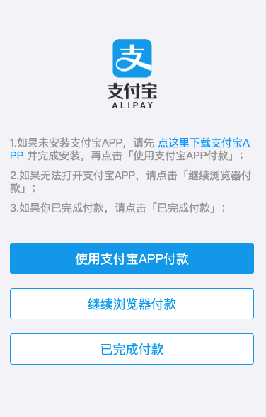

# 极速问诊-准备

## 极速问诊-需求分析{#consult-product}
> 理解：极速问诊阶段流程分析

线下看病流程：

选择医院（三甲、普通）=》挂号=》选择科室 =》选择医生（专家、主任）=》支付=》订单=》患者去医院找医生，当面沟通=》医生确定病情，开药=》患者去药房买药

线上看病流程：


极速问诊阶段：

1. **极速问诊**（记录-**问诊类型**）

2. 三甲图文问诊 或 普通图文问诊（记录-**问诊级别**）

3. 选择科室（记录-疾病科室）

4. 描述病情（记录-症状详情、时间、是否问诊过、图片）

5. 选择患者（记录-患者ID）

6. 支付问诊费（挂号费）

所有流程走完才能组合成完整的问诊记录，而且是不同的页面采集数据，这个实现需要 `pinia` 

接口数据：

- type 问诊类型：  1找医生   2**极速问诊**   3开药问诊  `type:1|2|3`
- illnessType 极速问诊类型：0普通  1三甲	`illnessType: 0|1`

提问：

- 刚刚看到 1 2 3 的时候你能记得他们代表什么意思吗？
  - 不清楚，对于数字字面量类型的联合类型语义差，建议使用 `枚举`


## 枚举基本语法{#enum-base}

> 掌握：枚举的基本语法和使用细节

- 作用：表示一组明确可选的值，和字面量类型配合联合类型类似。
- 解释：枚举可以定义一组常量，使用该类型后，约定只能使用这组常量中的其中一个。

```ts
// 创建枚举类型
enum Direction { Up, Down, Left, Right }

// 使用枚举类型
const changeDirection = (direction: Direction) => {
  console.log(direction)
}

// 调用函数时，需要应该传入：枚举 Direction 成员的任意一个
// 类似于 JS 中的对象，直接通过 点（.）语法 访问枚举的成员
changeDirection(Direction.Up)
```

问题：
- 通过枚举访问其成员，成员的值是什么？
  - 默认从 0 开始自增的数值
- 可以修改其成员的值吗？
  - `Up = 10` , 后面是从 10 开始自增
- 成员的值可以使用字符串吗？
  - `Up = 'Up'` 可以，但是后面的值都需要使用字符串。


## 枚举使用场景{#enum-intro}

> 场景：用于一组没有语义的可选值，给它们添加类型。

比如：
- 后台给的数据： 0 是男  1 是女  ----   1 是待付款  5 是已付款  8 是已完成
- 好处，通过枚举可以让成员更加语义化，提高代码可读性

代码：
```ts
// 性别
enum GenderType {
  Boy,
  Girl
}
const showGender = (gender: GenderType) => {
  if (gender === GenderType.Boy) {
    console.log('性别：男')
  }
}
showGender(GenderType.Boy)
// 订单状态
enum OrderStatus {
  UnPay = 1,
  Payed = 5,
  Complete = 8
}
const showOrderStatus = (status: OrderStatus) => {
  if (status === OrderStatus.Complete) {
    console.log('状态：已完成')
  }
}
showOrderStatus(OrderStatus.Complete)
```

小结：
- 枚举一般使用在，表示一组明确可选的值，语义化不高的情况。
- 如果这组可选值语义很高，如 ` unpay | payed | complete ` ，使用字面量配合联合类型更简单些。
思考：
- 枚举的选项可以代表值，可以写在 `d.ts` 文件吗？
  - 不能，有值的需要写在 ts 文件中


## 极速问诊-定义类型{#consult-type}
> 根据api接口，定义[问诊订单记录](https://www.apifox.cn/apidoc/shared-16a58bff-e4db-465c-9c8b-859c839318ac/api-34951419)数据相关类型

步骤：
- 问诊类型枚举
- 患病时间枚举
- 图片数组类型
- **问诊记录类型**（创建问诊订单）

代码：

`enums/index.ts`
```ts
// 问诊类型：1找医生 2== 极速问诊 == 3开药问诊
export enum ConsultType {
  Doctor = 1,
  Fast = 2,
  Medication = 3
}
// 患病时间：1一周内2一月内3半年内4半年以上
export enum ConsultTime {
  Week = 1,
  Month,
  HalfYear,
  More
}
```

`types/consult.d.ts`
```ts
import { ConsultType, ConsultTime } from '@/enums'

// 图片列表
export type Image = {
  id: string
  url: string
}
// 问诊记录=> 极速问诊参数
export type Consult = {
  type: ConsultType // 问诊类型：1找医生 2极速问诊 3开药问诊
  illnessType: 0 | 1 // 问诊级别：0普通  1三甲
  depId: string // 问诊科室id
  illnessDesc: string // 病情描述
  illnessTime: ConsultTime // 患病时间：1一周内2一月内3半年内4半年以上
  consultFlag: 0 | 1 // 是否问诊过：0未问诊1问诊过
  pictures: Image[] // 病例信息-图片集合
  patientId: string // 患者id
  couponId: string // 优惠卷id
}

// 问诊记录-全部可选
// Required 转换为全部必须   Partial 转换问全部可选  两个内置的泛型类型
export type PartialConsult = Partial<Consult>
```
小结：
- 全部可选是因为信息是一点一点累加上去的
- Required 转换为全部必须
- Partial 转换问全部可选 

注意：
- 枚举类型需要在 ts 文件中，**因为枚举会编译成 js 代码**

## 极速问诊-问诊记录仓库{#consult-store}
> 实现：病情描述仓库的定义，实现问诊记录分步修改

问题❓：如何跨页面共享使用数据？

需求：

- 定义仓库，提供
  1. 问诊记录数据，创建订单使用
  
  2. 修改问诊类型type方法：1找医生 2极速问诊 3开药问诊
  
  3. 修改极速问诊类型illnessType方法：0普通  1三甲
  
  4. 修改科室id方法
  
  5. 修改病情描述相关信息方法：illnessDesc、illnessTime、consultFlag、pictures
  
  6. 修改患者patientId的方法
  7. ~~修改优惠卷couponId的方法~~
  
  8. 清空问诊记录方法
  
- 导出仓库

- 首页点击极速问诊记录问诊类型且跳转页面

代码：

1. 定义仓库 `stores/modules/consult.ts`

```ts
import type { ConsultType } from '@/enums'
import type { PartialConsult } from '@/types/consult'
import { defineStore } from 'pinia'
import { ref } from 'vue'

export const useConsultStore = defineStore(
  'cp-consult',
  () => {
    // 1. 问诊记录数据
    const consult = ref<PartialConsult>({})
    // 2. 设置问诊类型
    const setType = (type: ConsultType) => (consult.value.type = type)
    // 3. 设置极速问诊级别
    const setIllnessType = (type: 0 | 1) => (consult.value.illnessType = type)
    // 4. 设置科室
    const setDep = (id: string) => (consult.value.depId = id)
    // 5. 设置病情描述
    const setIllness = (
      illness: Pick<PartialConsult, 'illnessDesc' | 'illnessTime' | 'consultFlag' | 'pictures'>
    ) => {
      consult.value.illnessDesc = illness.illnessDesc
      consult.value.illnessTime = illness.illnessTime
      consult.value.consultFlag = illness.consultFlag
      consult.value.pictures = illness.pictures
    }
    // 6. 设置患者
    const setPatient = (id: string) => (consult.value.patientId = id)
    // 7. 设置优惠券
    // const setCunpon = (id?: string) => (consult.value.couponId = id)
    // 8. 清空记录
    const clear = () => (consult.value = {})

    return { consult, setType, setIllnessType, setDep, setIllness, setPatient, clear }
  },
  {
    persist: true
  }
)
```

2. 导出仓库 `stores/index.ts`

```ts
export * from './modules/consult'
```

3. 首页点击极速问诊记录**问诊类型**且跳转页面 `views/Home/index.vue`

```ts
import { useConsultStore } from '@/stores'
import { ConsultType } from '@/enums'

const store = useConsultStore()
```

```diff
<router-link to="/consult/fast"
+            @click="store.setType(ConsultType.Fast)"
             class="nav">
```

# 极速问诊-订单

## 极速问诊-选择问诊级别-路由{#consult-change-type}


> 完成选择三甲还是普通问诊页面，点击后记录对应的类型，跳转到选择科室路由

步骤：
- 路由和组件
- 点击入口记录极速问诊级别

代码：

1）路由和组件 

`router/index.ts`
```ts
{
  path: '/consult/fast',
  component: () => import('@/views/consult/ConsultFast.vue'),
  meta: { title: '极速问诊' }
}
```

2）点击入口记录极速问诊级别

`Consult/ConsultFast.vue`

```ts
<script setup lang="ts">
import { useConsultStore } from '@/stores'

const store = useConsultStore()
</script>
```

```diff
<router-link to="/consult/dep" class="item"
+             @click="store.setIllnessType(1)">
<router-link to="/consult/dep" class="item"
+             @click="store.setIllnessType(0)">
```

## 极速问诊-选择科室-路由{#consult-dep-html}


> 实现：配置科室选择路由

代码：

1. 路由与组件

`router/index.ts`

```ts
    {
      path: '/consult/dep',
      component: () => import('@/views/consult/ConsultDep.vue'),
      meta: { title: '选择科室' }
    }
```

2. 分析结构

## 极速问诊-选择科室-业务{#consult-dep-logic}
> 实现：科室切换以及跳转到病情描述

步骤：

1. 编写科室需要的类型：父子科室

2. 准备[API函数](https://www.apifox.cn/apidoc/shared-16a58bff-e4db-465c-9c8b-859c839318ac/api-41224944)

3. 实现一级科室切换

4. 实现二级科室切换

5. 跳转时记录科室到问诊记录


代码：

1）编写科室需要的类型 `types/consult.d.ts`
```ts
// 科室
export type SubDep = {
  id: string
  name: string
}
// 一级科室
export type TopDep = SubDep & {
  child: SubDep[]
}
```

2）准备API函数 `api/consult.ts`

```diff
import type {
  DoctorPage,
  FollowType,
  KnowledgePage,
  KnowledgeParams,
  PageParams,
+  TopDep
} from '@/types/consult'

+ export const getAllDep = () => request.get<any, TopDep[]>('/dep/all')
```

3）实现一级科室切换 `Consult/ConsultDep.vue`

```ts
import { getAllDep } from '@/api/consult'
import type { TopDep } from '@/types/consult'
import { onMounted, ref } from 'vue'
```
```ts
// 获取所有科室
const allDep = ref<TopDep[]>([])
onMounted(async () => {
  const res = await getAllDep()
  allDep.value = res
})
```
```html
<van-sidebar v-model="active">
  <van-sidebar-item :title="top.name" v-for="top in allDep" :key="top.id" />
</van-sidebar>
```

4）实现二级科室切换

```ts
import { ..., computed } from 'vue'
```
```ts
// 二级科室，注意：组件初始化没有数据 child 可能拿不到
const subDep = computed(() => allDep.value[active.value]?.child)
```
```html
<div class="sub-dep">
  <router-link to="/consult/illness" v-for="sub in subDep" :key="sub.id">
    {{ sub.name }}
  </router-link>
</div>
```

注意❓：使用可选链操作符，解决组件初始化没有数据 child 可能拿不到


5）跳转时记录科室到问诊记录

```ts
import { useConsultStore } from '@/stores'

const store = useConsultStore()
```

```diff
        <router-link
          to="/consult/illness"
          v-for="sub in subDep"
          :key="sub.id"
+          @click="store.setDep(sub.id)"
        >
          {{ sub.name }}
        </router-link>
```


## 病情描述-路由和表单准备{#illness-html}


> 实现：路由配置，了解组件以及页面的基础布局（医生提示，描述，症状时间，是否已问诊）

1）路由

```ts
    {
      path: '/consult/illness',
      component: () => import('@/views/consult/ConsultIllness.vue'),
      meta: { title: '病情描述' }
    },
```

2）准备病情描述类型和表单数据

`consult.d.ts`

```ts
// 病情描述全部必填
export type ConsultIllness = Pick<
  PartialConsult,
  'illnessDesc' | 'illnessTime' | 'consultFlag' | 'pictures'
>
```

`Consult/ConsultIllness.vue`

```ts
import type { ConsultIllness } from '@/types/consult'
import { ref } from 'vue'

// 表单变量
const form = ref<ConsultIllness>({
  illnessDesc: '',
  illnessTime: undefined,
  consultFlag: undefined,
  pictures: []
})
```
```diff
    <!-- 表单 -->
    <div class="illness-form">
      <van-field
        type="textarea"
        rows="3"
        placeholder="请详细描述您的病情，病情描述不能为空"
+       v-model="form.illnessDesc"
      ></van-field>
      <div class="item">
        <p>本次患病多久了？</p>
        <cp-radio-btn :options="timeOptions"
+        v-model="form.illnessTime" />
      </div>
      <div class="item">
        <p>此次病情是否去医院问诊过？</p>
        <cp-radio-btn :options="flagOptions"
+        v-model="form.consultFlag" />
      </div>
    </div>
```

## 病情描述-图片上传-组件(作业){#illness-img}
> 实现：使用 [van-upload 组件](https://vant-contrib.gitee.io/vant/#/zh-CN/uploader)，进行样式和功能配置

步骤：
- 配置文字和图标
- 配置最多数量和最大体积
- 支持双向数据绑定，支持选择图片后触发函数，支持点击删除事件函数


代码：

1）配置文字和图标

```diff
        <van-uploader
+          upload-icon="photo-o"
+          upload-text="上传图片"
        ></van-uploader>
```

2）配置最多数量和最大体积

```diff
        <van-uploader
+          max-count="9"
+          :max-size="5 * 1024 * 1024" // 1M = 1024KB  1KB = 1024B(byte)
          upload-icon="photo-o"
          upload-text="上传图片"
        ></van-uploader>
```

3）支持双向数据绑定，支持选择图片后触发函数，支持点击删除事件函数

```diff
        <van-uploader
+          :after-read="onAfterRead"
+          @delete="onDeleteImg"
+          v-model="fileList"
          max-count="9"
          :max-size="5 * 1024 * 1024"
          upload-icon="photo-o"
          upload-text="上传图片"
        ></van-uploader>
```
```ts
// 有赞提供的类型
import type { UploaderAfterRead, UploaderFileListItem } from 'vant/lib/uploader/types'
import type { Image } from '@/types/consult'
```
```ts
const fileList = ref<Image[]>([])
const onAfterRead: UploaderAfterRead = (item) => {
  // TODO 上传图片：调用后台api上传接口
}
const onDeleteImg = (item: UploaderFileListItem) => {
  // TODO 删除图片
}
```

小结：
- fileList 是配置图片预览使用的，同步 form 中的 pictures
- 读取成功后，需要自己**调用接口上传**
- 删除成功后触发的事件，需要去**删除 form 中的数据**


## 病情描述-图片上传-业务(作业){#illness-img-logic}
> 实现：上传图片与删除图片功能

步骤：
- 定义上传图片 [api 函数](https://www.apifox.cn/apidoc/shared-16a58bff-e4db-465c-9c8b-859c839318ac/api-31644706)
- 实现上传
- 实现删除


代码：

1）定义 api 函数 `api/consult.ts`

```diff
import type {
  DoctorPage,
  FollowType,
+  Image,
  KnowledgePage,
  KnowledgeParams,
  PageParams,
  TopDep
} from '@/types/consult'
```
```ts
// 上传病情描述图片
export const uploadImage = (file: File) => {
  const fd = new FormData()
  // 说明：formData对象的key属性值后台定义
  fd.append('file', file)
  return request.post<any, Image>('/upload', fd)
}
```

2）实现上传 `Consult/ConsultIllness.vue`

```ts
import { uploadImage } from '@/api/consult'
```

```ts
const onAfterRead: UploaderAfterRead = (item) => {
  // 排除多图上传数组的情况
  if (Array.isArray(item)) return
  // 非空判断
  if (!item.file) return
  // 开始上传 => 单图上传
  // 通过 status 属性可以标识上传状态，uploading 表示上传中，failed 表示上传失败，done 表示上传完成
  item.status = 'uploading'
  item.message = '上传中...'
  uploadImage(item.file)
    .then((res) => {
      item.status = 'done'
      item.message = undefined
      // 给 item 加上 url 是为了删除可以根据 url 进行删除
      item.url = res.data.url
      // 存储上传成功图片url
      form.value.pictures?.push(res)
    })
    .catch(() => {
      item.status = 'failed'
      item.message = '上传失败'
    })
}
```

3）实现删除

```ts
const onDeleteImg = (item: UploaderFileListItem) => {
  // 删除已经上传图片
  form.value.pictures = form.value.pictures?.filter((pic) => pic.url !== item.url)
}
```

小结：
- 给 item 加上 url 是为了删除可以根据 url 进行filter过滤删除


## 病情描述-保存数据{#illness-data}
> 实现：按钮点亮，提交校验，保存数据，跳转选择患者

1）添加vant按钮，实现按钮点亮交互

```html
<van-button :disabled="disabled" @click="next" type="primary" block round>下一步</van-button>
```
```ts
import { computed, ref } from 'vue'
// ... 省略 ...
const disabled = computed(
  () =>
    !form.value.illnessDesc ||
    !form.value.illnessTime ||
    // 说明：选择就诊过consultFlag的值为0,会有隐式转换
    formData.value.consultFlag === undefined
)
```

2）提交校验 保存数据，跳转选择患者 

```ts
import { useRouter } from 'vue-router'
import { useConsultStore } from '@/stores'
```

```ts
const store = useConsultStore()
const router = useRouter()
const next = () => {
  // 存储病情描述
  store.setIllness(form.value)
  // 跳转档案管理：选择患者，需要根据 isChange 实现选择功能
  router.push('/user/patient?isChange=1')
}
```

说明❓：后续需要根据`?isChange=1`参数实现患者选择功能


## 病情描述-回显数据{#illness-show}

> 实现：进入页面时候提示用户是否回显之前填写的病情描述信息

1）进入页面，如果有记录数据，弹出确认框

```ts
import { ..., onMounted } from 'vue'
import { showConfirmDialog } from 'vant'
```
```ts
// 回显数据
onMounted(() => {
  if (store.consult.illnessDesc) {
    showConfirmDialog({
      title: '提示',
      message: '您之前有填写病情描述的记录，需要回现吗？',
      closeOnPopstate: false // 是否在页面回退时自动关闭,注意默认值为true
    }).then(() => {
      // 确认
    })
  }
})
```

2）回显数据

从 store 拿出记录的数据
```ts
// ...
.then(() => {
      // 确认
      const { illnessDesc, illnessTime, consultFlag, pictures } = store.consult
      form.value = { illnessDesc, illnessTime, consultFlag, pictures }
      // 图片回显预览
      fileList.value = pictures || []
    })
```

说明❓：回退页面时，确认框会自动关闭，需要设置`closeOnPopstate: false`

## 选择患者-家庭档案兼容{#consult-change-patient}


> 实现：在家庭档案基础上实现选择患者功能

步骤：
- 界面兼容，根据地址栏是否有`isChange`标识
- 点击选中效果
- 默认选中效果
- 记录患者ID跳转到待支付页面

    

代码：

`User/PatientInfo.vue`

1. 界面兼容选择患者

```ts
import { useRoute } from 'vue-router'

// 是否是选择患者
const route = useRoute()
const isChange = computed(() => route.query.isChange === '1')
```
```diff
<cp-nav-bar
+ :title="isChange ? '选择患者' : '家庭档案'" />
-<!-- 头部选择提示 -->
<div class="patient-change"
+ v-if="isChange">
  <h3>请选择患者信息</h3>
  <p>以便医生给出更准确的治疗，信息仅医生可见</p>
</div>

-<!-- 患者选择下一步 -->
<div class="patient-next"
+ v-if="isChange">
  <van-button type="primary" @click="next" round block>下一步</van-button>
 </div>
```
2. 点击选中效果

```ts
// 存储点击选中患者ID作为标识
const patientId = ref<string>()
const selectedPatient = (item: Patient) => {
  if (isChange.value) {
    patientId.value = item.id
  }
}
```

```diff
<div
class="patient-item"
v-for="item in list"
:key="item.id"
+ @click="selectedPatient(item)"
+ :class="{ selected: patientId === item.id }"
>
```

3) 默认选中效果

```diff
const loadList = async () => {
  const res = await getPatientList()
  list.value = res.data
+  // 设置默认选中的ID，当你是选择患者的时候，且有患者信息的时候
+  if (isChange.value && list.value.length) {
+    const defPatient = list.value.find((item) => item.defaultFlag === 1)
+    if (defPatient) patientId.value = defPatient.id
+    else patientId.value = list.value[0].id
+  }
}
```

4. 记录患者ID跳转到待支付页面

```ts
const store = useConsultStore()
const router = useRouter()
const next = async () => {
  if (!patientId.value) return Toast('请选问诊择患者')
  store.setPatient(patientId.value)
  router.push('/consult/pay')
}
```


# 极速问诊-支付

## 问诊支付-路由和预支付信息渲染{#pay-html}


> 实现：问诊页面路由配置，获取问诊预支付信息并渲染。

需求：

1. 配置预订单信息页面路由
2. 定义 [API 函数](https://www.apifox.cn/apidoc/shared-16a58bff-e4db-465c-9c8b-859c839318ac/api-34951337)，获取预支付和患者信息
3. 获取数据渲染

1）路由配置

路由 `router/index.ts`

```ts
    {
      path: '/consult/pay',
      component: () => import('@/views/consult/ConsultPay.vue'),
      meta: { title: '问诊支付' }
    }
```

2）定义 [API 函数](https://www.apifox.cn/apidoc/shared-16a58bff-e4db-465c-9c8b-859c839318ac/api-34951337)，获取预支付信息

`types/consult.d.ts`

```ts
// 问诊订单预支付请求参数
export type ConsultOrderPreParams = Pick<PartialConsult, 'type' | 'illnessType'>

// 问诊订单预支付返回数据
export type ConsultOrderPreData = {
  pointDeduction: number
  couponDeduction: number
  couponId: string
  payment: number  // 应付
  couponId: number
  actualPayment: number // 实付
}
```
`api/consult.ts`

```ts
import type { ConsultOrderPreData, ConsultOrderPreParams } from '@/types/consult'
```
```ts
// 拉取预支付订单信息
export const getConsultOrderPre = (params: ConsultOrderPreParams) =>
  request.get<ConsultOrderPreData>('/patient/consult/order/pre', { params })
```

`api/user.ts`

```ts
// 查询患者详情
export const getPatientDetail = (id: string) => request.get<Patient>(`/patient/info/${id}`)
```

3）获取数据渲染 `Consult/ConsultPay.vue`

```vue
<script setup lang="ts">
import { getConsultOrderPre } from '@/api/consult'
import { getPatientDetail } from '@/api/user'
import { useConsultStore } from '@/stores'
import type { ConsultOrderPreData } from '@/types/consult'
import type { Patient } from '@/types/user'
import { onMounted, ref } from 'vue'

const store = useConsultStore()
// 1. 查询预订单信息
const payInfo = ref<ConsultOrderPreData>()
const loadData = async () => {
  const res = await getConsultOrderPre({
    type: store.consult.type,
    illnessType: store.consult.illnessType
  })
  payInfo.value = res.data
  // 设置默认优惠券
  store.setCunpon(payInfo.value.couponId)
}
// 2. 查询患者信息
const patient = ref<Patient>()
const loadPatient = async () => {
  if (!store.consult.patientId) return
  const res = await getPatientDetail(store.consult.patientId)
  patient.value = res.data
}

onMounted(() => {
  loadData()
  loadPatient()
})

const agree = ref(false)
</script>
```

```diff
<template>
  <div class="consult-pay-page" v-if="payInfo">
    <cp-nav-bar title="支付" />
    <div class="pay-info">
+      <p class="tit">图文问诊 {{ payInfo?.payment }} 元</p>
      
      <p class="desc">
        <span>极速问诊</span>
        <span>自动分配医生</span>
      </p>
    </div>
    <van-cell-group>
+      <van-cell title="优惠券" :value="`-¥${payInfo.couponDeduction}`" />
+      <van-cell title="积分抵扣" :value="`-¥${payInfo.pointDeduction}`" />
+     <van-cell title="实付款" :value="`¥${payInfo.actualPayment}`" class="pay-price" />
    </van-cell-group>
    <div class="pay-space"></div>
    <van-cell-group>
      <van-cell
        title="患者信息"
+        :value="`${patient?.name} | ${patient?.genderValue} | ${patient?.age}岁`"
      ></van-cell>
+      <van-cell title="病情描述" :label="store.consult.illnessDesc"></van-cell>
    </van-cell-group>
    <div class="pay-schema">
      <van-checkbox v-model="agree">我已同意 <span class="text">支付协议</span></van-checkbox>
    </div>
    <van-submit-bar
      button-type="primary"
+     :price="payInfo.actualPayment * 100"
      button-text="立即支付"
      text-align="left"
    />
  </div>
</template>
```

注意❓：`van-submit-bar`组件price要乘于100（单位：分）

## 问诊支付-流程讲解{#pay-line}

> 了解支付流程


支付流程：
1. 点击支付按钮，调用**生成订单接口**，得到 `订单ID`，打开选择支付方式对话框

2.  选择`支付方式`，（测试环境要配置 `回跳地址`）**调用支付地址api，得到支付地址**，跳转到支付宝页面

    - 使用支付宝APP支付（在手机上且安装沙箱支付宝）

    - 使用浏览器账号密码支付 （**测试推荐**）

3.  支付成功回跳到问诊室页面

回跳地址：开发中自行定义
```
http://localhost/room 
```

[支付宝](https://open.alipay.com/)沙箱账号：

```
买家账号：jfjbwb4477@sandbox.com
登录密码：111111
支付密码：111111
```


## 问诊支付-生成订单{#pay-create-order}

> 实现：打开弹层选择支付方式，创建订单，进行支付

步骤：

1. van-submit-bar组件绑定点击事件，同意协议后打开支付抽屉
2. 准备订单API函数
3. 打开抽屉创建订单，存储订单ID并清空问诊记录数据


1）打开选择支付方式抽屉

```ts
const agree = ref(false)
const show = ref(false)
// 支付方式
const paymentMethod = ref<0 | 1>()
const submit = async () => {
  if (!agree.value) return Toast('请勾选我已同意支付协议')
  // 打开
  show.value = true
}
```

```diff
    <div class="pay-schema">
+      <van-checkbox v-model="agree">我已同意 <span class="text">支付协议</span></van-checkbox>
    </div>
    <!-- 3. 支付 -->
    <van-submit-bar
      button-type="primary"
      :price="payInfo.actualPayment * 100"
      button-text="立即支付"
      text-align="left"
+      @click="submit"
    />
```

```html
<!-- 支付弹层 -->
<van-action-sheet v-model:show="show" title="选择支付方式">
  <div class="pay-type">
    <p class="amount">￥{{ payInfo.actualPayment.toFixed(2) }}</p>
    <van-cell-group>
      <van-cell title="微信支付" @click="paymentMethod = 0">
        <template #icon><cp-icon name="consult-wechat" /></template>
        <template #extra><van-checkbox :checked="paymentMethod === 0" /></template>
      </van-cell>
      <van-cell title="支付宝支付" @click="paymentMethod = 1">
        <template #icon><cp-icon name="consult-alipay" /></template>
        <template #extra><van-checkbox :checked="paymentMethod === 1" /></template>
      </van-cell>
    </van-cell-group>
    <div class="btn">
      <van-button type="primary" round block>立即支付</van-button>
    </div>
  </div>
</van-action-sheet>
```

2）准备创建订单[api函数](https://www.apifox.cn/apidoc/shared-16a58bff-e4db-465c-9c8b-859c839318ac/api-34951419)

```ts
// 生成订单
export const createConsultOrder = (data: PartialConsult) =>
  request.post<any, { id: string }>('/patient/consult/order', data)
```

3）打开抽屉的时候**生成订单ID**，成功后清空本地存储的问诊订单信息

```diff
+ import { ...,createConsultOrder } from '@/api/consult'

const agree = ref(false)
const show = ref(false)
const paymentMethod = ref<0 | 1>()
+ const orderId = ref('')
const submit = async () => {
  if (!agree.value) return Toast('请勾选我已同意支付协议')
+  const res = await createConsultOrder(store.consult)
+  orderId.value = res.id
+  store.clear()
  // 打开
  show.value = true
}
```

说明❓：订单创建成功后，清除store中数据，刷新页面接口请求异常，可以try/catch捕获跳回首页

## 问诊支付-进行支付{#pay-logic}

> 实现：获取支付地址，进行订单支付


需求：

1. 生成订单后：不可回退，用户离开页面前确认
2. 生成订单后：不可关闭支付抽屉
2. 获取后台支付地址，跳转支付


1）生成订单后不可回退（点击浏览器回退按钮测试）

```ts
import { onBeforeRouteLeave } from 'vue-router'
```
```ts
onBeforeRouteLeave(() => {
  if (orderId.value) return false
})
```

2）生成订单后不可关闭支付抽屉

```diff
  <van-action-sheet
    v-model:show="show"
    title="选择支付方式"
    :close-on-popstate="false"
+    :before-close="onClose"
+    :closeable="false"
  >
```

```ts
const router = useRouter()
const onClose = () => {
  return showConfirmDialog({
    title: '关闭支付',
    message: '取消支付将无法获得医生回复，医生接诊名额有限，是否确认关闭？',
    cancelButtonText: '仍要关闭',
    confirmButtonText: '继续支付',
    confirmButtonColor: 'var(--cp-primary)'
  })
    .then(() => {
      return false
    })
    .catch(() => {
      orderId.value = '' // 清空后才能跳转页面
      router.push('/user/consult')
      return true
    })
}
```

3）生成支付地址的 [API 函数](https://www.apifox.cn/apidoc/shared-16a58bff-e4db-465c-9c8b-859c839318ac/api-34951432)

```ts
// 获取支付地址  0 是微信  1 支付宝
export const getConsultOrderPayUrl = (data: {
  paymentMethod: 0 | 1
  orderId: string
  payCallback: string
}) => request.post<any, { payUrl: string }>('/patient/consult/pay', data)
```

4）点击抽屉支付按钮，跳转到支付宝页面



```vue
<div class="btn">
  <van-button @click="pay" type="primary" round block>立即支付</van-button>
</div>
```

```ts
// 跳转支付
const pay = async () => {
  // 注意支付方式0微信，不能做!判断
  if (paymentMethod.value === undefined) return Toast('请选择支付方式')
  showLoadingToast('跳转支付')
  const res = await getConsultOrderPayUrl({
    orderId: orderId.value,
    paymentMethod: paymentMethod.value,
    payCallback: 'http://localhost/room'
  })
  window.location.href = res.payUrl
}
```

说明❓：选择继续浏览器支付，使用账号密码登录即可


小结：

前端支付准备什么？

1. 创建订单
2. 获取支付地址，跳转支付宝平台支付，支付成功回跳

# 第八-九天


