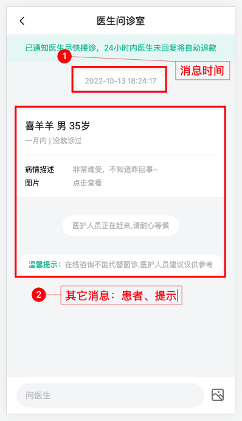

# 问诊室模块

## 问诊室-路由与组件

> 目标：配置路由和分析结构


1）路由配置

```ts
    {
      path: '/room',
      component: () => import('@/views/room/index.vue'),
      meta: { title: '问诊室' }
    },
```


## 问诊室-消息卡片

> 目标：了解问诊室消息卡片类型

组件 `Room/components/RoomMessage.vue` 

1. 病情描述

```html
  <div class="msg msg-illness">
    <div class="patient van-hairline--bottom">
      <p>李富贵 男 31岁</p>
      <p>一周内 | 未去医院就诊</p>
    </div>
    <van-row>
      <van-col span="6">病情描述</van-col>
      <van-col span="18">头痛、头晕、恶心</van-col>
      <van-col span="6">图片</van-col>
      <van-col span="18">点击查看</van-col>
    </van-row>
  </div>
```

2. 温馨提示-通知

```html
  <div class="msg msg-tip">
    <div class="content">
      <span class="green">温馨提示：</span>
      <span>在线咨询不能代替面诊，医护人员建议仅供参考</span>
    </div>
  </div>
```

3. 通知

```html
  <div class="msg msg-tip">
    <div class="content">
      <span>医护人员正在赶来，请耐心等候</span>
    </div>
  </div>
```

4. 发送文字

```html
  <div class="msg msg-to">
    <div class="content">
      <div class="time">20:12</div>
      <div class="pao">大夫你好？</div>
    </div>
    <van-image src="https://yjy-oss-files.oss-cn-zhangjiakou.aliyuncs.com/tuxian/popular_3.jpg" />
  </div>
```

5. 发送图片

```html
  <div class="msg msg-to">
    <div class="content">
      <div class="time">20:12</div>
      <van-image
        fit="contain"
        src="https://yjy-oss-files.oss-cn-zhangjiakou.aliyuncs.com/tuxian/popular_3.jpg"
      />
    </div>
    <van-image src="https://yjy-oss-files.oss-cn-zhangjiakou.aliyuncs.com/tuxian/popular_3.jpg" />
  </div>
```

6. 接收文字

```html
  <div class="msg msg-from">
    <van-image src="https://yjy-oss-files.oss-cn-zhangjiakou.aliyuncs.com/tuxian/popular_3.jpg" />
    <div class="content">
      <div class="time">20:12</div>
      <div class="pao">哪里不舒服</div>
    </div>
  </div>
```

7. 处方消息

```html
  <div class="msg msg-recipe">
    <div class="content">
      <div class="head van-hairline--bottom">
        <div class="head-tit">
          <h3>电子处方</h3>
          <p>原始处方 <van-icon name="arrow"></van-icon></p>
        </div>
        <p>李富贵 男 31岁 血管性头痛</p>
        <p>开方时间：2022-01-15 14:21:42</p>
      </div>
      <div class="body">
        <div class="body-item" v-for="i in 2" :key="i">
          <div class="durg">
            <p>优赛明 维生素E乳</p>
            <p>口服，每次1袋，每天3次，用药3天</p>
          </div>
          <div class="num">x1</div>
        </div>
      </div>
      <div class="foot"><span>购买药品</span></div>
    </div>
  </div>
```

8. 订单取消

```html
  <div class="msg msg-tip msg-tip-cancel">
    <div class="content">
      <span>订单取消</span>
    </div>
  </div>
```

小结：

- 知道问诊室大概有哪些消息卡片（类型）


## 问诊室-websocket介绍

> 目标：认识websocket 

什么是 websocket ? https://websocket.org/

- 是一种网络通信协议，和 HTTP 协议 一样。


为什么需要websocket ?

- 因为 HTTP 协议有一个缺陷：通信只能由客户端发起。


理解 websokect 通讯过程


了解 websocket api含义

```js
// 创建ws实例，建立连接
var ws = new WebSocket("wss://javascript.info/article/websocket/demo/hello");

// 连接成功事件
ws.onopen = function(evt) { 
  console.log("Connection open ...");
  // 发送消息
  ws.send("Hello WebSockets!");
};
// 接受消息事件
ws.onmessage = function(evt) {
  console.log( "Received Message: " + evt.data);
  // 关闭连接  
  ws.close();
};
// 关闭连接事件
ws.onclose = function(evt) {
  console.log("Connection closed.");
};      
```

说明：我们项目中使用 socket.io-client 来实现客户端代码，它是基于 websocket 的库。


## 问诊室-socket.io使用

> 目的：掌握 socket.io 的基本使用

1. socket.io 什么？
   - socket.io 是一个基于 WebSocket 的 CS（客户端-服务端）的实时通信库
   - 使用它可以在后端提供一个即时通讯服务
   - 它也提供一个 js 库，在前端可以去链接后端的 socket.io 创建的服务
   - 总结：它是一套基于 websocket 前后端即时通讯解决方案
3. 我们需要掌握的客户端几个 api 的基本使用

如何使用客户端js库?

```bash
pnpm add socket.io-client
```

如何建立连接？**浏览器和服务器建立双向通信（类似打电话）**

```ts
import { io } from 'socket.io-client'
// 参数1：不传默认是当前服务域名，开发中传入服务器地址
// 参数2：配置参数，根据需要再来介绍
const socket = io(url, options)
```

如何确定连接成功？

```ts
socket.on('connect', () => {
  // 建立连接成功
})
```

如何发送消息？**浏览器向服务器发消息**

```ts
// chat message 发送消息事件，由后台约定，可变
socket.emit('chat message', '消息内容')
```

如何接收消息？**接收服务器发送的消息**

```ts
// chat message 接收消息事件，由后台约定，可变
socket.on('chat message', (ev) => {
  // ev 是服务器发送的消息
})
```

如何关闭连接？

```ts
// 离开组件需要使用
socket.close()
```

小结：

- sockt.io 在前端使用的js库需要知道哪些内容？
  - 如何建立链接 `io('地址')`
  - 连接成功的事件 `connect`
  - 如何发消息 `emit` + 事件
  - 如何收消息 `on` + 事件
  - 如果关闭连接 `close()`


## 问诊室-通讯规则

> 知道前后端ws**通信事件**以及定义**数据的类型**

1. [前后台约定](https://www.apifox.cn/apidoc/shared-16a58bff-e4db-465c-9c8b-859c839318ac/api-31644739)通讯的一些事件


`chatMsgList` **接收**聊天记录

`sendChatMsg` 发送消息

`receiveChatMsg` **接收**消息

`statusChange` **接收**订单状态改变


2. [前后台约定](https://www.apifox.cn/apidoc/shared-16a58bff-e4db-465c-9c8b-859c839318ac/api-31644738)的消息数据的类型

`enums/index.ts`

```ts
// 消息类型
export enum MsgType {
  // 文字
  MsgText = 1,
  // 图片
  MsgImage = 4,
  // 患者
  CardPat = 21,
  // 处方
  CardPre = 22,
  // 未评价
  CardEvaForm = 23,
  // 已评价
  CardEva = 24,
  // 通用系统
  Notify = 31,
  // 温馨提示
  NotifyTip = 32,
  // 取消订单
  NotifyCancel = 33
}

// 处方状态
export enum PrescriptionStatus {
  // 未支付
  NotPayment = 1,
  // 已支付
  Payment = 2,
  // 无效
  Invalid = 3
}

// 问诊订单状态
export enum OrderType {
  // ----------------问诊订单------------------
  // 待支付
  ConsultPay = 1,
  // 待接诊
  ConsultWait = 2,
  // 咨询中
  ConsultChat = 3,
  // 已完成
  ConsultComplete = 4,
  // 已取消
  ConsultCancel = 5,
  // ----------------药品订单------------------
  // 待支付
  MedicinePay = 10,
  // 待发货
  MedicineSend = 11,
  // 待收货
  MedicineTake = 12,
  // 已完成
  MedicineComplete = 13,
  // 已取消
  MedicineCancel = 14
}
```

`types/room.d.ts`

```ts
import { MsgType, PrescriptionStatus } from '@/enums'
import type { Consult, Image } from './consult'
import type { Patient } from './user'

// 1. 聊天-消息中包含处方和药品类型
// 药品
export type Medical = {
  id: string
  name: string
  amount: string
  avatar: string
  specs: string
  // 用量
  usageDosag: string
  quantity: string
  // 是否是处方药
  prescriptionFlag: 0 | 1
}
// 处方
export type Prescription = {
  id: string
  orderId: string
  createTime: string
  name: string
  recordId: string
  gender: 0 | 1
  genderValue: string
  age: number
  // 诊断信息
  diagnosis: string
  status: PrescriptionStatus
  // 药品订单
  medicines: Medical[]
}

// 2. 聊天-评价医生
export type EvaluateDoc = {
  id?: string
  score?: number
  content?: string
  createTime?: string
  creator?: string
}

// 3. 聊天-消息类型
// 消息类型：聊天-接收对话信息api
export type Message = {
  id: string
  msgType: MsgType
  // 发消息的人ID
  from?: string
  fromAvatar?: string
  // 收消息的人ID
  to?: string
  toAvatar?: string
  createTime: string
  // 具体消息内容
  msg: {
    // 文字类型
    content?: string
    // 图片类型
    picture?: Image
    // 患者卡片
    consultRecord?: Consult & {
      patientInfo: Patient
    }
    // 处方信息
    prescription?: Prescription
    // 评价信息
    evaluateDoc?: EvaluateDoc
  }
}

// 消息分组：聊天-查询历史聊天记录api
export type TimeMessages = {
  createTime: string
  items: Message[]
  orderId: string
  sid: string
}
```


## 问诊室-建立连接

> 实现：问诊app和后台ws服务建立连接

步骤：

- 安装 sokect.io-client 包
- 在组件挂载完毕，进行[socket连接](https://www.apifox.cn/apidoc/shared-16a58bff-e4db-465c-9c8b-859c839318ac/api-31644738)
- 监听连接成功，监听错误消息，监听关闭连接
- 组件卸载关闭连接

代码：

1. 安装 sokect.io-client 包

```bash
pnpm add sokect.io-client
```

2. 建立连接

`views/room/index.vue`

```ts
import { onMounted, onUnmounted } from 'vue'
import { useUserStore } from '@/stores'
import { useRoute } from 'vue-router'
import { io, type Socket } from 'socket.io-client'
import { baseURL } from '@/utils/request'

const store = useUserStore()
const route = useRoute()

let socket: Socket
onUnmounted(() => {
  socket.close()
})
onMounted(async () => {
  // 建立链接，创建 socket.io 实例
  socket = io(baseURL, {
    auth: {
      token: `Bearer ${store.user?.token}`
    },
    query: {
      orderId: route.query.orderId
    }
  })

  socket.on('connect', () => {
    // 建立连接成功
    console.log('connect')
  })

  socket.on('error', (event) => {
    // 错误异常消息
    console.log('error')
  })

  socket.on('disconnect', ()=> {
    // 已经断开连接
    console.log('disconnect')
  })
})
```


## 问诊室-默认消息

> 实现：获取接诊前后默认聊天消息并渲染



需求❓：ws连接建立后，通过监听`chatMsgList`事件，服务器会返回**患者和提示消息**

说明：返回的是聊天历史记录（如果有）和默认消息

步骤：

- 监听[默认聊天消息](https://www.apifox.cn/apidoc/shared-16a58bff-e4db-465c-9c8b-859c839318ac/api-31644739)，并且处理成消息列表
  
- 进行渲染服务器返回的患者信息和提示消息
- 进行数据格式化和预览病情图片

代码：

1. 监听默认聊天记录，并且处理成消息列表 

`Room/index.vue`

```ts
import { MsgType } from '@/enums'
import type { Message, TimeMessages } from '@/types/room'

const list = ref<Message[]>([])
```

```ts
  // 聊天历史记录
  socket.on('chatMsgList', ({ data }: { data: TimeMessages[] }) => {
    // 准备转换常规消息列表
    const arr: Message[] = []
    data.forEach((item, i) => {
      // 1. 处理消息时间
      arr.push({
        msgType: MsgType.Notify,
        msg: { content: item.createTime },
        createTime: item.createTime,
        id: item.createTime
      })
      // 2. 其它消息
      arr.push(...item.items)
    })
    // 追加到聊天消息列表
    list.value.push(...arr)
  })
```

2) 进行渲染

 `Room/index.vue`

```html
<room-message :list="list" />
```

 `Room/components/RoomMessage.vue`
```ts
import { ConsultTime } from '@/enums'
import type { Message } from '@/types/room'

defineProps<{ list: Message[] }>()
```

```html
  <template v-for="{ msgType, msg, id } in list" :key="id">
    <!-- 1. 病情描述 -->
    <div class="msg msg-illness" v-if="msgType === MsgType.CardPat">
      <div class="patient van-hairline--bottom" v-if="msg.consultRecord">
        <p>
          {{ msg.consultRecord.patientInfo.name }}
          {{ msg.consultRecord.patientInfo.genderValue }}
          {{ msg.consultRecord.patientInfo.age }}岁
        </p>
        <p>
          {{ msg.consultRecord.illnessTime }} |
          {{ msg.consultRecord.consultFlag }}
        </p>
      </div>
      <van-row>
        <van-col span="6">病情描述</van-col>
        <van-col span="18">{{ msg.consultRecord?.illnessDesc }}</van-col>
        <van-col span="6">图片</van-col>
        <van-col span="18"> 点击查看 </van-col>
      </van-row>
    </div>
    <!--2.  温馨提示 -->
    <div class="msg msg-tip" v-if="msgType === MsgType.NotifyTip">
      <div class="content">
        <span class="green">温馨提示：</span>
        <span>{{ msg.content }}</span>
      </div>
    </div>
    <!-- 3. 通用通知 -->
    <div class="msg msg-tip" v-if="msgType === MsgType.Notify">
      <div class="content">
        <span>{{ msg.content }}</span>
      </div>
    </div>
  </template>    
```

3. 格式化病情描述数据

抽取常量数据 `api/constants.ts`

```ts
import { ConsultTime } from '@/enums'
// 患病时间
export const timeOptions = [
  { label: '一周内', value: ConsultTime.Week },
  { label: '一月内', value: ConsultTime.Month },
  { label: '半年内', value: ConsultTime.HalfYear },
  { label: '大于半年', value: ConsultTime.More }
]
// 是否就诊过
export const flagOptions = [
  { label: '就诊过', value: 0 },
  { label: '没就诊过', value: 1 }
]
```

病情描述消息卡片使用

```js
import { flagOptions, timeOptions } from '@/api/constants'

// 获取患病时间label信息
const getIllnessTimeText = (time: ConsultTime) =>
  timeOptions.find((item) => item.value === time)?.label
// 获取是否就诊label信息
const getConsultFlagText = (flag: 0 | 1) =>
  flagOptions.find((item) => item.value === flag)?.label
```

```diff
    <!-- 1. 病情描述 -->
    <div class="msg msg-illness" v-if="msgType === MsgType.CardPat">
      <div class="patient van-hairline--bottom" v-if="msg.consultRecord">
        <p>
          {{ msg.consultRecord.patientInfo.name }}
          {{ msg.consultRecord.patientInfo.genderValue }}
          {{ msg.consultRecord.patientInfo.age }}岁
        </p>
        <p>
+          {{ getIllnessTimeText(msg.consultRecord.illnessTime) }} |
+          {{ getConsultFlagText(msg.consultRecord.consultFlag) }}
        </p>
      </div>
      <van-row>
        <van-col span="6">病情描述</van-col>
        <van-col span="18">{{ msg.consultRecord?.illnessDesc }}</van-col>
        <van-col span="6">图片</van-col>
        <van-col span="18"> 点击查看 </van-col>
      </van-row>
    </div>
```

4. 预览病情图片 `Room/components/RoomMessage.vue`

```diff
<van-row>
  <van-col span="6">病情描述</van-col>
  <van-col span="18">{{ msg.consultRecord?.illnessDesc }}</van-col>
  <van-col span="6">图片</van-col>
+  <van-col span="18" @click="previewImg(msg.consultRecord?.pictures)"> 点击查看 </van-col>
</van-row>
```

```ts
import { showImagePreview } from 'vant'

const previewImg = (pictures?: Image[]) => {
  if (pictures && pictures.length) showImagePreview(pictures.map((item) => item.url))
}
```

注意❓：showImagePreview函数形式，需要在入口手动引入样式

`main.ts`

```ts
import 'vant/es/image-preview/style';
```

## 问诊室-文字聊天

> 实现：可以发送文字消息，可以接收文字消息


需求分析❓：

1. 底部`RoomAction.vue`操作组件，可以输入文字，触发 `send-text` 事件传出文字
2. 问诊室组件，监听 `send-text` 事件接收文字
3. 定义订单详情[api接口](https://www.apifox.cn/apidoc/shared-16a58bff-e4db-465c-9c8b-859c839318ac/api-34951420)和数据类型，需要使用医生ID，作为收信息人的标识
4. 获取订单详情，然后通过 `socket.emit` 的 `sendChatMsg` 事件发送文字给服务器，发送消息需要字段：from发送人（患者）、to收消息人（医生）、msgType消息类型、msg消息内容
5. 通过 `socket.on` 的 `receiveChatMsg` 事件接收发送成功或者医生发来的消息，**追加到聊天列表list中**，并处理滚动
6. 在`RoomMessage.vue`组件展示渲染聊天消息
8. 在`RoomAction.vue`中处理医生未接诊，禁用消息输入框


代码：

1）底部操作组件，可以输入文字，触发 `send-text` 事件传出文字
`Room/components/RoomAction.vue`

```ts
import { ref } from 'vue'

const emit = defineEmits<{
  (e: 'send-text', text: string): void
}>()

const text = ref('')

const sendText = () => {
  emit('send-text', text.value)
  text.value = ''
}
```

```diff
    <van-field
+      v-model="text"
      type="text"
      class="input"
      :border="false"
      placeholder="问医生"
      autocomplete="off"
+      @keyup.enter="sendText"
    ></van-field>
```

2）问诊室组件，监听 `send-text` 事件接收文字 
`Room/index.vue`

```html
<room-action @send-text="sendText" />
```

```ts
const sendText = (text: string) => {
  // 发送消息
}
```

3）获取订单详情，需要**使用医生ID**，作为收信息人的标识
`types/consult.d.ts`

```ts
// 问诊订单详情类型
export type ConsultOrderItem = Consult & {
  id: string
  createTime: string
  docInfo?: Doctor
  patientInfo: Patient
  orderNo: string
  statusValue: string
  typeValue: string
  status: OrderType
  countdown: number
  prescriptionId?: string
  evaluateId: number
  payment: number
  couponDeduction: number
  pointDeduction: number
  actualPayment: number
}
```

`api/consult.ts`

```ts
export const getConsultOrderDetail = (orderId: string) =>
  request.get<any, ConsultOrderItem>('/patient/consult/order/detail', { params:{orderId} })
```

4）通过 `socket.emit` 的 `sendChatMsg` 发送文字给服务器

`Room/index.vue`

```ts
import type { ConsultOrderItem } from '@/types/consult'
import { getConsultOrderDetail } from '@/services/consult'
// 1. 获取订单详情
const consult = ref<ConsultOrderItem>()

onMounted(async () => {
  const res = await getConsultOrderDetail(route.query.orderId as string)
  consult.value = res
})  
// 2. 发送消息
const sendText = (text: string) => {
  // 发送信息需要数据：发送人、收消息人、消息类型、消息内容
  socket.emit('sendChatMsg', {
    from: store.user?.id, // 发送人
    to: consult.value?.docInfo?.id, // 收消息人
    msgType: MsgType.MsgText, // 消息类型
    msg: { content: text } // 消息内容
  })
}
```

5）通过 `socket.on` 的 `receiveChatMsg` 接收**发送成功或者医生发来的消息**

```ts
 // 接收消息
  socket.on('receiveChatMsg', async (msg) => {
    list.value.push(msg)
    await nextTick()
    window.scrollTo(0, document.body.scrollHeight)
  })
```

6）展示消息  `Room/components/RoomMessage.vue`

```bash
pnpm i dayjs   
```

```ts
import dayjs from 'dayjs'

const formatTime = (time: string) => dayjs(time).format('HH:mm')
const store = useUserStore()
```

```html
    <!-- 发送文字：患者发的消息 -->
    <div class="msg msg-to" v-if="msgType === MsgType.MsgText && store.user?.id === from">
      <div class="content">
        <div class="time">{{ formatTime(createTime) }}</div>
        <div class="pao">{{ msg.content }}</div>
      </div>
      <van-image :src="store.user?.avatar" />
    </div>

    <!-- 接收文字：医生发的消息 -->
    <div class="msg msg-from" v-if="msgType === MsgType.MsgText && store.user?.id !== from">
      <van-image :src="fromAvatar" />
      <div class="content">
        <div class="time">{{ formatTime(createTime) }}</div>
        <div class="pao">{{ msg.content }}</div>
      </div>
    </div>
```

说明❓：

1. 患者：`store.user?.id === from`
2. 医生：`store.user?.id !== from`
2. **医生未接单，发送消息无响应**


7）医生未接诊，不是咨询中状态禁用消息输入框

`Room/index.vue`

```diff
    <room-action
      @send-text="sendText"
+      :disabled="consult?.status !== OrderType.ConsultChat"
    ></room-action>
```

`Room/components/RoomAction.vue`

```ts
// 发消息输入框是否可用
defineProps<{
  disabled: boolean
}>()
```

```diff
  <div class="room-action">
    <van-field
+     :disabled="disabled"
      v-model="text"
      type="text"
      class="input"
      :border="false"
      placeholder="问医生"
      autocomplete="off"
      @keyup.enter="sendText"
    ></van-field>
    <van-uploader
+   :disabled="disabled"
    :preview-image="false">
      <cp-icon name="consult-img" />
    </van-uploader>
  </div>
```


## 问诊室-医生接单

> 使用[医生端app](https://consult-doc-client.itheima.net/grab)接单


步骤：

1. 抢单前需要，监听超级医生订单状态变更
  
   1）医生接单后，会触发ws的statusChange事件，更新订单状态
   
   `Room/index.vue`
   
   ```ts
   onMounted(async () => {
     // ...
     
     // 3. 监听超级医生订单状态变更，更新订单状态（必须）
     socket.on('statusChange', async () => {
       const res = await getConsultOrderDetail(route.query.orderId as string)
       consult.value = res.data
       console.log('订单状态更新了：', consult.value)
     })
   
   })
   ```
   
   2）处理问诊订单状态
   
   `Room/index.vue`
   
   ```diff
       <!-- 1. 问诊状态-->
       <room-status
   +    :status="consult?.status"
   +    :countdown="consult?.countdown"></room-status>
   ```
   
   `Room/components/RoomStatus.vue`
   
   ```vue
   <script setup lang="ts">
   import { OrderType } from '@/enums'
   const { status, countdown = 0 } = defineProps<{
     status?: OrderType
     countdown?: number
   }>()
   </script>
   
   <template>
     <div class="room-status">
       <!-- 1. 未接诊 -->
       <div class="wait" v-if="status === OrderType.ConsultWait">
         已通知医生尽快接诊，24小时内医生未回复将自动退款
       </div>
       <!-- 2. 接诊：咨询中 -->
       <div class="chat" v-if="status === OrderType.ConsultChat">
         <span>咨询中</span>
         <span>剩余时间：<van-count-down :time="countdown * 1000"></van-count-down></span>
       </div>
       <!-- 3. 问诊结束 -->
       <div
         class="end"
         v-if="status === OrderType.ConsultComplete || status === OrderType.ConsultCancel"
       >
         <van-icon name="passed" /> 已结束
       </div>
     </div>
   </template>
   ```
   
   
   
2. 在抢单中心，输入**订单号抢单**

3. 抢单成功后，进入**医生问诊室**，可以**和患者端沟通**


## 问诊室-图片聊天

> 实现：点击图片icon上传图片，成功后发送图片消息


需求分析❓：

1. 底部操作组件，可以调用后台api函数上传图片，触发 `send-image` 事件传出图片对象

2. 问诊室组件，监听 `send-image` 事件接收图片对象

3. 通过 `socket.emit` 的 `sendChatMsg` 发送图片给服务器

4. 展示图片消息


代码：

1）底部操作组件，可以上传图片，触发 `send-image` 事件传出图片对象

`Room/components/RoomAction.vue`

```ts
import { uploadImage } from '@/api/consult'
import type { Image } from '@/types/consult'
import { showLoadingToast } from 'vant'
import type { UploaderAfterRead } from 'vant/lib/uploader/types'
```

```diff
const emit = defineEmits<{
  (e: 'send-text', text: string): void
+  (e: 'send-image', img: Image): void
}>()
```

```ts
const sendImage: UploaderAfterRead = async (data) => {
  // 排除多图上传数组情况
  if (Array.isArray(data)) return
  // 排除不存在情况
  if (!data.file) return
   const t = showLoadingToast({
    message: '正在上传',
    duration: 0 // 设置为0不会自动关闭
  })
  const res = await uploadImage(data.file)
  // 关闭提示
  t.close()
  emit('send-image', res)
}
```

```diff
 <van-uploader :preview-image="false" :disabled="disabled"
+ :after-read="sendImage">
      <cp-icon name="consult-img" />
    </van-uploader>
```

2）问诊室组件，监听 `send-image` 事件接收图片对象，通过 `socket.emit` 的 `sendChatMsg` 发送图片给服务器

`Room/index.vue`

```diff
<room-action @send-text="sendText"
+             @send-image="sendImage" />
```

```ts
import type { Image } from '@/types/consult'

const sendImage = (img: Image) => {
  socket.emit('sendChatMsg', {
    from: store.user?.id,
    to: consult.value?.docInfo?.id,
    msgType: MsgType.MsgImage,
    msg: { picture: img }
  })
}
```

3）展示消息

  `Room/components/RoomMessage.vue`

```html
    <!-- 6. 发送图片 -->
    <div class="msg msg-to" v-if="msgType === MsgType.MsgImage && store.user?.id === from">
      <div class="content">
        <div class="time">{{ formatTime(createTime) }}</div>
        <van-image @load="loadSuccess()" fit="contain" :src="msg.picture?.url" />
      </div>
      <van-image :src="store.user?.avatar" />
    </div>
    <!-- 7. 接收图片 -->
    <div class="msg msg-from" v-if="msgType === MsgType.MsgImage && store.user?.id !== from">
      <van-image :src="fromAvatar" />
      <div class="content">
        <div class="time">{{ formatTime(createTime) }}</div>
        <van-image @load="loadSuccess()" fit="contain" :src="msg.picture?.url" />
      </div>
    </div>
```

说明❓：解决图片加载滚动没有到最底部问题

* 图片加载完成后，执行一次滚动

```ts
// 图片加载成功=> 执行滚动
const loadSuccess = () => {
  window.scrollTo(0, document.body.scrollHeight)
}
```

## 问诊室-查看处方

> 实现：在医生端app，点击开处方，患者端app展示处方消息并支持查看

* 医生端app:


* 患者端app:


步骤：

* 展示处方消息

- 定义查看处方[API函数](https://www.apifox.cn/apidoc/shared-16a58bff-e4db-465c-9c8b-859c839318ac/api-34951425)
- 点击查看处方**预览处方图片**

代码：

1）展示处方消息

  `Room/components/RoomMessage.vue`

```vue
    <!-- 8. 处方消息 -->
    <div class="msg msg-recipe" v-if="msgType === MsgType.CardPre">
      <div class="content">
        <div class="head van-hairline--bottom">
          <div class="head-tit">
            <h3>电子处方</h3>
            <p>原始处方 <van-icon name="arrow"></van-icon></p>
          </div>
          <p>
            {{ msg.prescription?.name }}
            {{ msg.prescription?.genderValue }}
            {{ msg.prescription?.age }}岁
            {{ msg.prescription?.diagnosis }}
          </p>
          <p>开方时间：{{ msg.prescription?.createTime }}</p>
        </div>
        <div class="body">
          <div class="body-item" v-for="med in msg.prescription?.medicines" :key="med.id">
            <div class="durg">
              <p>{{ med.name }} {{ med.specs }}</p>
              <p>{{ med.usageDosag }}</p>
            </div>
            <div class="num">x{{ med.quantity }}</div>
          </div>
        </div>
        <div class="foot"><span>购买药品</span></div>
      </div>
    </div>
```

2）定义查看处方API

`api/consult.ts`

```ts
// 查看处方
export const getPrescriptionPic = (id: string) =>
  request.get<any, { url: string }>(`/patient/consult/prescription/${id}`)
```

3）点击查看处方预览处方图片

  `Room/components/RoomMessage.vue`

```diff
        <div class="head van-hairline--bottom">
          <div class="head-tit">
            <h3>电子处方</h3>
            <p
+            @click="showPrescription(msg.prescription?.id)">
            原始处方 <van-icon name="arrow"></van-icon></p>
          </div>
          <p>
            {{ msg.prescription?.name }}
            {{ msg.prescription?.genderValue }}
            {{ msg.prescription?.age }}岁
            {{ msg.prescription?.diagnosis }}
          </p>
          <p>开方时间：{{ msg.prescription?.createTime }}</p>
        </div>
```

```ts
  import { getPrescriptionPic } from '@/api/consult'

  const showPrescription = async (id?: string) => {
    if (id) {
      const res = await getPrescriptionPic(id)
      showImagePreview([res.url])
    }
  }
```

说明❓：后台处方图片没实现

## 问诊室-购买药品

> 实现：点击处方的购买药品，进行处方订单的支付跳转


步骤：

- 处方状态不同此按钮操作不同：
  - 如果处方失效：提示即可
  - 如果没付款：去药品预支付页面

代码：

  `Room/components/RoomMessage.vue`

```diff
        <div class="body">
          <div class="body-item" v-for="med in msg.prescription?.medicines" :key="med.id">
            <div class="durg">
              <p>{{ med.name }} {{ med.specs }}</p>
              <p>{{ med.usageDosag }}</p>
            </div>
            <div class="num">x{{ med.quantity }}</div>
          </div>
        </div>
+        <div class="foot"><span @click="buy(msg.prescription)">购买药品</span></div>
      </div>
```

```ts
import { useRouter } from 'vue-router'
import { PrescriptionStatus } from '@/enums'
import { showFailToast } from 'vant'

// 点击处方的跳转
const router = useRouter()
const buy = (pre?: Prescription) => {
  if (pre) {
    // 1. 如果处方失效：提示即可
    if (pre.status === PrescriptionStatus.Invalid) return showFailToast('处方已失效')
    // 2. 如果没付款且没订单ID：去药品预支付页面
    if (pre.status === PrescriptionStatus.NotPayment)
      return router.push(`/medicine/pay?id=${pre.id}`)
  }
}
```

## 问诊室-评价医生(作业)

> 实现：医生端app，**点击问诊结束**，给医生做评价


步骤：

- 展示问诊室状态和评价组件
- 评价表单数据绑定和校验
- 提交评价
- 修改消息

代码：

1）展示问诊室状态和评价组件

`Room/components/RoomMessage.vue`

```html
    <!-- 9. 订单取消/关闭诊室 -->
    <div class="msg msg-tip msg-tip-cancel" v-if="msgType === MsgType.NotifyCancel">
      <div class="content">
        <span>{{ msg.content }}</span>
      </div>
    </div>
    <!-- 10. 医生评价 -->
    <div class="msg" v-if="msgType === MsgType.CardEva || msgType === MsgType.CardEvaForm">
      <evaluate-card :evaluateDoc="msg.evaluateDoc"></evaluate-card>
    </div>
```

`Room/components/evaluateCard.vue`

```ts
import type { EvaluateDoc } from '@/types/room'

defineProps<{
  // 接收评价数据：存在说明评价过，相反没有
  evaluateDoc?: EvaluateDoc
}>()
```

```diff
<template>
-  <!-- 1. 已经评价过 -->
+  <div class="evalutate-card" v-if="evaluateDoc">
    <p class="title">医生服务评价</p>
    <p class="desc">我们会更加努力提升服务质量</p>
    <van-rate
+      :modelValue="evaluateDoc.score"
      size="7vw"
      gutter="3vw"
      color="#FADB14"
      void-icon="star"
      void-color="rgba(0,0,0,0.04)"
    />
  </div>
- <!-- 2. 还没有评价 -->
  <div class="evalutate-card" v-else>
    <p class="title">感谢您的评价</p>
    <p class="desc">本次在线问诊服务您还满意吗？</p>
    <van-rate
      size="7vw"
      gutter="3vw"
      color="#FADB14"
      void-icon="star"
      void-color="rgba(0,0,0,0.04)"
    />
    <van-field
      type="textarea"
      maxlength="150"
      show-word-limit
      rows="3"
      placeholder="请描述您对医生的评价或是在医生看诊过程中遇到的问题"
    ></van-field>
    <div class="footer">
      <van-checkbox>匿名评价</van-checkbox>
      <van-button type="primary" size="small" round> 提交评价 </van-button>
    </div>
  </div>
</template>
```

2）评价表单数据绑定和校验

```ts
import { Toast } from 'vant'
import { computed, inject, ref } from 'vue'

const score = ref(0)
const anonymousFlag = ref(false)
const content = ref('')
const disabled = computed(() => !score.value || !content.value)

const onSubmit = async () => {
  
}
```

```diff
- <!-- 2. 还没有评价 -->
<div class="evalutate-card" v-else>
    <p class="title">感谢您的评价</p>
    <p class="desc">本次在线问诊服务您还满意吗？</p>
    <van-rate
+    v-model="score"
      size="7vw"
      gutter="3vw"
      color="#FADB14"
      void-icon="star"
      void-color="rgba(0,0,0,0.04)"
    />
    <van-field
+      v-model="content"
      type="textarea"
      maxlength="150"
      show-word-limit
      rows="3"
      placeholder="请描述您对医生的评价或是在医生看诊过程中遇到的问题"
    ></van-field>
    <div class="footer">
+      <van-checkbox v-model="anonymousFlag">匿名评价</van-checkbox>
+      <van-button :disabled="disabled" @click="onSubmit" type="primary" size="small" round>
        提交评价
      </van-button>
    </div>
  </div>
```

4）提交评价

1. 定义评价[api函数](https://www.apifox.cn/apidoc/shared-16a58bff-e4db-465c-9c8b-859c839318ac/api-34951418)

`api/consult.ts`

```ts
// 评价问诊
export const evaluateConsultOrder = (data: {
  docId: string // 医生ID
  orderId: string // 订单ID
  score: number // 评价星级
  content: string // 评价留言
  anonymousFlag: 0 | 1 // 是否匿名评价：1匿名 0实名
}) => request.post('/patient/order/evaluate', data)
```

2. 注入订单信息：提供医生ID和订单ID

`Room/index.vue`

```ts
import { provide } from 'vue'
// ...
provide('consult', consult)
```

3. 评价组件接收注入的数据

`Room/components/EvaluateCard.vue`

```ts
import { inject, type Ref } from 'vue'
import type { ConsultOrderItem } from '@/types/consult'
// 说明❓：Ref<type> 指定类型为Ref，提交时才可以使用.value访问变量
const consult = inject<Ref<ConsultOrderItem>>('consult')
```

4. 提交评价

```diff
+ import { evaluateConsultOrder } from '@/api/consult'

const onSubmit = async () => {
  if (!score.value) return Toast('请选择评分')
  if (!content.value) return Toast('请输入评价')
+  if (!consult?.value) return Toast('未找到订单')
+  if (consult.value.docInfo?.id) {
+    await evaluateConsultOrder({
+      docId: consult.value?.docInfo?.id,
+      orderId: consult.value?.id,
+      score: score.value,
+      content: content.value,
+      anonymousFlag: anonymousFlag.value ? 1 : 0
+    })
+  }
  // 修改消息：评价请求成功，改成已评价
}
```

5）成功后修改消息，切换显示已评价
`Room/index.vue`

```ts
// 评价成功，修改评价消息状态和数据，切换卡片展示
const completeEva = (score: number) => {
  // 获取评价信息数据
  const item = list.value.find((item) => item.msgType === MsgType.CardEvaForm)
  if (item) {
    item.msg.evaluateDoc = { score }
    item.msgType = MsgType.CardEva
  }
}
provide('completeEva', completeEva)
```

`Room/components/EvaluateCard.vue`

```diff
+ const completeEva = inject<(score: number) => void>('completeEva')


const onSubmit = async () => {
  if (!consult?.value) return Toast('未找到订单')
  if (consult.value.docInfo?.id) {
    await evaluateConsultOrder({
      docId: consult.value.docInfo?.id,
      orderId: consult.value?.id,
      score: score.value,
      content: content.value,
      anonymousFlag: anonymousFlag.value ? 1 : 0
    })
  }
-  // 修改消息：评价请求成功，改成已评价
+  completeEva && completeEva(score.value)
}
```


# 第十天